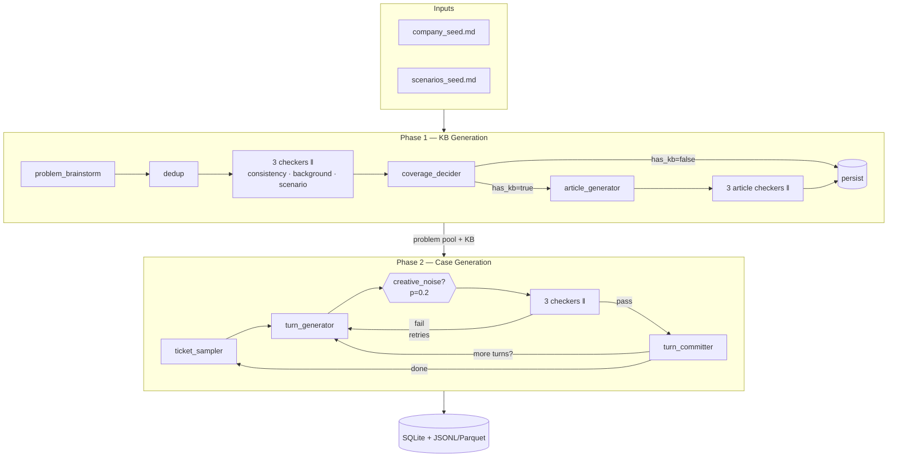

# csfd — Customer-Service Fake Data

> Synthetic, schema-grounded, multi-turn customer-service tickets for benchmarking RAG, classification, and agent-based pipelines.

A production-grade LangGraph multi-agent system composing the **Evaluator-Optimizer** and **Parallelization (sectioning)** patterns from Anthropic's *Building Effective Agents* into a reproducible two-phase pipeline:

1. **Phase 1 — Knowledge Foundation** — brainstorm problems → decide KB coverage → write KB articles for covered problems.
2. **Phase 2 — Case Generation** — sample (problem, ticket_type) pairs → generate multi-turn conversations.

Hard routing rule: **`problem.has_kb=False ⇒ ticket_type=L3`** (technical/domain specialist). By construction, the dataset has both KB-grounded and KB-absent paths — ideal for RAG benchmarking.

## Quickstart

```bash
uv sync
cp .env.example .env             # populate ANTHROPIC_API_KEY or LOCAL_BASE_URL
csfd init                        # scaffolds seeds/, data/, .env.example
# edit seeds/company_seed.md and seeds/scenarios_seed.md
csfd db-migrate                  # creates runs.sqlite
csfd generate --seed 42 --problems 10
```

## LangGraph Studio

```bash
uv sync
langgraph dev
```

Studio opens at `http://localhost:8123` exposing both Phase 1 and Phase 2 graphs for time-travel debugging, per-node input/output inspection, and manual state edits.

## Architecture



The full design lives in [`docs/superpowers/specs/2026-05-15-customer-service-fake-data-design.md`](docs/superpowers/specs/2026-05-15-customer-service-fake-data-design.md).

## Reproducibility

Every run stamps:
- `run_seed` — all sampling derives from `derive_rng(seed, label)`
- `pipeline.version` — semver bumped on schema-breaking changes
- `git_sha` — captured at run start
- `config_snapshot_json` — fully-resolved merged YAML
- `prompt_id` — sha256 prefix of every prompt template content used, recorded in `agent_traces.prompt_id`

Pin an exported benchmark to its full provenance with one query against `runs.config_snapshot_json ⋈ agent_traces.prompt_id`.

## Benchmark consumption

The "gold tuple" join for downstream RAG benchmarks:

```sql
SELECT p.id AS problem_id, p.title, p.has_kb,
       kb.id AS kb_article_id, kb.content_markdown,
       t.id AS ticket_id, t.ticket_type, t.status,
       tu.turn_index, tu.speaker, tu.content
FROM problems p
LEFT JOIN kb_articles kb ON kb.problem_id = p.id
JOIN tickets t ON t.problem_id = p.id
JOIN turns tu ON tu.ticket_id = t.id
WHERE p.run_id = :phase1_run_id
ORDER BY t.id, tu.turn_index;
```

Or use the exports under `data/exports/<run_id>/`:
- `problems.jsonl(.parquet)`
- `kb_articles.jsonl(.parquet)`
- `tickets.jsonl(.parquet)`
- `turns.jsonl(.parquet)`
- `agent_traces.jsonl(.parquet)` — every LLM call, with prompt_id, tokens, latency, cost

## Configuration profiles

Pre-built overlays under `config/profiles/`:
- `claude-only.yaml` — every agent on Anthropic
- `local-only.yaml` — every agent on Ollama (recommend ≥70B for JSON-schema decoding)
- `mixed.yaml` — Generator on Claude, checkers on local Llama
- `dev.yaml` — small problem count, low temperature, fast iteration

```bash
csfd generate --profile mixed
```

## CLI

| Command | Purpose |
|---|---|
| `csfd init` | scaffold `seeds/`, `data/`, `.env.example` |
| `csfd db-migrate` | apply SQL migrations to `runs.sqlite` |
| `csfd phase1 run --seed N --problems M` | Phase 1 only |
| `csfd phase2 run --parent-run-id UUID` | Phase 2 chained off a prior run |
| `csfd generate --seed N --problems M` | both phases |
| `csfd export RUN_ID --format jsonl\|parquet\|both` | dump to `data/exports/<run_id>/` |
| `csfd inspect RUN_ID` | print summary stats |
| `csfd render-graphs` | regenerate `docs/diagrams/*.mmd` |

All commands accept `--profile <name>` to select a YAML overlay.

## Tests

```bash
uv run pytest -v      # unit + integration; FakeChatModel, no API spend
uv run mypy src tests # strict
uv run ruff check src tests
```

Live LLM tests are gated behind `-m live_llm`.

## License

[Apache-2.0](LICENSE).
