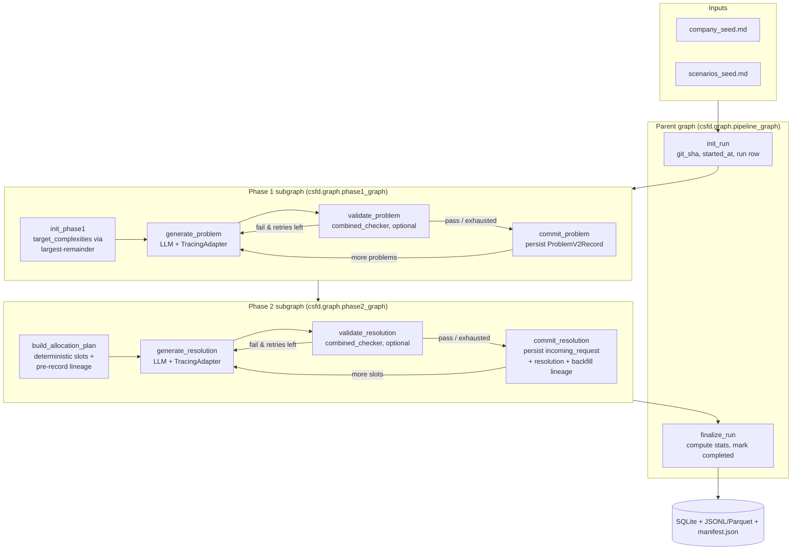

# csfd — Customer-Service Fake Data

> Synthetic, schema-grounded, multi-turn customer-service tickets for benchmarking RAG, classification, and agent-based pipelines.

## Business motivation

Customer-service AI teams need realistic evaluation data before they can trust an assistant, routing model, or RAG workflow in production. Real support tickets are hard to share because they contain customer data, are unevenly distributed across issue types, and rarely include clean lineage from root cause to resolution. `csfd` creates controlled synthetic datasets that preserve the useful structure of support work without exposing private records.

The generated data is intended for practical evaluation tasks:

- **RAG evaluation** — test whether a system can retrieve the right context and answer grounded customer questions.
- **Routing and triage** — benchmark classifiers across exact ticket-type, customer-tier, and tone distributions.
- **Agent workflow testing** — replay incoming requests and multi-turn resolutions against support agents.
- **Regression datasets** — pin a benchmark to config, prompt, model, git SHA, and run statistics so future changes are comparable.

## What the generator produces

Each run produces a benchmark-ready dataset with separate artifacts for causes, customer inputs, support outcomes, and auditability:

- **`problems`** — the Phase 1 Problem Database. Each row is a synthetic root cause with title, summary, background, category, complexity, and resolution hints. Use this as the ground-truth issue pool behind the generated tickets.
- **`incoming_requests`** — standalone customer messages created from the allocation plan. These are the inputs a classifier, RAG system, or support agent would receive at evaluation time.
- **`resolutions`** — full multi-turn support conversations for each incoming request. These provide expected handling behavior, turn counts, resolution status, and agent/customer dialogue for workflow regression tests.
- **`lineage`** — the join table that links each ticket slot to its originating problem, request, and resolution. This makes evaluation slices explainable: every benchmark example can be traced back to the root cause and configured distribution slot.
- **`agent_traces`** — one audit row per LLM call, including prompt version, model/provider metadata, latency, checker verdicts, and parent-child links between generation and validation. Use this to debug output quality and compare runs.
- **`manifest.json`** — export metadata and file checksums for the generated JSONL/Parquet artifacts. Use it to pin a dataset version in downstream benchmarks.

Together, these datasets support both online-style evaluation, where only `incoming_requests` are shown to a system under test, and offline analysis, where `problems`, `resolutions`, `lineage`, and traces explain why each example exists and how it was generated.

## What the generator consumes

Each run is driven by two kinds of inputs: **seed files** that describe the fictional domain, and **config files** that pin down how much data to make, in what proportions, and with which models. Together they fully determine a run — same seeds + same config + same `run_seed` reproduce the same allocation plan.

### Seed files (`seeds/`)

Markdown documents that ground generation in a concrete business. They are referenced from the generator prompts and are the only source of domain-specific content; swap them out to retarget the generator at a different company or industry without touching code.

- **`seeds/company_seed.md`** — the company profile. Identity, sector, products (e.g. the flagship CT-500 chiller), representative components, customer segments, and service organisation. This is what makes generated problems and resolutions sound like they belong to a real manufacturer rather than a generic SaaS.
- **`seeds/scenarios_seed.md`** — the customer-service case catalogue. A structured list of business cases (documentation requests, L1/L2/L3 troubleshooting, field-service escalations) with tags, escalation tier, as-is process, sample-data hints, and systems touched. The generator uses these as the templates that Phase 1 problems and Phase 2 resolutions are built against.

`csfd init` scaffolds both files; the shipped versions describe the fictional **CoolTherm Industrial Chillers** company used as the running example.

### Config files (`config/`)

YAML that controls the deterministic shape of the run — counts, proportions, retry budget, model choice, and validation toggles.

- **`config/default.yaml`** — the base config, always loaded. Top-level sections:
  - `pipeline` — `version`, `run_seed`, and the per-run budget (`max_tokens_per_run`, `max_usd_per_run`, `max_retries_per_artifact`).
  - `agents` — the two LLM buckets (`generator` and `combined_checker`) with `provider`, `model`, `temperature`, `max_tokens`, and `timeout_s`. Every node in the graph routes to one of these buckets.
  - `problem_database` — Phase 1 controls: `count` and `complexity_proportions` (simple / medium / complex), applied with largest-remainder rounding.
  - `tickets` — Phase 2 controls: `total`, `type_proportions`, `tier_proportions`, `tone_proportions_per_type`, `turns_per_type`, and `assignment_strategy` (`complexity_weighted` or `uniform`).
  - `validation` — whether the combined checker runs after each generation and how its verdict gates retries.
- **`config/profiles/*.yaml`** — overlays applied on top of `default.yaml` via `--profile <name>`. Shipped overlays cover model routing (`claude-only`, `claude-cli`, `local-only`, `mixed`) and a small `dev` overlay that shrinks problem/ticket counts for fast iteration.
- **`.env`** — credentials and endpoints (`ANTHROPIC_API_KEY`, `LOCAL_BASE_URL`, …) read at runtime. Not part of the deterministic snapshot.

The resolved config (default + active profile) is persisted as `runs.config_snapshot_json`, so any exported dataset can be traced back to the exact inputs that produced it.

## Goals

`csfd` focuses on three goals:

1. **Control** — produce exact counts for problem complexity, ticket type, customer tier, and tone.
2. **Reproducibility** — make allocation deterministic and persist lineage, config snapshots, prompt versions, and model metadata.
3. **Inspectability** — expose the generation pipeline as LangGraph graphs, SQLite tables, JSONL/Parquet exports, and trace rows.

`csfd generate` runs a **deterministic, proportion-based LangGraph pipeline**: you specify how many problems and how many tickets you want and the breakdown by ticket type / customer tier / tone, and the tool produces *exactly* those counts. The single parent graph composes two phase subgraphs:

1. **Phase 1 — Problem Database** — generate `problem_database.count` problems with target complexities driven by `complexity_proportions` (largest-remainder rounding). Each problem flows through a `generate_problem → validate_problem → commit_problem` retry sub-loop.
2. **Allocator** — `csfd.allocator.build_allocation_plan` produces a fully deterministic plan: every ticket slot's `(problem_id, ticket_type, customer_tier, customer_tone)` is chosen before any LLM call.
3. **Phase 2 — Resolution per slot** — for each slot, one LLM call produces the standalone incoming request plus the full multi-turn resolution. Same retry shape as Phase 1.

Three output datasets per run: **`incoming_requests`** (denormalized customer requests), **`resolutions`** (multi-turn conversations), and **`lineage`** (problem → request → resolution traceability). Every LLM call also writes one row to **`agent_traces`** with `prompt_id`, `model_provider`, `model_id`, `latency_ms`, and (for checkers) `verdict` / `verdict_issues_json` — checker traces link to their generator via `parent_trace_id`.

## Quickstart

```bash
uv sync
cp .env.example .env             # populate ANTHROPIC_API_KEY or LOCAL_BASE_URL
csfd init                        # scaffolds seeds/, data/, .env.example
# edit seeds/company_seed.md and seeds/scenarios_seed.md
csfd db-migrate                  # creates runs.sqlite (applies all migrations)
csfd generate --seed 42 --problems 10 --tickets 100
```

The proportions, turn counts, and assignment strategy live in `config/default.yaml` under the `problem_database`, `tickets`, and `validation` sections. Use `--profile dev` for a small smoke run (`problem_database.count=3`, `tickets.total=6`).

## Architecture

The pipeline is a LangGraph parent graph composed of two phase subgraphs. The parent sequences `init_run` → Phase 1 subgraph → Phase 2 subgraph → `finalize_run`; each subgraph contains its own per-artifact retry sub-loop and outer iteration loop. All three graphs share a single `PipelineState` Pydantic model defined in `src/csfd/graph/pipeline_graph.py`.

### Parent graph

The parent graph owns run lifecycle and durability. It creates the `runs` row, captures provenance (`git_sha`, config snapshot, seed, pipeline version), executes Phase 1 and Phase 2 in order, computes final statistics, and marks the run completed. CLI execution uses the run ID as the LangGraph `thread_id`, so graph checkpoints and application rows refer to the same unit of work.

### Phase 1 graph — Problem Database

Phase 1 turns company/scenario seeds into a reusable Problem Database. It deterministically assigns target complexities, asks the generator to produce one problem at a time, validates each candidate with the combined checker, retries on failed verdicts, and persists accepted `ProblemV2Record` rows. Its output is not a ticket yet; it is the controlled pool of root causes that Phase 2 will allocate across ticket slots.

### Phase 2 graph — Requests and resolutions

Phase 2 consumes the persisted Problem Database and the configured ticket proportions. It first builds the allocation plan, which fixes every slot's problem, ticket type, customer tier, and tone before generation starts. For each slot, it generates a standalone incoming customer request and a full resolution conversation, validates the result, persists `incoming_requests` and `resolutions`, and backfills `lineage` so every benchmark row can be traced back to its originating problem.



The parent graph is exposed to LangGraph Studio at `langgraph.json:pipeline` (pre-built at module import time in `src/csfd/graph/studio.py`). CLI runs use an async SQLite checkpointer (`csfd.graph.checkpointer.async_sqlite_checkpointer`) for durable execution — `thread_id=run_id`.

### Step by step: how the graph runs

A single `csfd generate` invocation walks the parent graph from top to bottom. Each numbered step below is what actually happens, in order, between you pressing enter and the export files landing on disk.

1. **Bootstrap the run.** The CLI loads `config/default.yaml` plus any `--profile` overlay, resolves the seed and counts, opens `runs.sqlite`, and hands a fresh `PipelineState` to the parent graph. The graph's `thread_id` is set to the new `run_id` so every checkpoint LangGraph writes is tied to the same unit of work as the application rows.

2. **`init_run` node.** The parent's first node inserts a row into the `runs` table and captures provenance up front: `git_sha` (from `git rev-parse HEAD`), `started_at`, the resolved config snapshot, the `pipeline.version`, and the seed. From this point on, any failure can still be traced back to an exact configuration.

3. **Enter the Phase 1 subgraph.** Control transfers to `init_phase1`, which uses **largest-remainder rounding** on `complexity_proportions` to produce an exact list of target complexities — e.g. `[easy, easy, medium, medium, medium, hard]`. The list length equals `problem_database.count`, so the Phase 1 loop knows exactly how many problems to make and which complexity each one must be.

4. **Generate one problem.** `generate_problem` pops the next target complexity, renders the problem-generator Jinja template (its `prompt_id` is the sha256-prefix hash of the template source), and calls the configured generator model through `TracingAdapter`. The adapter writes one row to `agent_traces` recording `prompt_id`, `model_provider`, `model_id`, `attempt`, and `latency_ms`.

5. **Validate the problem.** If validation is enabled, `validate_problem` runs the combined checker LLM against the candidate. The checker's trace row links back to the generator's via `parent_trace_id` and records a `verdict` plus `verdict_issues_json`.

6. **Retry sub-loop.** If the verdict is `fail` and retries remain, control returns to `generate_problem` and the generator tries again — same target complexity, fresh LLM call, fresh trace row. If retries are exhausted, the last candidate is accepted with a quality flag so the run never stalls.

7. **Commit the problem.** `commit_problem` persists an accepted `ProblemV2Record` into the `problems` table.

8. **Outer Phase 1 loop.** If more target complexities remain in the list, the graph routes back to `generate_problem`; otherwise Phase 1 exits and the parent graph hands the now-populated Problem Database to Phase 2.

9. **Build the allocation plan.** Phase 2 starts with `build_allocation_plan`, which is the deterministic core of the system: before any Phase 2 LLM call, `csfd.allocator.build_allocation_plan` reads `tickets.total` plus the type / tier / tone proportions and produces the full list of slots. Each slot is a fixed tuple `(slot_index, problem_id, ticket_type, customer_tier, customer_tone, customer_name)`. The same seed and config always produce the same slot list. This node also pre-records `lineage` rows so each slot is traceable even before its request and resolution exist.

10. **Generate the resolution for a slot.** `generate_resolution` pops the next slot, renders the resolution template against that slot's problem + ticket parameters, and makes a single LLM call that produces both the standalone incoming customer message and the full multi-turn agent/customer conversation. Another `agent_traces` row is written.

11. **Validate the resolution.** Same shape as Phase 1: `validate_resolution` runs the combined checker, with its own trace row linked via `parent_trace_id`.

12. **Retry sub-loop.** Fail + retries left → back to `generate_resolution` with the same slot. Retries exhausted → accept with a quality flag.

13. **Commit the resolution.** `commit_resolution` inserts the `incoming_requests` row and the `resolutions` row, then backfills the pre-recorded `lineage` row with their ids. The benchmark "gold tuple" is now complete for this slot.

14. **Outer Phase 2 loop.** If more slots remain in the allocation plan, route back to `generate_resolution`; otherwise Phase 2 exits.

15. **`finalize_run` node.** The parent graph aggregates end-of-run statistics — total problems, requests, resolutions, traces, plus type/tier/tone/complexity breakdowns and quality-flag distribution — writes `stats_json` and `completed_at` onto the `runs` row, and marks the run completed.

16. **Export (separate step).** `csfd export <run_id>` reads from SQLite and writes `problems`, `incoming_requests`, `resolutions`, `lineage`, and `agent_traces` to JSONL/Parquet under `data/exports/<run_id>/`, plus a `manifest.json` with SHA-256 checksums of every file.

Two invariants hold across the whole walk: every LLM call produces exactly one `agent_traces` row (so cost and quality are auditable per call), and Phase 2 never invents allocation decisions on the fly — the plan from step 9 fully determines what gets generated.

## LangGraph Studio

```bash
uv sync
csfd db-migrate                       # create runs.sqlite (prerequisite)
langgraph dev                         # start Studio
```

Studio opens at `http://localhost:8123` and shows the parent graph with both phase subgraphs nested. You get per-node input/output inspection, time-travel debugging, and manual state edits.

The persistence layer inside graph nodes is `aiosqlite`-backed (see `src/csfd/storage/db_async.py`), so [`blockbuster`](https://github.com/cbornet/blockbuster)'s sync-I/O trap is respected without any `--allow-blocking` flag. The sync `Database` is still used for read paths outside the graph (CLI inspect/export, tests, migrations).

## Reproducibility

Every run stamps:
- `run_seed` — drives the `uniform` allocator's tiebreaker shuffle; the `complexity_weighted` strategy is reproducible without a seed
- `pipeline.version` — semver bumped on schema-breaking changes
- `git_sha` — captured at run start via `git rev-parse HEAD` (NULL outside a git repo)
- `config_snapshot_json` — the resolved `problem_database` + `tickets` + `validation` sections
- `stats_json` — end-of-run counts (problems, requests, resolutions, traces) plus type/tier/tone/complexity breakdowns and quality-flag distribution
- `prompt_id` — sha256-prefix hash of the **prompt template source** (the Jinja file contents, not the per-call rendered prompt — so the id is a stable handle that changes only when a template is edited), recorded on every row in `agent_traces.prompt_id`. Each LLM call also records `model_provider`, `model_id`, `attempt`, `latency_ms`, and (for checker calls) `verdict` and `verdict_issues_json`. Token usage (`tokens_in`, `tokens_out`) is populated from LangChain's `usage_metadata` for any provider that emits it (Anthropic, OpenAI-compatible); `FakeChatModel` and the Claude CLI wrapper leave them NULL.

Determinism guarantee: given identical config and seed, two runs against fresh databases produce slot-by-slot identical lineage rows `(slot_index, problem_index_within_run, ticket_type, customer_tier, customer_tone, customer_name)`. Run-scoped UUIDs (`run_id` and the prefix of `problem_id` / `ticket_uid`) of course differ — the deterministic part is the per-run index suffix. The only source of additional variation are the LLM responses themselves.

Pin an exported benchmark to its provenance via `runs.config_snapshot_json` and the per-row `prompt_id` / `model_id` columns in `agent_traces`.

## Benchmark consumption

The "gold tuple" join over `problems`, `incoming_requests`, `resolutions`, and `lineage`:

```sql
SELECT p.id AS problem_id,
       p.title, p.summary, p.complexity, p.category,
       l.slot_index, l.customer_tier, l.customer_tone,
       ir.request_uid, ir.subject, ir.body,
       res.resolution_uid, res.turns_json, res.turn_count, res.resolved
FROM lineage l
JOIN problems p           ON p.id = l.problem_id
JOIN incoming_requests ir ON ir.id = l.incoming_request_id
JOIN resolutions res      ON res.id = l.resolution_id
WHERE l.run_id = :run_id
ORDER BY l.slot_index;
```

Exports under `data/exports/<run_id>/`:
- `problems.jsonl(.parquet)` — Problem Database rows
- `incoming_requests.jsonl(.parquet)` — denormalized customer requests
- `resolutions.jsonl(.parquet)` — multi-turn conversations
- `lineage.jsonl(.parquet)` — problem → request → resolution traceability
- `agent_traces.jsonl(.parquet)` — every LLM call (`prompt_id`, `model_provider`, `model_id`, `attempt`, `latency_ms`, `verdict`)
- `manifest.json` — SHA-256 of every JSONL file

## Configuration profiles

Pre-built overlays under `config/profiles/`:
- `claude-only.yaml` — every agent on Anthropic (default; empty overlay)
- `claude-cli.yaml` — every agent via the local `claude` CLI (subscription auth, no API key). Requires the `claude` binary on `$PATH` and a logged-in session.
- `local-only.yaml` — every agent on Ollama (recommend ≥70B for JSON-schema decoding)
- `mixed.yaml` — Generator on Claude, checker on local Llama
- `dev.yaml` — small problem/ticket counts for fast iteration

```bash
csfd generate --profile mixed
```

## CLI

| Command | Purpose |
|---|---|
| `csfd init` | scaffold `seeds/`, `data/`, `.env.example` |
| `csfd db-migrate` | apply SQL migrations to `runs.sqlite` |
| `csfd generate --seed N --problems M --tickets T` | run the deterministic LangGraph pipeline |
| `csfd export RUN_ID --format jsonl\|parquet\|both` | dump to `data/exports/<run_id>/` |
| `csfd inspect RUN_ID` | print summary stats |
| `csfd render-graphs` | regenerate `docs/diagrams/*.mmd` |

All commands accept `--profile <name>` to select a YAML overlay.

## Tests

```bash
uv run pytest -q      # unit + integration; FakeChatModel, no API spend
uv run mypy src tests # strict
uv run ruff check src tests
```

Live LLM tests are gated behind `-m live_llm`. The retry sub-loop (generator → checker fail → re-generate → checker pass → commit) is covered end-to-end by `tests/integration/test_pipeline_retry.py`, which asserts that the retry counter advances, each checker trace links to its same-attempt generator via `parent_trace_id`, and the accepted record has no `warning:retries_exhausted` quality flag.

## Planned improvements

Concrete next steps that would meaningfully raise the quality, throughput, or realism of the generated datasets. Each is scoped so it can land as an isolated PR without disturbing the determinism guarantees above.

1. **Prompt optimization.** Current agent prompts in the repository are simplistic, mostly used for testing purposes only.

2. **De-duplicate problems by embedding similarity at commit time.** `commit_problem` currently accepts any candidate that passes the checker, so two near-identical root causes can both enter the Problem Database — which silently inflates "diversity" metrics and biases Phase 2 allocations. Embedding each accepted candidate (e.g. a small local model) and rejecting commits whose cosine similarity to an existing problem exceeds a configurable threshold would enforce semantic spread at the database level. On rejection, the Phase 1 retry sub-loop already handles re-generation cleanly; the only new state is an embeddings table keyed on `problem_id` for fast in-run lookup.

3. **Add creativity / noise agents to diversify generation.** Right now every problem and every resolution is produced by a single generator prompt against the same seed material, which biases output toward the model's mode and produces tickets that feel stylistically homogeneous. A lightweight "noise" agent inserted before the generator — varying customer voice, urgency, partial information, typos, regional phrasing, or back-and-forth ambiguity per slot — would yield datasets that better stress-test routing, RAG retrieval, and agent handling of messy real-world inputs. Determinism is preserved by deriving the noise agent's choices from `(run_seed, slot_index)`.

4. **Turn-based ticket creation.** Right now, the whole conversation is created by a generation agent. This can be improved and made more realistic by creating 2 agents, one mimicking the customer and another mimicking the customer support, that chat in turns. Each agent will have access to partial data, making the "problem discovery" more realistic.

## License

[Apache-2.0](LICENSE).
