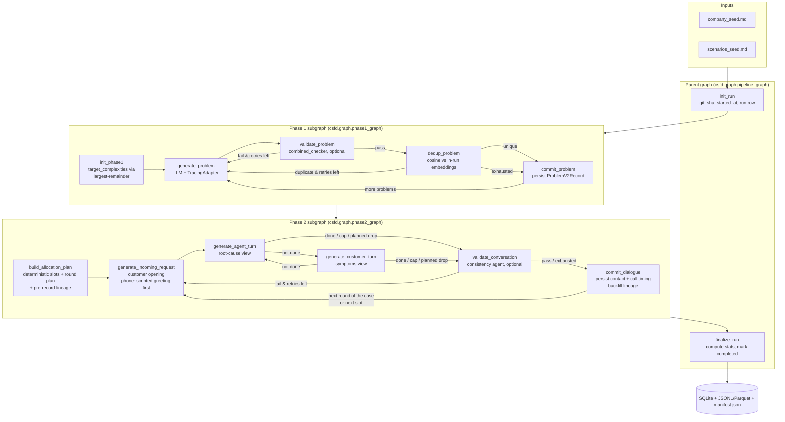

# csfd — Customer-Service Fake Data

> Synthetic, schema-grounded, multi-turn customer-service tickets for benchmarking RAG, classification, and agent-based pipelines.

## Business motivation

Customer-service AI teams need realistic evaluation data before they can trust an assistant, routing model, or RAG workflow in production. Real support tickets are hard to share because they contain customer data, are unevenly distributed across issue types, and rarely include clean lineage from root cause to resolution. `csfd` creates controlled synthetic datasets that preserve the useful structure of support work without exposing private records.

The generated data is intended for practical evaluation tasks:

- **RAG evaluation** — test whether a system can retrieve the right context and answer grounded customer questions.
- **Routing and triage** — benchmark classifiers across exact ticket-type, customer-tier, and tone distributions.
- **Agent workflow testing** — replay incoming requests and multi-turn resolutions against support agents.
- **Regression datasets** — pin a benchmark to config, prompt, model, git SHA, and run statistics so future changes are comparable.

## What the generator produces

Each run produces a benchmark-ready dataset with separate artifacts for causes, customer inputs, support outcomes, and auditability:

- **`problems`** — the Phase 1 Problem Database. Each row is a synthetic root cause with title, summary, background, category, complexity, and resolution hints. Use this as the ground-truth issue pool behind the generated tickets.
- **`incoming_requests`** — standalone customer messages created from the allocation plan. These are the inputs a classifier, RAG system, or support agent would receive at evaluation time.
- **`resolutions`** — full multi-turn support conversations for each incoming request. These provide expected handling behavior, turn counts, resolution status, and agent/customer dialogue for workflow regression tests.
- **`lineage`** — the join table that links each ticket slot to its originating problem, request, and resolution. This makes evaluation slices explainable: every benchmark example can be traced back to the root cause and configured distribution slot.
- **`agent_traces`** — one audit row per LLM call, including prompt version, model/provider metadata, latency, checker verdicts, and parent-child links between generation and validation. Use this to debug output quality and compare runs.
- **`manifest.json`** — export metadata and file checksums for the generated JSONL/Parquet artifacts. Use it to pin a dataset version in downstream benchmarks.
- **`transcripts/`** — the same conversations rendered as plain-text transcripts, one folder per case (`csfd export --format transcripts`). Depending on `tickets.channel` these are dated email threads or call transcripts with speaker labels, timestamps, and call metadata, ready to feed a pipeline that consumes call transcriptions. See [Conversation formats](#conversation-formats).

Together, these datasets support both online-style evaluation, where only `incoming_requests` are shown to a system under test, and offline analysis, where `problems`, `resolutions`, `lineage`, and traces explain why each example exists and how it was generated.

## What the generator consumes

Each run is driven by two kinds of inputs: **seed files** that describe the fictional domain, and **config files** that pin down how much data to make, in what proportions, and with which models. Together they fully determine a run — same seeds + same config + same `run_seed` reproduce the same allocation plan.

### Seed files (`seeds/`)

Markdown documents that ground generation in a concrete business. They are referenced from the generator prompts and are the only source of domain-specific content; swap them out to retarget the generator at a different company or industry without touching code.

- **`seeds/company_seed.md`** — the company profile. Identity, sector, products (e.g. the flagship CT-500 chiller), representative components, customer segments, and service organisation. This is what makes generated problems and resolutions sound like they belong to a real manufacturer rather than a generic SaaS.
- **`seeds/scenarios_seed.md`** — the customer-service case catalogue. A structured list of business cases (documentation requests, L1/L2/L3 troubleshooting, field-service escalations) with tags, escalation tier, as-is process, sample-data hints, and systems touched. The generator uses these as the templates that Phase 1 problems and Phase 2 resolutions are built against.

`csfd init` scaffolds both files; the shipped versions describe the fictional **CoolTherm Industrial Chillers** company used as the running example.

### Config files (`config/`)

YAML that controls the deterministic shape of the run — counts, proportions, retry budget, model choice, and validation toggles.

- **`config/default.yaml`** — the base config, always loaded. Top-level sections:
  - `pipeline` — `version`, `run_seed`, and the per-run budget (`max_tokens_per_run`, `max_usd_per_run`, `max_retries_per_artifact`).
  - `agents` — the two LLM buckets (`generator` and `combined_checker`) with `provider`, `model`, `temperature`, `max_tokens`, and `timeout_s`. Every node in the graph routes to one of these buckets.
  - `problem_database` — Phase 1 controls: `count` and `complexity_proportions` (simple / medium / complex), applied with largest-remainder rounding.
  - `tickets` — Phase 2 controls: `total`, `type_proportions`, `tier_proportions`, `tone_proportions_per_type`, `dialogue.turn_cap`, and `assignment_strategy` (`complexity_weighted` or `uniform`). Turn count is **emergent** — the two dialogue agents decide when the conversation is over — so there is no per-type turn target; `dialogue.turn_cap` (default 20) is only a hard safety ceiling that rarely binds. Conversation format: `channel` (`email`, the default, or `phone`; see [Conversation formats](#conversation-formats)), `phone.disfluency` (`none` / `light` / `moderate`), and `calendar` (the fixed start date, span, and business hours that seeded contact times are drawn from). `rounds` spreads a case over several related contacts (callbacks); see [Multi-call cases](#multi-call-cases-rounds).
  - `validation` — whether the combined checker runs after each generation and how its verdict gates retries.
  - `embedding` — opt-in Phase 1 dedup. When `enabled: true`, accepted candidates are embedded via an OpenAI-compatible endpoint (defaults to local Ollama at `http://localhost:11434/v1` with `embeddinggemma:300m`) and rejected if cosine similarity to any already-committed problem in the run meets or exceeds `threshold`. `dim` truncates the model's native vector (Matryoshka); `text_template` selects between `title_summary` and `title_summary_background`.
- **`config/profiles/*.yaml`** — overlays applied on top of `default.yaml` via `--profile <name>`. Shipped overlays cover model routing (`claude-only`, `claude-cli`, `local-only`, `mixed`) and a small `dev` overlay that shrinks problem/ticket counts for fast iteration.
- **`.env`** — credentials and endpoints (`ANTHROPIC_API_KEY`, `LOCAL_BASE_URL`, …) read at runtime. Not part of the deterministic snapshot.

The resolved config (default + active profile) is persisted as `runs.config_snapshot_json`, so any exported dataset can be traced back to the exact inputs that produced it.

## Goals

`csfd` focuses on three goals:

1. **Control** — produce exact counts for problem complexity, ticket type, customer tier, and tone.
2. **Reproducibility** — make allocation deterministic and persist lineage, config snapshots, prompt versions, and model metadata.
3. **Inspectability** — expose the generation pipeline as LangGraph graphs, SQLite tables, JSONL/Parquet exports, and trace rows.

`csfd generate` runs a **deterministic, proportion-based LangGraph pipeline**: you specify how many problems and how many tickets you want and the breakdown by ticket type / customer tier / tone, and the tool produces *exactly* those counts. The single parent graph composes two phase subgraphs:

1. **Phase 1 — Problem Database** — generate `problem_database.count` problems with target complexities driven by `complexity_proportions` (largest-remainder rounding). Each problem flows through a `generate_problem → validate_problem → commit_problem` retry sub-loop.
2. **Allocator** — `csfd.allocator.build_allocation_plan` produces a fully deterministic plan: every ticket slot's `(problem_id, ticket_type, customer_tier, customer_tone)` is chosen before any LLM call.
3. **Phase 2 — Resolution per slot** — for each slot, a turn-based dialogue between two information-asymmetric agents produces the conversation. A customer agent (which sees only the problem's symptoms, impact, and persona) opens with the standalone incoming request; a service agent (which sees the root cause, background, and resolution hint) replies. Turns alternate — one LLM call each — until whichever speaker just spoke flags the conversation done, or a hard `dialogue.turn_cap` is reached. A consistency agent then reviews the full transcript and may pass it, pass it with edits, or fail it (a fail re-rolls the whole conversation within the same retry budget as Phase 1). Conversation length is emergent: simple problems resolve in 2–3 turns, complex ones take more. This costs more LLM calls per slot than a single-shot generator — typically ~4–10 turn calls plus one consistency call.

Three output datasets per run: **`incoming_requests`** (denormalized customer requests), **`resolutions`** (multi-turn conversations), and **`lineage`** (problem → request → resolution traceability). Every LLM call also writes one row to **`agent_traces`** with `prompt_id`, `model_provider`, `model_id`, `latency_ms`, and (for checkers) `verdict` / `verdict_issues_json` — checker traces link to their generator via `parent_trace_id`.

## Quickstart

```bash
uv sync
cp .env.example .env             # populate ANTHROPIC_API_KEY or LOCAL_BASE_URL
csfd init                        # scaffolds seeds/, data/, .env.example
# edit seeds/company_seed.md and seeds/scenarios_seed.md
csfd db-migrate                  # creates runs.sqlite (applies all migrations)
csfd generate --seed 42 --problems 10 --tickets 100
```

The proportions, turn counts, and assignment strategy live in `config/default.yaml` under the `problem_database`, `tickets`, and `validation` sections. Use `--profile dev` for a small smoke run (`problem_database.count=3`, `tickets.total=6`).

`--channel` selects the conversation format (`email`, the default, or `phone`). To generate phone calls instead of email tickets, and get them as text transcripts:

```bash
csfd generate --channel phone --seed 42 --problems 5 --tickets 20   # prints the run id
csfd export <run_id> --format transcripts                           # data/exports/<run_id>/transcripts/
```

To make every case a series of related calls (the caller calls back until it is solved):

```bash
csfd generate --channel phone --rounds 3 --problems 5 --tickets 10  # 10 cases x 3 calls
csfd export <run_id> --format transcripts                           # case_*/call_01.txt … call_03.txt
```

## Architecture

The pipeline is a LangGraph parent graph composed of two phase subgraphs. The parent sequences `init_run` → Phase 1 subgraph → Phase 2 subgraph → `finalize_run`; each subgraph contains its own per-artifact retry sub-loop and outer iteration loop. All three graphs share a single `PipelineState` Pydantic model defined in `src/csfd/graph/pipeline_graph.py`.

### Parent graph

The parent graph owns run lifecycle and durability. It creates the `runs` row, captures provenance (`git_sha`, config snapshot, seed, pipeline version), executes Phase 1 and Phase 2 in order, computes final statistics, and marks the run completed. CLI execution uses the run ID as the LangGraph `thread_id`, so graph checkpoints and application rows refer to the same unit of work.

### Phase 1 graph — Problem Database

Phase 1 turns company/scenario seeds into a reusable Problem Database. It deterministically assigns target complexities, asks the generator to produce one problem at a time, validates each candidate with the combined checker, retries on failed verdicts, and persists accepted `ProblemV2Record` rows. Its output is not a ticket yet; it is the controlled pool of root causes that Phase 2 will allocate across ticket slots. After validation passes, accepted candidates are embedded and rejected if cosine similarity to any already-committed problem in the run exceeds `embedding.threshold`; rejections re-enter the same retry sub-loop with a synthesised `near_duplicate` verdict that surfaces the matched problem's title and summary to the next generation attempt.

### Phase 2 graph — Requests and resolutions

Phase 2 consumes the persisted Problem Database and the configured ticket proportions. It first builds the allocation plan, which fixes every slot's problem, ticket type, customer tier, and tone before generation starts, plus each slot's round plan (how many contacts the case takes and when). For each contact, it generates a standalone incoming customer request and a full turn-by-turn conversation, validates the result, persists `incoming_requests` and `resolutions`, and backfills `lineage` so every benchmark row can be traced back to its originating problem.



The parent graph is exposed to LangGraph Studio at `langgraph.json:pipeline` (pre-built at module import time in `src/csfd/graph/studio.py`). CLI runs use an async SQLite checkpointer (`csfd.graph.checkpointer.async_sqlite_checkpointer`) for durable execution — `thread_id=run_id`.

### Step by step: how the graph runs

A single `csfd generate` invocation walks the parent graph from top to bottom. Each numbered step below is what actually happens, in order, between you pressing enter and the export files landing on disk.

1. **Bootstrap the run.** The CLI loads `config/default.yaml` plus any `--profile` overlay, resolves the seed and counts, opens `runs.sqlite`, and hands a fresh `PipelineState` to the parent graph. The graph's `thread_id` is set to the new `run_id` so every checkpoint LangGraph writes is tied to the same unit of work as the application rows.

2. **`init_run` node.** The parent's first node inserts a row into the `runs` table and captures provenance up front: `git_sha` (from `git rev-parse HEAD`), `started_at`, the resolved config snapshot, the `pipeline.version`, and the seed. From this point on, any failure can still be traced back to an exact configuration.

3. **Enter the Phase 1 subgraph.** Control transfers to `init_phase1`, which uses **largest-remainder rounding** on `complexity_proportions` to produce an exact list of target complexities — e.g. `[easy, easy, medium, medium, medium, hard]`. The list length equals `problem_database.count`, so the Phase 1 loop knows exactly how many problems to make and which complexity each one must be.

4. **Generate one problem.** `generate_problem` pops the next target complexity, renders the problem-generator Jinja template (its `prompt_id` is the sha256-prefix hash of the template source), and calls the configured generator model through `TracingAdapter`. The adapter writes one row to `agent_traces` recording `prompt_id`, `model_provider`, `model_id`, `attempt`, and `latency_ms`.

5. **Validate the problem.** If validation is enabled, `validate_problem` runs the combined checker LLM against the candidate. The checker's trace row links back to the generator's via `parent_trace_id` and records a `verdict` plus `verdict_issues_json`.

6. **Retry sub-loop.** If the verdict is `fail` and retries remain, control returns to `generate_problem` and the generator tries again — same target complexity, fresh LLM call, fresh trace row. If retries are exhausted, the last candidate is accepted with a quality flag so the run never stalls.

6a. **Dedup the accepted candidate.** When `embedding.enabled` is true, `dedup_problem` embeds the candidate (title + summary by default) via Ollama's OpenAI-compatible `/v1/embeddings` endpoint and compares against the in-run cache of already-committed problem embeddings. If the highest cosine score meets or exceeds `embedding.threshold`, a synthetic `Verdict(checker="dedup_problem", passed=False, issues=[Issue(rule_violated="near_duplicate_of_committed_problem", ...)])` is written to `last_verdict`; the generator's next attempt sees the matched problem's title and summary in `prior_verdicts`. Retries share the validation budget. If retries are exhausted, the candidate is committed with `quality_flag = "warning:dedup_exhausted"`.

7. **Commit the problem.** `commit_problem` persists an accepted `ProblemV2Record` into the `problems` table.

8. **Outer Phase 1 loop.** If more target complexities remain in the list, the graph routes back to `generate_problem`; otherwise Phase 1 exits and the parent graph hands the now-populated Problem Database to Phase 2.

9. **Build the allocation plan.** Phase 2 starts with `build_allocation_plan`, which is the deterministic core of the system: before any Phase 2 LLM call, `csfd.allocator.build_allocation_plan` reads `tickets.total` plus the type / tier / tone proportions and produces the full list of slots. Each slot is a fixed tuple `(slot_index, problem_id, ticket_type, customer_tier, customer_tone, customer_name)`. The same seed and config always produce the same slot list. This node also pre-records `lineage` rows so each slot is traceable even before its request and resolution exist.

10. **Run the turn-based dialogue for a slot.** `generate_incoming_request` makes the customer's opening LLM call (symptoms + persona only) and seeds turn 1. Then `generate_agent_turn` and `generate_customer_turn` alternate — one LLM call each, each writing an `agent_traces` row — with the customer agent seeing only customer-observable fields and the service agent seeing only root-cause fields. The loop ends when whichever speaker just spoke flags `done`, or when `dialogue.turn_cap` is hit (committed with a `warning:turn_cap_hit` flag).

11. **Validate the conversation.** `validate_conversation` runs the consistency agent over the full transcript, with its own trace row linked via `parent_trace_id`. It returns pass, pass-with-edits (the transcript is rewritten in place and flagged `info:consistency_edited`), or fail.

12. **Retry sub-loop.** Fail + retries left → re-roll the whole conversation from `generate_incoming_request`. Retries exhausted → accept with a quality flag.

13. **Commit the dialogue.** `commit_dialogue` inserts the `incoming_requests` row and the `resolutions` row (with the full turn list, the derived `resolved` flag, and per-message timing: utterance offsets for calls, sent times for emails), then backfills the pre-recorded `lineage` row with their ids. For the first contact of a case, the benchmark "gold tuple" is now complete for this slot.

14. **Outer Phase 2 loop.** If the case has more rounds, route back to `generate_incoming_request` for the same slot with the committed contact added to the case history. Otherwise, if more slots remain in the allocation plan, move to the next slot; when none remain, Phase 2 exits.

15. **`finalize_run` node.** The parent graph aggregates end-of-run statistics — total problems, requests, resolutions, traces, plus type/tier/tone/complexity breakdowns and quality-flag distribution — writes `stats_json` and `completed_at` onto the `runs` row, and marks the run completed.

16. **Export (separate step).** `csfd export <run_id>` reads from SQLite and writes `problems`, `incoming_requests`, `resolutions`, `lineage`, and `agent_traces` to JSONL/Parquet under `data/exports/<run_id>/`, plus a `manifest.json` with SHA-256 checksums of every file.

Two invariants hold across the whole walk: every LLM call produces exactly one `agent_traces` row (so cost and quality are auditable per call), and Phase 2 never invents allocation decisions on the fly — the plan from step 9 fully determines what gets generated.

## Conversation formats

One switch selects how Phase 2 conversations look: `tickets.channel` in YAML, or `csfd generate --channel`.

| Value | Conversation | Transcript file |
|---|---|---|
| `email` (default) | Written support tickets: the customer's opening email (subject + body), then written replies, each dated | `email_NN.txt`, an email thread |
| `phone` | Spoken support calls: scripted greeting, verification, troubleshooting, closing; per-utterance timestamps | `call_NN.txt`, a call transcript |

A run uses one format; a mixed email and phone run is not supported yet. The dialogue loop, information asymmetry, consistency review, allocation plan, and [multi-contact cases](#multi-call-cases-rounds) are identical for both. Only the prompts and the recorded timing change. Nothing time-related is ever asked of the model. Each contact's `started_at` is a seeded weekday, business-hours slot inside `tickets.calendar`, and `resolutions` records `channel`, `agent_name`, `end_reason`, `started_at`, `ended_at`, and `duration_s`.

### Phone calls

- **Call flow.** Turn 1 is the agent's scripted greeting, picked by seed from a few call-center scripts (no LLM call). Turn 2 is the caller's opening. The `phone_agent_turn` prompt then steers the usual flow: verify who is calling and which machine (model, serial, site), clarify, troubleshoot one step at a time, agree the next step, and close. The agent cannot see the machine and has to ask. The call reason the caller gives is logged in `incoming_requests.subject`.
- **Speech, in moderation.** `tickets.phone.disfluency` (`--disfluency`) controls filler words, restarts, and cut-ins: `none`, `light` (default: occasional), or `moderate`. Callers get more disfluency than agents. The consistency checker is told to keep them rather than tidy the speech into prose.
- **Transcript tags.** The prompts allow only `[hold]` (at the start of an agent turn, back from a hold the caller agreed to), `[pause]`, `[inaudible]`, and a trailing `--` for a cut-off. They affect timing and rendering. The checker removes any other bracketed tag.
- **Timing.** At commit, `csfd.calls.estimate_turn_timings` derives per-utterance `start_s` / `end_s` from word counts (about 150 wpm), seeded response latencies, hold gaps (30–180 s), and pauses, and stores them in `turns_json`. `ended_at` / `duration_s` mark the end of the call.

### Email threads

- **Messages.** The customer's opening email carries the subject. Customer and agent then exchange written replies. For single-contact cases the email prompts render exactly as before this format existed.
- **Dates.** At commit, `csfd.calls.estimate_email_times` gives each message a seeded `sent_at` in `turns_json`: support replies after 5 minutes to 4 hours, customers after 3 minutes to 8 hours, both moved into business hours. `ended_at` is the last message's time. When another contact of the same case is planned, the thread is compressed to finish well before it starts. The compression is measured in working minutes, so every message stays inside business hours; the trade-off is that a heavily compressed thread finishes closer to the next contact than the drawn delays would have.
- **Rendering.** Each message is written with `From` / `To` / `Date` / `Subject` headers (`Re:` on replies), then the body, then a light one-line quote of the message it answers. Addresses use reserved `.example` domains. The support desk is named after the company in `seeds/company_seed.md`, which is recorded in `runs.config_snapshot_json`.

### Transcript export

`csfd export <run_id> --format transcripts` (or `--format all`) writes a text-first view grouped by case:

```text
data/exports/<run_id>/transcripts/
  cases.jsonl              # one line per case: metadata + utterances (start_s/end_s or sent_at)
  case_000001/
    case.json              # case metadata: problem_id, tier, tone, per-contact timing and outcome
    call_01.txt            # the transcript (email_01.txt on the email channel)
```

Each transcript file is a `key: value` header, a blank line, then the conversation. A call transcript has one line per utterance (`--no-timestamps` drops the `[HH:MM:SS]` prefixes). The two samples below are real output from small `claude_code_cli` runs with two contacts per case, each showing the second contact (the email bodies are shortened with `[…]`).

```text
CALL TRANSCRIPT
case_id: 841e40a2-…:000001
call: 2 of 2
channel: phone (inbound)
started_at: 2026-01-08T09:19:38+00:00
ended_at: 2026-01-08T09:23:49+00:00
duration: 00:04:11
since_previous_call: 17h 53m
caller: Customer-standard-0001 (standard tier)
agent: Agent-l1-0001 (L1 Support)

[00:00:00] AGENT: Thank you for calling CoolTherm Industrial Chillers support, this is Agent-l1-0001. How can I help you today?
[00:00:07] CUSTOMER: Hi, this is Customer-standard-0001 calling back about the temperature control issue on our CT-5000. I spoke with someone yesterday who said Level 2 would reach out within a few hours to tune the PID settings, but I haven't heard from anyone yet and the chiller's still cycling every couple minutes.
[00:00:28] AGENT: I apologize for that delay - you definitely should have heard from Level 2 by now. Let me check on the status of your escalation right away and make sure we get this prioritized. Can you hold for just a moment while I reach out to the team?
[00:00:48] CUSTOMER: Sure, no problem — I can hold.
[00:00:51] (caller on hold, 00:02:48)
[00:03:40] AGENT: Thanks for holding. I've contacted the Level 2 team and they're going to call you back within the next hour to remotely tune those PID parameters. I've flagged this as high priority since you've been waiting since yesterday. You should see a call from a CoolTherm technical number - they'll be able to access your unit remotely and get that temperature control stabilized. Is there anything else I can help with while I have you on the line?
```

An email thread has one block per message:

```text
EMAIL THREAD
case_id: df8e0bab-…:000001
thread: 2 of 2
channel: email
started_at: 2026-01-08T09:19:38+00:00
ended_at: 2026-01-08T09:25:07+00:00
since_previous_thread: 17h 43m
subject: Re: Chiller temperature cycling - completed requested checks
customer: Customer-standard-0001 (standard tier)
agent: Agent-l1-0001 (L1 Support)

From: Customer-standard-0001 <customer-standard-0001@customer.example>
To: CoolTherm Industrial Chillers Support <support@cooltherm-industrial-chillers.example>
Date: Thu, 08 Jan 2026 09:19:38 +0000
Subject: Re: Chiller temperature cycling - completed requested checks

I completed the checks you requested yesterday. The refrigerant sight glass shows no bubbles during operation, and I didn't find any obvious leaks at the service ports. I've been recording outlet temperatures from the evaporator over the […]

----------------------------------------
From: Agent-l1-0001, CoolTherm Industrial Chillers Support <support@cooltherm-industrial-chillers.example>
To: Customer-standard-0001 <customer-standard-0001@customer.example>
Date: Thu, 08 Jan 2026 09:25:07 +0000
Subject: Re: Chiller temperature cycling - completed requested checks

Thank you for completing those checks. The clear sight glass is good news, but the persistent cycling and overshoot behavior, especially after your recent maintenance, points to a thermostatic expansion valve issue or a marginal […]

On Thu, 08 Jan 2026 at 09:19, Customer-standard-0001 wrote:
> I completed the checks you requested yesterday. The refrigerant sight glass shows no bubbles during…
```

A case with several contacts gets `call_01.txt`, `call_02.txt`, … (or `email_01.txt`, …) in the same folder. Each later file's header adds `since_previous_call:` / `since_previous_thread:`. See [Multi-call cases](#multi-call-cases-rounds).

The transcript folder deliberately holds no ground truth. Join `case.json`'s `problem_id` against `problems.jsonl` to score a downstream report against the root cause and resolution hints.

## Multi-call cases (rounds)

A downstream consumer often needs *several* contacts about the same problem, such as a caller who hangs up, tries something, and calls back. `tickets.rounds` models this without a second pipeline. Each allocation slot is a **case** (one `lineage` row, one `ticket_uid`), and a case can span N **rounds** (contacts). All rounds of a case share the problem, customer, tier, tone, and `case_uid`.

```yaml
tickets:
  total: 20                  # cases
  rounds:
    proportions: {1: 0.5, 2: 0.3, 3: 0.2}   # 10 x 1 call, 6 x 2 calls, 4 x 3 calls = 34 calls
    callback_reasons: {follow_up: 0.7, dropped: 0.3}
    gap_hours: [2, 72]
```

`--rounds N` is the shortcut for `proportions: {N: 1.0}`. The default `{1: 1.0}` is the original one-contact-per-case behaviour, with identical prompts.

How a case plays out:

- **Planned up front, deterministically.** `csfd.rounds` assigns contact counts with largest-remainder rounding and a seeded shuffle, then plans each contact before any LLM call:
  - its start time: a log-uniform gap from `gap_hours`, moved into business hours if it falls outside them;
  - how each non-final contact ends.
- **Non-final rounds end without closing the case:**
  - `follow_up`: both speakers work toward a next step that needs time (a test the customer runs, a part, a technician visit) and end with `done_reason="follow_up"`.
  - `dropped`: the contact cuts off after a seeded number of turns. This reuses the turn-cap route with a lower per-contact cap and is recorded as `end_reason="dropped"` with no warning. A call renders it as `(call disconnected)`; on the email channel the thread just goes quiet, rendered as `(no further reply in this thread)`.
- **The final round** is told to bring the case to a conclusion.
- **Continuity.** From round 2 on, both the customer and the agent prompts get the earlier contacts' transcripts: the customer remembers them, and the agent reads them as case history. The prompts also state the time since the last contact and how each earlier contact ended — an agreed next step, a dropped line, a contact that ran out of turns, an unhappy hang-up, or any other ending that did not fix the problem — so a later round never claims a next step that was never agreed. The caller refers back to the earlier call and keeps details such as the serial number. The agent picks up where the case left off. The consistency checker sees the same history and checks continuity, plus the planned ending (a follow-up round must not declare the problem fixed).
- **Retries** re-roll only the current round. Rounds already committed are never regenerated.

Storage and consumption:

- Every contact is one `incoming_requests` row and one `resolutions` row, with `case_uid` (= `lineage.ticket_uid`) and `round_index`. `resolutions` also carries `round_count`. Round 1 keeps the familiar `<ticket_uid>:req/:res` uids, and later rounds add `:rNN`. Only the final contact of a case can be stored `resolved = true`; every earlier contact is committed unresolved whatever the dialogue claimed, so the flag never contradicts the fact that the case continues.
- `lineage` stays one row per case and links to **round 1**. The gold-tuple join below therefore yields each case's first contact. Join `resolutions.case_uid = lineage.ticket_uid` for all of them.
- `runs.stats_json` counts types, tiers, and tones per case, and adds `contacts_per_case` and `channel_counts`.
- The transcript export groups a case's contacts into one folder (`call_01.txt` … `call_NN.txt`). `case.json` lists each contact's timing, `gap_since_previous_s`, `end_reason`, `outcome`, and `resolved`. Feed a whole folder to a consumer that builds one report from many calls.

```sql
-- every contact of every case, in order
SELECT l.ticket_uid AS case_uid, res.round_index, res.round_count, res.started_at,
       res.end_reason, res.resolved, res.turns_json
FROM lineage l
JOIN resolutions res ON res.case_uid = l.ticket_uid
WHERE l.run_id = :run_id
ORDER BY l.slot_index, res.round_index;
```

## LangGraph Studio

```bash
uv sync
csfd db-migrate                       # create runs.sqlite (prerequisite)
langgraph dev                         # start Studio
```

Studio opens at `http://localhost:8123` and shows the parent graph with both phase subgraphs nested. You get per-node input/output inspection, time-travel debugging, and manual state edits.

The persistence layer inside graph nodes is `aiosqlite`-backed (see `src/csfd/storage/db_async.py`), so [`blockbuster`](https://github.com/cbornet/blockbuster)'s sync-I/O trap is respected without any `--allow-blocking` flag. The sync `Database` is still used for read paths outside the graph (CLI inspect/export, tests, migrations).

## Reproducibility

**Reproducibility contract.** Given identical config, `run_seed`, and a fresh database, `csfd` reproduces the **allocation plan and slot-by-slot lineage** plus all provenance stamps — but **not generated text**. Agent temperatures are nonzero and provider models drift, so problem and resolution *content* is never bitwise-reproducible across runs. What is reproducible is the deterministic skeleton: which problem index, ticket type, tier, and tone occupy each slot, and the recorded config/prompt/model/git provenance that lets you trace any example back to its inputs.

Every run stamps:
- `run_seed` — drives the `uniform` allocator's tiebreaker shuffle; the `complexity_weighted` strategy splits each ticket type's slots across its non-empty preferred complexity buckets via fixed rank weights, so it is reproducible without a seed
- `pipeline.version` — semver bumped on schema-breaking changes
- `git_sha` — captured at run start via `git rev-parse HEAD` (NULL outside a git repo)
- `config_snapshot_json` — the resolved `problem_database` + `tickets` + `validation` + `embedding` sections, plus the seed company's name
- `stats_json` — end-of-run counts (problems, requests, resolutions, traces) plus type/tier/tone/complexity breakdowns and quality-flag distribution
- `prompt_id` — sha256-prefix hash of the **prompt template source** (the Jinja file contents, not the per-call rendered prompt — so the id is a stable handle that changes only when a template is edited), recorded on every row in `agent_traces.prompt_id`. Each LLM call also records `model_provider`, `model_id`, `attempt`, `latency_ms`, and (for checker calls) `verdict` and `verdict_issues_json`. Token usage (`tokens_in`, `tokens_out`) is populated from LangChain's `usage_metadata` for any provider that emits it (Anthropic, OpenAI-compatible); `FakeChatModel` and the Claude CLI wrapper leave them NULL.

Determinism guarantee: given identical config and seed, two runs against fresh databases produce slot-by-slot identical lineage rows `(slot_index, problem_index_within_run, ticket_type, customer_tier, customer_tone, customer_name)`. Run-scoped UUIDs (`run_id` and the prefix of `problem_id` / `ticket_uid`) of course differ — the deterministic part is the per-run index suffix. The only source of additional variation are the LLM responses themselves.

Pin an exported benchmark to its provenance via `runs.config_snapshot_json` and the per-row `prompt_id` / `model_id` columns in `agent_traces`.

Contact metadata follows the same rule. Several values come from `(run_seed, slot_index)` plus `tickets.calendar` / `tickets.rounds`, never the wall clock, so they reproduce exactly:

- the number of contacts per case;
- each contact's `started_at`, agent name, and planned ending (including where a dropped call cuts off);
- the phone channel's scripted greeting. Per-utterance timestamps, `ended_at`, and `duration_s` are derived deterministically from the generated text, so they vary only when the text does.

Embedding scores depend on the Ollama model/version and platform: a candidate whose cosine is very close to `embedding.threshold` can flip across Ollama upgrades. The deterministic allocation guarantee (slot-by-slot lineage) is unchanged.

Known limitation — model revisions: `agent_traces.model_id` records the model *name* (e.g. `claude-sonnet-4-6`), not the provider's underlying snapshot/revision. A provider-side model update served under the same name changes outputs without changing the recorded provenance. For stricter provenance, pin an explicit model snapshot identifier in your profile config.

## Benchmark consumption

The "gold tuple" join over `problems`, `incoming_requests`, `resolutions`, and `lineage` (for multi-call cases this is the first contact; see [Multi-call cases](#multi-call-cases-rounds) for the per-contact join):

```sql
SELECT p.id AS problem_id,
       p.title, p.summary, p.complexity, p.category,
       l.slot_index, l.customer_tier, l.customer_tone,
       ir.request_uid, ir.subject, ir.body,
       res.resolution_uid, res.turns_json, res.turn_count, res.resolved
FROM lineage l
JOIN problems p           ON p.id = l.problem_id
JOIN incoming_requests ir ON ir.id = l.incoming_request_id
JOIN resolutions res      ON res.id = l.resolution_id
WHERE l.run_id = :run_id
ORDER BY l.slot_index;
```

Exports under `data/exports/<run_id>/`:
- `problems.jsonl(.parquet)` — Problem Database rows
- `incoming_requests.jsonl(.parquet)` — denormalized customer requests
- `resolutions.jsonl(.parquet)` — multi-turn conversations
- `lineage.jsonl(.parquet)` — problem → request → resolution traceability
- `agent_traces.jsonl(.parquet)` — every LLM call (`prompt_id`, `model_provider`, `model_id`, `attempt`, `latency_ms`, `verdict`)
- `problem_embeddings.jsonl(.parquet)` — per-problem dedup vector (`problem_id`, `model`, `dim`, deserialized `vector: list[float]`)
- `manifest.json` — SHA-256 of every JSONL file
- `transcripts/` — plain-text transcripts grouped by case, plus `case.json` / `cases.jsonl` (only with `--format transcripts` or `--format all`)

## Configuration profiles

Pre-built overlays under `config/profiles/`:
- `claude-only.yaml` — every agent on Anthropic (default; empty overlay)
- `claude-cli.yaml` — every agent via the local `claude` CLI (subscription auth, no API key). Requires the `claude` binary on `$PATH` and a logged-in session.
- `local-only.yaml` — every agent on Ollama (recommend ≥70B for JSON-schema decoding)
- `mixed.yaml` — Generator on Claude, checker on local Llama
- `dev.yaml` — small problem/ticket counts for fast iteration

```bash
csfd generate --profile mixed
```

Embedding-based dedup is enabled in `local-only` and `mixed` (which run against a local Ollama instance). `claude-only`, `claude-cli`, and `dev` leave it disabled because Anthropic and the Claude CLI do not expose embedding endpoints.

## CLI

| Command | Purpose |
|---|---|
| `csfd init` | scaffold `seeds/`, `data/`, `.env.example` |
| `csfd db-migrate` | apply SQL migrations to `runs.sqlite` |
| `csfd generate --seed N --problems M --tickets T` | run the deterministic LangGraph pipeline |
| `csfd generate --channel phone [--disfluency none\|light\|moderate]` | generate phone-call transcripts instead of email tickets |
| `csfd generate --rounds N` | make every case N related contacts (callbacks); mixes go in `tickets.rounds.proportions` |
| `csfd export RUN_ID --format jsonl\|parquet\|both\|transcripts\|all [--no-timestamps]` | dump to `data/exports/<run_id>/` (`both` = JSONL + Parquet; `all` adds transcripts) |
| `csfd inspect RUN_ID` | print summary stats |
| `csfd render-graphs` | regenerate `docs/diagrams/*.mmd` |

All commands accept `--profile <name>` to select a YAML overlay.

## Tests

```bash
uv run pytest -q      # unit + integration; FakeChatModel, no API spend
uv run mypy src tests # strict
uv run ruff check src tests
```

`.no-mistakes.yaml` declares these same lint/test commands for the no-mistakes gate, so its pipeline runs the exact commands above instead of improvising.

Live LLM tests are gated behind `-m live_llm`. The retry sub-loop (generator → checker fail → re-generate → checker pass → commit) is covered end-to-end by `tests/integration/test_pipeline_retry.py`, which asserts that the retry counter advances, each checker trace links to its same-attempt generator via `parent_trace_id`, and the accepted record has no `warning:retries_exhausted` quality flag.

## Planned improvements

Concrete next steps that would meaningfully raise the quality, throughput, or realism of the generated datasets. Each is scoped so it can land as an isolated PR without disturbing the determinism guarantees above.

1. **Prompt optimization.** Current agent prompts in the repository are simplistic, mostly used for testing purposes only.

2. **Add creativity / noise agents to diversify generation.** Right now every problem and every resolution is produced by a single generator prompt against the same seed material, which biases output toward the model's mode and produces tickets that feel stylistically homogeneous. A lightweight "noise" agent inserted before the generator — varying customer voice, urgency, partial information, typos, regional phrasing, or back-and-forth ambiguity per slot — would yield datasets that better stress-test routing, RAG retrieval, and agent handling of messy real-world inputs. Determinism is preserved by deriving the noise agent's choices from `(run_seed, slot_index)`.

3. **Richer call realism.** The phone channel is one channel per run, and each call has a single agent. Natural next steps:
   - a `channel_proportions` mix of email and phone within one run;
   - warm transfers inside a call (a second agent speaker, e.g. L1 to L2);
   - a callback picked up by a different agent (today every round of a case is answered by the same one);
   - escalating the ticket tier between rounds of a case;
   - an optional, seeded ASR-noise pass (substitutions and deletions) on the exported transcripts, to stress downstream consumers.

## License

[Apache-2.0](LICENSE).
