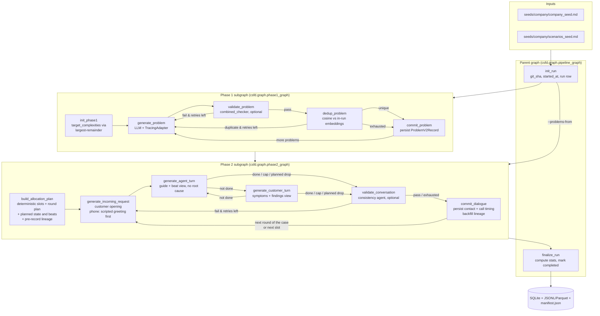

# csfd — Customer-Service Fake Data

> Synthetic, schema-grounded, multi-turn customer-service tickets for benchmarking RAG, classification, and agent-based pipelines.

## Business motivation

Customer-service AI teams need realistic evaluation data before they can trust an assistant, routing model, or RAG workflow in production. Real support tickets are hard to share because they contain customer data, are unevenly distributed across issue types, and rarely include clean lineage from root cause to resolution. `csfd` creates controlled synthetic datasets that preserve the useful structure of support work without exposing private records.

The generated data is intended for practical evaluation tasks:

- **RAG evaluation** — test whether a system can retrieve the right context and answer grounded customer questions.
- **Routing and triage** — benchmark classifiers across exact ticket-type, customer-tier, and tone distributions.
- **Agent workflow testing** — replay incoming requests and multi-turn resolutions against support agents.
- **Regression datasets** — pin a benchmark to config, prompt, model, git SHA, and run statistics so future changes are comparable.

## What the generator produces

Each run produces a benchmark-ready dataset with separate artifacts for causes, customer inputs, support outcomes, and auditability:

- **`problems`** — the Phase 1 Problem Database. Each row is a synthetic root cause with title, summary, background, symptoms, category, complexity, resolution hints, a canonical **diagnosis plan** (candidate causes, ordered checks with what the customer finds, resolution, verification, prevention) and the **viable outcomes** a case about it can end in. Use this as the ground-truth issue pool behind the generated tickets; see [Ground truth and honest outcomes](#ground-truth-and-honest-outcomes).
- **`incoming_requests`** — standalone customer messages created from the allocation plan. These are the inputs a classifier, RAG system, or support agent would receive at evaluation time.
- **`resolutions`** — full multi-turn support conversations for each incoming request. These provide expected handling behavior, turn counts, and agent/customer dialogue, plus an honest outcome per contact: the `problem_state` it left the problem in, its `contact_ending`, and the `commitments` made, each next to what was planned. `resolved` is derived: true only when the problem is fixed.
- **`lineage`** — the join table that links each ticket slot to its originating problem, request, and resolution, plus the case's seeded facts and its plan (the planned problem state and, per contact, the end mode and diagnosis beat). This makes evaluation slices explainable: every benchmark example can be traced back to the root cause and configured distribution slot.
- **`agent_traces`** — one audit row per LLM call, including prompt version, model/provider metadata, latency, checker verdicts, and parent-child links between generation and validation. Use this to debug output quality and compare runs.
- **`manifest.json`** — export metadata and file checksums for the generated JSONL/Parquet artifacts. Use it to pin a dataset version in downstream benchmarks.
- **`transcripts/`** — the same conversations rendered as plain-text transcripts, one folder per case (`csfd export --format transcripts`). Depending on `tickets.channel` these are dated email threads or call transcripts with speaker labels, timestamps, and call metadata, ready to feed a pipeline that consumes call transcriptions. See [Conversation formats](#conversation-formats).

Together, these datasets support both online-style evaluation, where only `incoming_requests` are shown to a system under test, and offline analysis, where `problems`, `resolutions`, `lineage`, and traces explain why each example exists and how it was generated.

## What the generator consumes

Each run is driven by two kinds of inputs: **seed files** that describe the fictional domain, and **config files** that pin down how much data to make, in what proportions, and with which models. Together they fully determine a run — same seeds + same config + same `run_seed` reproduce the same allocation plan.

### Seed files (`seeds/<company>/`)

Markdown documents that ground generation in a concrete business. They are referenced from the generator prompts and are the only source of domain-specific content; add a folder to retarget the generator at a different company or industry without touching code. Each company is one folder under `seeds/`, selected with `seeds.company` in YAML or `--company` on `csfd generate` (`--company-seed` / `--scenarios-seed` still take explicit file paths):

- **`seeds/<company>/company_seed.md`** — the company profile. Identity, sector, products, what typically goes wrong, customer segments, and service organisation. This is what makes generated problems and resolutions sound like they belong to a real manufacturer rather than a generic SaaS. Its structured `## Case facts` section (an `### Assets` table of `Model | Description | Serial format`, plus `### Caller roles` and `### Site locales` bullet lists) is what each case's facts are drawn from — see [Case facts](#case-facts). Serial formats use `#` for a digit and `?` for an upper-case letter. Model names are shaped like `CF-600` (letters, a separator, at least three digits) so the identifier check can recognise the family and catch invented variants. A seed without the section still works, but its cases get no machine or caller role. Phase 1 also receives the asset table as the product catalogue.
- **`seeds/<company>/scenarios_seed.md`** — the customer-service scenario catalogue. One `## Category — Title` section per scenario (documentation requests, known troubleshooting patterns, L2 remote diagnosis, field-service escalations) with the tier, the customer's opening request, the agent's first move, what goes wrong today, and sample-data hints. Phase 1 builds its problems against these.

Two fictional companies ship, both invented (no real company, product or trademark names):

| `--company` | Company | Domain | Machines in the case-facts catalogue |
|---|---|---|---|
| `kalvora` (default) | **Kalvora Dental** | Dental laboratory and practice equipment plus restorative materials | CF-600 firing furnace, CP-800 press furnace, SX-1500 sintering furnace, MV-450 / MV-650 milling units, LQ-220 curing light |
| `norrholt` | **Norrholt Glass Machinery** | Glass-container (bottle and jar) forming | FX-608 / FX-612 IS forming machines, GF-350 gob feeder, TC-400 forming controls, VQ-220 ware inspection |

`csfd init` scaffolds a stub company at `seeds/my_company/` (use it with `--company my_company`). The seed slug is recorded in `runs.config_snapshot_json` under `company.seed`.

### Config files (`config/`)

YAML that controls the deterministic shape of the run — counts, proportions, retry budget, model choice, and validation toggles.

- **`config/default.yaml`** — the base config, always loaded. Top-level sections:
  - `seeds` — `dir` and `company`: which `seeds/<company>/` folder the run uses (CLI: `--seeds-dir`, `--company`).
  - `pipeline` — `version`, `run_seed`, and the per-run budget (`max_tokens_per_run`, `max_usd_per_run`, `max_retries_per_artifact`).
  - `agents` — the two LLM buckets (`generator` and `combined_checker`) with `provider`, `model`, `temperature`, `max_tokens`, and `timeout_s`. Every node in the graph routes to one of these buckets.
  - `problem_database` — Phase 1 controls: `count` and `complexity_proportions` (simple / medium / complex), applied with largest-remainder rounding.
  - `tickets` — Phase 2 controls: `total`, `type_proportions`, `tier_proportions`, `tone_proportions_per_type`, `dialogue.turn_cap`, and `assignment_strategy` (`complexity_weighted` or `uniform`). Turn count is **emergent** — the two dialogue agents decide when the conversation is over — so there is no per-type turn target; `dialogue.turn_cap` (default 20) is only a hard safety ceiling that rarely binds. Conversation format: `channel` (`email`, the default, or `phone`; see [Conversation formats](#conversation-formats)), `phone.disfluency` (`none` / `light` / `moderate`), and `calendar` (the fixed start date, span, and business hours that seeded contact times are drawn from). `rounds` spreads a case over several related contacts (callbacks); see [Multi-call cases](#multi-call-cases-rounds).
  - `validation` — whether the combined checker runs after each generation and how its verdict gates retries.
  - `embedding` — opt-in Phase 1 dedup. When `enabled: true`, accepted candidates are embedded via an OpenAI-compatible endpoint (defaults to local Ollama at `http://localhost:11434/v1` with `embeddinggemma:300m`) and rejected if cosine similarity to any already-committed problem in the run meets or exceeds `threshold`. `dim` truncates the model's native vector (Matryoshka); `text_template` selects between `title_summary` and `title_summary_background`.
- **`config/profiles/*.yaml`** — overlays applied on top of `default.yaml` via `--profile <name>`. Shipped overlays cover model routing (`claude-only`, `claude-cli`, `codex-cli`, `local-only`, `mixed`) and a small `dev` overlay that shrinks problem/ticket counts for fast iteration.
- **`.env`** — credentials and endpoints (`ANTHROPIC_API_KEY`, `LOCAL_BASE_URL`, …) read at runtime. Not part of the deterministic snapshot.

The resolved config (default + active profile) is persisted as `runs.config_snapshot_json`, so any exported dataset can be traced back to the exact inputs that produced it.

## Goals

`csfd` focuses on three goals:

1. **Control** — produce exact counts for problem complexity, ticket type, customer tier, and tone.
2. **Reproducibility** — make allocation deterministic and persist lineage, config snapshots, prompt versions, and model metadata.
3. **Inspectability** — expose the generation pipeline as LangGraph graphs, SQLite tables, JSONL/Parquet exports, and trace rows.

`csfd generate` runs a **deterministic, proportion-based LangGraph pipeline**: you specify how many problems and how many tickets you want and the breakdown by ticket type / customer tier / tone, and the tool produces *exactly* those counts. The single parent graph composes two phase subgraphs:

1. **Phase 1 — Problem Database** — generate `problem_database.count` problems with target complexities driven by `complexity_proportions` (largest-remainder rounding). Each problem flows through a `generate_problem → validate_problem → commit_problem` retry sub-loop.
2. **Allocator** — `csfd.allocator.build_allocation_plan` produces a fully deterministic plan: every ticket slot's `(problem_id, ticket_type, customer_tier, customer_tone)` is chosen before any LLM call.
3. **Phase 2 — Resolution per slot** — for each slot, a turn-based dialogue between two information-asymmetric agents produces the conversation. A customer agent (which sees only the problem's symptoms, impact, and persona, the [case facts](#case-facts) a customer knows, and what they find when asked to run each diagnostic check) opens with the standalone incoming request; a service agent replies. The service agent is **not told the root cause**: it gets a troubleshooting guide built from the problem's diagnosis plan (candidate causes, checks without results) plus the case facts a CRM shows, and reaches the cause through the customer's answers, following the contact's planned beat. Turns alternate — one LLM call each — until whichever speaker just spoke flags the conversation done, or a hard `dialogue.turn_cap` is reached. A consistency agent then reviews the full transcript and may pass it, pass it with edits, or fail it (a fail re-rolls the whole conversation within the same retry budget as Phase 1). Conversation length is emergent: simple problems resolve in 2–3 turns, complex ones take more. This costs more LLM calls per slot than a single-shot generator — typically ~4–10 turn calls plus one consistency call.

Three output datasets per run: **`incoming_requests`** (denormalized customer requests), **`resolutions`** (multi-turn conversations), and **`lineage`** (problem → request → resolution traceability). Every LLM call also writes one row to **`agent_traces`** with `prompt_id`, `model_provider`, `model_id`, `latency_ms`, and (for checkers) `verdict` / `verdict_issues_json` — checker traces link to their generator via `parent_trace_id`.

## Quickstart

```bash
uv sync
cp .env.example .env             # populate ANTHROPIC_API_KEY or LOCAL_BASE_URL
csfd init                        # scaffolds seeds/my_company/, data/, .env.example
# use a shipped company (--company kalvora | norrholt) or edit seeds/my_company/*.md
csfd db-migrate                  # creates runs.sqlite (idempotent schema create)
csfd generate --seed 42 --problems 10 --tickets 100                     # default company: kalvora
csfd generate --company norrholt --seed 42 --problems 10 --tickets 100  # the glass-machinery seed
```

The proportions, turn counts, and assignment strategy live in `config/default.yaml` under the `problem_database`, `tickets`, and `validation` sections. Use `--profile dev` for a small smoke run (`problem_database.count=3`, `tickets.total=6`).

`--channel` selects the conversation format (`email`, the default, or `phone`). To generate phone calls instead of email tickets, and get them as text transcripts:

```bash
csfd generate --channel phone --seed 42 --problems 5 --tickets 20   # prints the run id
csfd export <run_id> --format transcripts                           # data/exports/<run_id>/transcripts/
```

To make every case a series of related calls (the caller calls back until it is solved):

```bash
csfd generate --channel phone --rounds 3 --problems 5 --tickets 10  # 10 cases x 3 calls
csfd export <run_id> --format transcripts                           # case_*/call_01.txt … call_03.txt
```

## Walkthrough: generating each format

The only thing that changes between formats is the `--channel` (and, for phone, `--disfluency`) flag on `csfd generate`; every other command is the same. The two implemented channels are `email` (written tickets) and `phone` (call transcripts) — see [Conversation formats](#conversation-formats) for what each looks like. `csfd generate` calls a real LLM (per `config/default.yaml`'s `agents` section, or a `--profile` override), so `.env` needs a working `ANTHROPIC_API_KEY`, `LOCAL_BASE_URL`, or a configured `claude_code_cli`/`codex_cli` agent before any of the walkthroughs below will actually generate data.

### 0. One-time setup

```bash
uv sync
cp .env.example .env             # then fill in ANTHROPIC_API_KEY or LOCAL_BASE_URL
csfd init                        # scaffolds seeds/my_company/{company,scenarios}_seed.md, data/, .env.example
csfd db-migrate                  # creates data/runs.sqlite if missing (idempotent — safe to re-run)
```

`csfd init` and `csfd db-migrate` never touch the network. `db-migrate` can be re-run against the same file at any point (before or after `generate`) without side effects — it only creates tables/indexes that don't already exist.

### 1. Email tickets (default channel)

```bash
csfd generate --seed 42 --problems 5 --tickets 20                  # channel defaults to "email"; prints the run id
csfd export <run_id> --format transcripts                          # writes data/exports/<run_id>/transcripts/
```

Output: `data/exports/<run_id>/transcripts/cases.jsonl` (one line per case) plus one `case_NNNNNN/` folder per case, each with `case.json` (case metadata) and `email_01.txt` (the rendered thread — `email_02.txt`, … for cases with more than one round).

### 2. Phone calls

```bash
csfd generate --channel phone --seed 42 --problems 5 --tickets 20        # spoken calls instead of written tickets
csfd export <run_id> --format transcripts                                # writes data/exports/<run_id>/transcripts/
```

Output layout is identical to email, except each contact file is `call_01.txt` (per-utterance `[HH:MM:SS]` timestamps; pass `--no-timestamps` on `export` to drop them). Add `--disfluency none|light|moderate` to `generate` to control caller filler/restarts (default `light`).

### 3. Multi-contact cases (callbacks)

Add `--rounds N` to either channel to make every case N related contacts instead of one (see [Multi-call cases](#multi-call-cases-rounds) for how non-final rounds end and what changes in the prompts):

```bash
csfd generate --channel phone --rounds 3 --seed 42 --problems 5 --tickets 10   # 10 cases x 3 calls = 30 contacts
csfd export <run_id> --format transcripts
```

Output: the same `case_NNNNNN/` folders, now each holding `call_01.txt` … `call_03.txt` (or `email_01.txt` … for the email channel) in contact order, plus `case.json`'s `contacts` list with per-contact timing and `end_reason`.

### 4. Every artifact, not just transcripts

`--format transcripts` only exports the text view. For the underlying tables:

```bash
csfd export <run_id> --format jsonl     # data/exports/<run_id>/{problems,incoming_requests,resolutions,lineage,agent_traces,problem_embeddings}.jsonl
csfd export <run_id> --format parquet   # same tables as .parquet
csfd export <run_id> --format both      # jsonl + parquet
csfd export <run_id> --format all       # jsonl + parquet + transcripts
csfd inspect <run_id>                   # prints per-artifact row counts for a quick sanity check
```

Any `export` that includes `jsonl` (`jsonl`, `both`, or `all`) also writes `data/exports/<run_id>/manifest.json` (file checksums, for pinning a dataset version); `parquet`- or `transcripts`-only exports do not.

## Architecture

The pipeline is a LangGraph parent graph composed of two phase subgraphs. The parent sequences `init_run` → Phase 1 subgraph → Phase 2 subgraph → `finalize_run`; each subgraph contains its own per-artifact retry sub-loop and outer iteration loop. All three graphs share a single `PipelineState` Pydantic model defined in `src/csfd/graph/pipeline_graph.py`.

### Parent graph

The parent graph owns run lifecycle and durability. It creates the `runs` row, captures provenance (`git_sha`, config snapshot, seed, pipeline version), executes Phase 1 and Phase 2 in order, computes final statistics, and marks the run completed. CLI execution uses the run ID as the LangGraph `thread_id`, so graph checkpoints and application rows refer to the same unit of work.

### Phase 1 graph — Problem Database

Phase 1 turns company/scenario seeds into a reusable Problem Database. It deterministically assigns target complexities, asks the generator to produce one problem at a time (including its diagnosis plan and viable outcomes, which the checker validates with the `diagnosis_plan_invalid` and `viable_outcomes_invalid` rules), validates each candidate with the combined checker, retries on failed verdicts, and persists accepted `ProblemV2Record` rows. Its output is not a ticket yet; it is the controlled pool of root causes that Phase 2 will allocate across ticket slots. After validation passes, accepted candidates are embedded and rejected if cosine similarity to any already-committed problem in the run exceeds `embedding.threshold`; rejections re-enter the same retry sub-loop with a synthesised `near_duplicate` verdict that surfaces the matched problem's title and summary to the next generation attempt.

### Phase 2 graph — Requests and resolutions

Phase 2 consumes the persisted Problem Database and the configured ticket proportions. It first builds the allocation plan, which fixes every slot's problem, ticket type, customer tier, and tone before generation starts, plus each slot's round plan (how many contacts the case takes and when), its planned problem state, and each contact's diagnosis beat. For each contact, it generates a standalone incoming customer request and a full turn-by-turn conversation, validates the result, persists `incoming_requests` and `resolutions`, and backfills `lineage` so every benchmark row can be traced back to its originating problem.


```mermaid
flowchart TB
    subgraph Seeds["Inputs"]
        C[seeds/company/company_seed.md]
        S[seeds/company/scenarios_seed.md]
    end
    subgraph PARENT["Parent graph (csfd.graph.pipeline_graph)"]
        IR[init_run<br>git_sha, started_at, run row]
        FR[finalize_run<br>compute stats, mark completed]
    end
    subgraph P1["Phase 1 subgraph (csfd.graph.phase1_graph)"]
        IP[init_phase1<br>target_complexities via<br>largest-remainder]
        GP[generate_problem<br>LLM + TracingAdapter]
        VP[validate_problem<br>combined_checker, optional]
        DP[dedup_problem<br>cosine vs in-run embeddings]
        CP[commit_problem<br>persist ProblemV2Record]
        IP --> GP
        GP --> VP
        VP -->|fail & retries left| GP
        VP -->|pass| DP
        DP -->|unique| CP
        DP -->|duplicate & retries left| GP
        DP -->|exhausted| CP
        CP -->|more problems| GP
    end
    subgraph P2["Phase 2 subgraph (csfd.graph.phase2_graph)"]
        BAP[build_allocation_plan<br>deterministic slots + round plan<br>+ planned state and beats<br>+ pre-record lineage]
        GIR[generate_incoming_request<br>customer opening<br>phone: scripted greeting first]
        GAT[generate_agent_turn<br>guide + beat view, no root cause]
        GCT[generate_customer_turn<br>symptoms + findings view]
        VC[validate_conversation<br>consistency agent, optional]
        CD[commit_dialogue<br>persist contact + call timing<br>backfill lineage]
        BAP --> GIR
        GIR --> GAT
        GAT -->|not done| GCT
        GCT -->|not done| GAT
        GAT -->|done / cap / planned drop| VC
        GCT -->|done / cap / planned drop| VC
        VC -->|fail & retries left| GIR
        VC -->|pass / exhausted| CD
        CD -->|next round of the case<br>or next slot| GIR
    end
    Seeds --> IR
    IR --> P1
    IR -->|--problems-from| P2
    P1 --> P2
    P2 --> FR
    FR --> EX[(SQLite + JSONL/Parquet + manifest.json)]
```

The parent graph is exposed to LangGraph Studio at `langgraph.json:pipeline` (pre-built at module import time in `src/csfd/graph/studio.py`). CLI runs use an async SQLite checkpointer (`csfd.graph.checkpointer.async_sqlite_checkpointer`) for durable execution — `thread_id=run_id`.

### Step by step: how the graph runs

A single `csfd generate` invocation walks the parent graph from top to bottom. Each numbered step below is what actually happens, in order, between you pressing enter and the export files landing on disk.

1. **Bootstrap the run.** The CLI loads `config/default.yaml` plus any `--profile` overlay, resolves the seed and counts, opens `runs.sqlite`, and hands a fresh `PipelineState` to the parent graph. The graph's `thread_id` is set to the new `run_id` so every checkpoint LangGraph writes is tied to the same unit of work as the application rows.

2. **`init_run` node.** The parent's first node inserts a row into the `runs` table and captures provenance up front: `git_sha` (from `git rev-parse HEAD`), `started_at`, the resolved config snapshot, the `pipeline.version`, and the seed. From this point on, any failure can still be traced back to an exact configuration.

3. **Enter the Phase 1 subgraph.** Control transfers to `init_phase1`, which uses **largest-remainder rounding** on `complexity_proportions` to produce an exact list of target complexities — e.g. `[easy, easy, medium, medium, medium, hard]`. The list length equals `problem_database.count`, so the Phase 1 loop knows exactly how many problems to make and which complexity each one must be.

4. **Generate one problem.** `generate_problem` pops the next target complexity, renders the problem-generator Jinja template (its `prompt_id` is the sha256-prefix hash of the template source), and calls the configured generator model through `TracingAdapter`. The adapter writes one row to `agent_traces` recording `prompt_id`, `model_provider`, `model_id`, `attempt`, and `latency_ms`.

5. **Validate the problem.** If validation is enabled, `validate_problem` runs the combined checker LLM against the candidate. The checker's trace row links back to the generator's via `parent_trace_id` and records a `verdict` plus `verdict_issues_json`.

6. **Retry sub-loop.** If the verdict is `fail` and retries remain, control returns to `generate_problem` and the generator tries again — same target complexity, fresh LLM call, fresh trace row. If retries are exhausted, the last candidate is accepted with a quality flag so the run never stalls.

6a. **Dedup the accepted candidate.** When `embedding.enabled` is true, `dedup_problem` embeds the candidate (title + summary by default) via Ollama's OpenAI-compatible `/v1/embeddings` endpoint and compares against the in-run cache of already-committed problem embeddings. If the highest cosine score meets or exceeds `embedding.threshold`, a synthetic `Verdict(checker="dedup_problem", passed=False, issues=[Issue(rule_violated="near_duplicate_of_committed_problem", ...)])` is written to `last_verdict`; the generator's next attempt sees the matched problem's title and summary in `prior_verdicts`. Retries share the validation budget. If retries are exhausted, the candidate is committed with `quality_flag = "warning:dedup_exhausted"`.

7. **Commit the problem.** `commit_problem` persists an accepted `ProblemV2Record` into the `problems` table.

8. **Outer Phase 1 loop.** If more target complexities remain in the list, the graph routes back to `generate_problem`; otherwise Phase 1 exits and the parent graph hands the now-populated Problem Database to Phase 2.

9. **Build the allocation plan.** Phase 2 starts with `build_allocation_plan`, which is the deterministic core of the system: before any Phase 2 LLM call, `csfd.allocator.build_allocation_plan` reads `tickets.total` plus the type / tier / tone proportions and produces the full list of slots. Each slot is a fixed tuple `(slot_index, problem_id, ticket_type, customer_tier, customer_tone, customer_name)`. The same seed and config always produce the same slot list. This node also draws each slot's [case facts](#case-facts), plans each case's final problem state within its problem's viable outcomes and splits the diagnosis plan into per-contact beats (see [Ground truth and honest outcomes](#ground-truth-and-honest-outcomes)), applies any [case plan](#case-plans-and-problem-reuse) pins, and pre-records `lineage` rows (with the facts and the plan) so each slot is traceable even before its request and resolution exist.

10. **Run the turn-based dialogue for a slot.** `generate_incoming_request` makes the customer's opening LLM call (symptoms + persona + the case facts a customer knows) and seeds turn 1. Then `generate_agent_turn` and `generate_customer_turn` alternate — one LLM call each, each writing an `agent_traces` row — with the customer agent seeing only customer-observable fields (and each check's finding) and the service agent seeing a troubleshooting guide and the planned beat, never the root cause. The loop ends when whichever speaker just spoke flags `done`, or when `dialogue.turn_cap` is hit (committed with a `warning:turn_cap_hit` flag).

11. **Validate the conversation.** `validate_conversation` runs the consistency agent over the full transcript, with its own trace row linked via `parent_trace_id`. It sees the problem background and the case facts, and checks that identifiers, dates and history in the dialogue match them. It returns pass, pass-with-edits (the transcript is rewritten in place and flagged `info:consistency_edited`), or fail. It also sees the diagnosis plan and the contact's plan, checks that the agent names a cause only after the confirming finding and that the customer's results match the plan, verifies the recorded commitments, and reports the `problem_state` the text actually reached. Code-level checks then fail the attempt when the text names a machine model or serial number that differs from the case record, or when the reported state or the contact's ending differs from the plan.

12. **Retry sub-loop.** Fail + retries left → re-roll the whole conversation from `generate_incoming_request`. Retries exhausted → accept with a quality flag.

13. **Commit the dialogue.** `commit_dialogue` inserts the `incoming_requests` row and the `resolutions` row (with the full turn list and its commitments, the problem state and contact ending next to the planned ones, the derived `resolved` flag, and per-message timing: utterance offsets for calls, sent times for emails), then backfills the pre-recorded `lineage` row with their ids. For the first contact of a case, the benchmark "gold tuple" is now complete for this slot.

14. **Outer Phase 2 loop.** If the case has more rounds, route back to `generate_incoming_request` for the same slot with the committed contact added to the case history. Otherwise, if more slots remain in the allocation plan, move to the next slot; when none remain, Phase 2 exits.

15. **`finalize_run` node.** The parent graph aggregates end-of-run statistics — total problems, requests, resolutions, traces, plus type/tier/tone/complexity breakdowns and quality-flag distribution — writes `stats_json` and `completed_at` onto the `runs` row, and marks the run completed.

16. **Export (separate step).** `csfd export <run_id>` reads from SQLite and writes the run's artifact tables and/or text transcripts under `data/exports/<run_id>/` — see [Walkthrough step 4](#4-every-artifact-not-just-transcripts) for the formats and files.

Two invariants hold across the whole walk: every LLM call produces exactly one `agent_traces` row (so cost and quality are auditable per call), and Phase 2 never invents allocation decisions on the fly — the plan from step 9 fully determines what gets generated.

## Conversation formats

One switch selects how Phase 2 conversations look: `tickets.channel` in YAML, or `csfd generate --channel`.

| Value | Conversation | Transcript file |
|---|---|---|
| `email` (default) | Written support tickets: the customer's opening email (subject + body), then written replies, each dated | `email_NN.txt`, an email thread |
| `phone` | Spoken support calls: scripted greeting, verification, troubleshooting, closing; per-utterance timestamps | `call_NN.txt`, a call transcript |

A run uses one format; a mixed email and phone run is not supported yet. The dialogue loop, information asymmetry, consistency review, allocation plan, and [multi-contact cases](#multi-call-cases-rounds) are identical for both. Only the prompts and the recorded timing change. Nothing time-related is ever asked of the model. Each contact's `started_at` is a seeded weekday, business-hours slot inside `tickets.calendar`, and `resolutions` records `channel`, `agent_name`, `end_reason`, `started_at`, `ended_at`, and `duration_s`.

### Phone calls

- **Call flow.** Turn 1 is the agent's scripted greeting, picked by seed from a few call-center scripts (no LLM call). Turn 2 is the caller's opening. The `phone_agent_turn` prompt then steers the usual flow: verify who is calling and which machine (model, serial, site), clarify, troubleshoot one step at a time, agree the next step, and close. The agent cannot see the machine and has to ask. The call reason the caller gives is logged in `incoming_requests.subject`.
- **Speech, in moderation.** `tickets.phone.disfluency` (`--disfluency`) controls filler words, restarts, and cut-ins: `none`, `light` (default: occasional), or `moderate`. Callers get more disfluency than agents. The consistency checker is told to keep them rather than tidy the speech into prose.
- **Transcript tags.** The prompts allow only `[hold]` (at the start of an agent turn, back from a hold the caller agreed to), `[pause]`, `[inaudible]`, and a trailing `--` for a cut-off. They affect timing and rendering. The checker removes any other bracketed tag.
- **Timing.** At commit, `csfd.calls.estimate_turn_timings` derives per-utterance `start_s` / `end_s` from word counts (about 150 wpm), seeded response latencies, hold gaps (30–180 s), and pauses, and stores them in `turns_json`. `ended_at` / `duration_s` mark the end of the call.

### Email threads

- **Messages.** The customer's opening email carries the subject. Customer and agent then exchange written replies. For single-contact cases the email prompts render exactly as before this format existed.
- **Dates.** At commit, `csfd.calls.estimate_email_times` gives each message a seeded `sent_at` in `turns_json`: support replies after 5 minutes to 4 hours, customers after 3 minutes to 8 hours, both moved into business hours. `ended_at` is the last message's time. When another contact of the same case is planned, the thread is compressed to finish well before it starts. The compression is measured in working minutes, so every message stays inside business hours; the trade-off is that a heavily compressed thread finishes closer to the next contact than the drawn delays would have.
- **Rendering.** Each message is written with `From` / `To` / `Date` / `Subject` headers (`Re:` on replies), then the body, then a light one-line quote of the message it answers. Addresses use reserved `.example` domains. The support desk is named after the company in the run's company seed, which is recorded in `runs.config_snapshot_json`.

### Transcript export

`csfd export <run_id> --format transcripts` (or `--format all`) writes a text-first view grouped by case:

```text
data/exports/<run_id>/transcripts/
  cases.jsonl              # one line per case: metadata + utterances (start_s/end_s or sent_at)
  case_000001/
    case.json              # case metadata: problem_id, tier, tone, case_facts, per-contact timing and outcome
    call_01.txt            # the transcript (email_01.txt on the email channel)
```

By default each transcript file is a `key: value` header, a blank line, then the conversation (see the style options below). A call transcript has one line per utterance (`--no-timestamps` drops the `[HH:MM:SS]` prefixes). The two samples below are real output from small `claude_code_cli` runs (Sonnet generating, Haiku checking) with two contacts per case, each showing the second contact: a Kalvora Dental call that reaches the cause from the program-set version the caller read out after the first call, and a Norrholt Glass Machinery email thread (email bodies shortened with `[…]`).

```text
CALL TRANSCRIPT
case_id: 0c9dd966-…:000001
call: 2 of 2
channel: phone (inbound)
started_at: 2026-01-09T13:30:22+00:00
ended_at: 2026-01-09T13:32:49+00:00
duration: 00:02:26
since_previous_call: 4h 33m
caller: Customer-premium-0001 (premium tier)
agent: Agent-l2-0001 (L2 Support)

[00:00:00] AGENT: Hi, thanks for calling Kalvora Dental. This is Agent-l2-0001, how can I help you today?
[00:00:06] CUSTOMER: Hi, it's Customer-premium-0001 again, dental assistant at Boechat in Chevalley, calling about the SX-1500, serial ending 062-WO. I called earlier this morning about the sintered crowns coming out patchy and the shade not matching the Zirvelle box, and I did what was asked, I checked the furnace's system screen and it shows program set P-2025.1. But honestly nothing's changed, we're still getting the same chalky, uneven crowns and it's been hours now, we really need this fixed.
[00:00:38] AGENT: Thanks for that, and sorry it's been such a frustrating morning. So P-2025.1 is what's currently installed, which tells me the newer program set with the Zirvelle sintering program isn't on there yet. I'd like to walk you through installing that update now through Kalvora Connect, is that all right?
[00:00:58] CUSTOMER: Yeah, okay, that's fine, let's go ahead and do the update through Kalvora Connect.
[00:01:05] AGENT: Great, so head over to Kalvora Connect on the furnace, and look for the pending update to program set P-2025.2. Go ahead and download and install that now, and let me know once it's finished.
[00:01:19] CUSTOMER: Okay, give me a second.[pause] Alright, it's downloaded and installed now, shows P-2025.2 on the screen.
[00:01:29] AGENT: Perfect, P-2025.2 is exactly what we needed. Can you check the program list now and confirm the Zirvelle ML sintering program shows up there?
[00:01:40] CUSTOMER: Okay, hold on, let me look.[pause] Yeah, I see it, Zirvelle ML is listed now under the sintering programs.
[00:01:52] AGENT: That's great news. Now that the Zirvelle ML program is there, can you go ahead and re-sinter a test piece with it, and let me know how the shade compares to the disc's reference once it's done?
[00:02:08] CUSTOMER: Okay, hold on, let me sinter one now.[pause] Alright, it's out and cooled down enough to check, and... yeah, actually this one looks even, no patchy spots, and the shade matches the reference on the box. That's a relief, finally.
```

An email thread has one block per message:

```text
EMAIL THREAD
case_id: 1ab7743c-…:000001
thread: 2 of 2
channel: email
started_at: 2026-01-26T09:22:22+00:00
ended_at: 2026-01-26T10:56:07+00:00
since_previous_thread: 2d 20h 20m
subject: Follow-up: FX-612 invert parts list still pending – 3 days on
customer: Customer-enterprise-0001 (enterprise tier)
agent: Agent-l1-0001 (L1 Support)

From: Customer-enterprise-0001 <customer-enterprise-0001@customer.example>
To: Norrholt Glass Machinery Support <support@norrholt-glass-machinery.example>
Date: Mon, 26 Jan 2026 09:22:22 +0000
Subject: Follow-up: FX-612 invert parts list still pending – 3 days on

Hello,

Following up on my ticket from Friday about the invert mechanism rebuild parts list and drawings for our FX-612 (serial FX612-7979-RV) — our shutdown is getting closer and we still don't have anything […]

Thank you,
Production Manager, Emo-Trillini SPA

----------------------------------------
From: Agent-l1-0001, Norrholt Glass Machinery Support <support@norrholt-glass-machinery.example>
To: Customer-enterprise-0001 <customer-enterprise-0001@customer.example>
Date: Mon, 26 Jan 2026 10:50:02 +0000
Subject: Re: Follow-up: FX-612 invert parts list still pending – 3 days on

Thanks for confirming that — I've cross-checked our equipment records against serial FX612-7979-RV, and they show servo invert generation 3 fitted to your machine, matching what you read off the tag,  […]

On Mon, 26 Jan 2026 at 09:22, Customer-enterprise-0001 wrote:
> Hello,

----------------------------------------
From: Customer-enterprise-0001 <customer-enterprise-0001@customer.example>
To: Norrholt Glass Machinery Support <support@norrholt-glass-machinery.example>
Date: Mon, 26 Jan 2026 10:56:07 +0000
Subject: Re: Follow-up: FX-612 invert parts list still pending – 3 days on

Received, thank you. I've compared the part numbers and drawing revision against the markings on our installed invert mechanism and they line up correctly. […]

On Mon, 26 Jan 2026 at 10:50, Agent-l1-0001 wrote:
> Thanks for confirming that — I've cross-checked our equipment records against serial FX612-7979-RV,…
```

A case with several contacts gets `call_01.txt`, `call_02.txt`, … (or `email_01.txt`, …) in the same folder. Each later file's header adds `since_previous_call:` / `since_previous_thread:`. See [Multi-call cases](#multi-call-cases-rounds).

The transcript text deliberately holds no ground truth. `case.json` carries the case's seeded `case_facts` (machine, serial number, site, caller role; see [Case facts](#case-facts)); join its `problem_id` against `problems.jsonl` to score a downstream report against the root cause and resolution hints.

Two options change the layout for downstream parsers. Set them under `storage.transcripts` in YAML or with `--speaker-style` / `--header-style` on `csfd export`; the defaults produce the format above.

| Option | Values |
|---|---|
| `speaker_style` | `upper` (default: `AGENT:` / `CUSTOMER:`), `title` (`Agent:` / `Customer:`), `role` (`Agent:` / `Caller (maintenance technician):`, from the case's caller role). Call transcripts only; emails keep their `From:` / `To:` lines. |
| `header_style` | `csfd` (default: the header above), `wissant` (only `call_id:` and `call_date:` — `thread_id:` / `thread_date:` for email — closed by a `---` line, the metadata block wissant's call-transcript adapter reads), `none` (the conversation only). |

```text
call_id: CSFD-0C9DD966-1-2
call_date: 2026-01-09
---
[00:00:00] Agent: Hi, thanks for calling Kalvora Dental. This is Agent-l2-0001, how can I help you today?
[00:00:06] Caller (dental assistant): Hi, it's Customer-premium-0001 again, dental assistant at Boechat in Chevalley, calling about the SX-1500, serial ending 062-WO. I called earlier this morning about the sintered crowns coming out patchy and the shade not matching the Zirvelle box, and I did what was asked, I checked the furnace's system screen and it shows program set P-2025.1. But honestly nothing's changed, we're still getting the same chalky, uneven crowns and it's been hours now, we really need this fixed. […]
```

## Case facts

Every case gets a seeded record of facts before any dialogue is generated, so both speakers talk about the same machine instead of inventing one (`csfd.facts`):

- **Asset** — a model from the company seed's `### Assets` table (a model the problem record already names wins; otherwise a seeded pick) and a serial number in that model's serial format.
- **Site** — the customer's company, city and country, drawn with [Faker](https://faker.readthedocs.io/) in one of the seed's `### Site locales`.
- **Caller role** — one of the seed's `### Caller roles`.

The customer prompts get the facts a customer knows (their job role, site, and the model and serial number on the nameplate); the agent prompts get the facts a CRM shows (account, contact role, installed machine). Neither prompt asks a speaker to make identifiers up. The consistency checker sees the record, and a code check fails any attempt whose transcript names a different catalogue-shaped model or serial number. On the re-roll, both speakers are told which identifier went wrong. The record is stored in `lineage.case_facts_json` and exported in `case.json` / `cases.jsonl`. The same `run_seed` draws the same facts. Databases created before this column existed are not upgraded (the schema is `CREATE ... IF NOT EXISTS`): `csfd db-migrate`, `csfd generate` and `csfd export` stop with an error naming the missing column, so delete or move the SQLite file (default `data/runs.sqlite`) and run `csfd db-migrate` to recreate it.

## Ground truth and honest outcomes

The ground truth of a case exists before its conversation, so every dialogue has lineage to a real problem with expected symptoms, root cause and solution; from a case's contacts the problem can be reconstructed partially or fully.

**Diagnosis plan (Phase 1, `csfd.diagnosis`).** Each problem carries a canonical plan, written like a knowledge-base troubleshooting guide: 2–4 `candidate_causes` an agent would weigh, each with its own fix (`resolution_steps`, `parts`, `verification` and `verification_finding`, `workaround`, `preventive_action`) and exactly one marked `is_root_cause`; 1–5 ordered `checks` (`how_to_check`, the `finding` the customer observes on this problem, which candidates it `rules_out`, and which check `confirms_cause`); and `safety` notes. It also lists `viable_outcomes`, the problem states a case about it can realistically end in (`not_a_fault` only for handling problems, `pending_part` only if a part is needed, and so on).

**The agent diagnoses instead of being told.** The service agent never sees the root cause, background or resolution hint. It gets a troubleshooting guide: every candidate cause with its fix, in a seeded order (so the true one is marked neither by position nor by having a fix), and the checks without their results, so it has to run the checks to know which fix applies. The customer gets the finding of each check planned so far and reports it only when asked. The consistency checker sees the whole plan and fails a dialogue whose agent names a cause before the confirming finding, or whose customer reports a different result.

**Beats per contact.** `plan_beats` spreads the checks up to the confirming one over the case's contacts: a `follow_up` contact runs its checks and agrees the next contact's first check as the customer's own test (the next contact opens with its result); a `dropped` contact is cut off mid-diagnosis and runs no checks; the final contact finishes. If an earlier contact did not actually end with its agreed next step (cut off, capped or broken off), its checks move into the next contact and no test result is reported. States that stop short (`pending_customer_test`, `escalated_open`, `abandoned`) never run the confirming check.

**Honest outcomes (`csfd.outcomes`).** Each case is planned, before any dialogue, to end in one `problem_state`, drawn from `tickets.outcome_proportions` (exact counts where viability allows) within its problem's viable outcomes:

| `problem_state` | Meaning | Planned `contact_ending` |
|---|---|---|
| `fixed_verified` | fixed, and the customer confirmed it works | `customer_satisfied` |
| `fixed_unverified` | fix applied, confirmation still to come | `customer_satisfied` |
| `workaround` | the customer can work, the cause is not removed | `customer_satisfied` |
| `pending_visit` / `pending_part` | a technician visit is booked / a part is on its way | `agreed_next_step` |
| `pending_customer_test` | the customer runs a check and reports back | `agreed_next_step` |
| `escalated_open` | handed to a higher tier, still open | `agreed_next_step` |
| `not_a_fault` | the machine works as designed | `customer_satisfied` |
| `abandoned` | the customer gave up before it was solved | `customer_frustrated` |

Non-final contacts are planned too: a `follow_up` contact leaves the case `pending_customer_test`, a `dropped` one leaves no state (`contact_ending` `dropped`). Both speakers are told how the contact ends. The consistency checker reports the state the text actually reached; a state or ending that differs from the plan fails the attempt (re-rolled within the retry budget; on exhaustion the reached state is stored and flagged `warning:retries_exhausted`). A capped contact is stored with what the checker reports and its `warning:turn_cap_hit` flag. With validation disabled the planned state is stored, flagged `warning:validation_skipped`.

Each dialogue turn also records the promises its speaker made as `commitments` (`{who, what, due}`), never rendered into the transcript and checked against the text. `resolutions` stores `problem_state`, `planned_problem_state`, `contact_ending`, `planned_contact_ending` and `commitments_json`; `lineage` stores the case's planned `problem_state` and its `case_plan_json` (per contact: end mode, planned ending, checks, agreed next check, whether the cause is reached). `resolved` is derived: true only for `fixed_*` on a case's last contact. `stats_json` adds `problem_state_counts` and `contact_ending_counts`, and `case.json` / `cases.jsonl` carry the same fields.

## Case plans and problem reuse

Proportions set totals per dimension; a golden case often needs one specific combination. `csfd generate --plan cases.yaml` pins cases explicitly (`csfd.case_plan`):

```yaml
cases:
  - problem: 0                 # index into the run's problems, or a problem id (with --problems-from)
    ticket_type: l2
    tier: enterprise
    tone: frustrated
    end_modes: [follow_up]     # contacts 1..N-1; implies contacts: 2
    problem_state: pending_visit
  - tone: polite               # everything left out is filled from the proportions
```

The number of entries is the number of cases. The proportional allocation plan is built for that many cases first, then each entry overrides what it pins, so unpinned dimensions stay deterministic. A pinned `problem_state` wins over the problem's viable outcomes. The plan is recorded in `runs.config_snapshot_json`.

`--problems-from <run_id>` reuses the committed problems (with their diagnosis plans) of an earlier run in the same database: Phase 1 is skipped, and the run is stored with `phase='phase2'` and that `parent_run_id`. The earlier run must have used the same company seed. With the same `--seed` and the same plan slot, the case facts (machine, serial number, site, caller role) come out identical too, so the two runs are parallel variants of one case. Together they render the same problem in another channel:

```bash
csfd generate --company kalvora --problems 3 --tickets 3                   # prints <run_a>
csfd generate --company kalvora --problems-from <run_a> --channel phone --plan cases.yaml
```

## Multi-call cases (rounds)

A downstream consumer often needs *several* contacts about the same problem, such as a caller who hangs up, tries something, and calls back. `tickets.rounds` models this without a second pipeline. Each allocation slot is a **case** (one `lineage` row, one `ticket_uid`), and a case can span N **rounds** (contacts). All rounds of a case share the problem, customer, tier, tone, and `case_uid`.

```yaml
tickets:
  total: 20                  # cases
  rounds:
    proportions: {1: 0.5, 2: 0.3, 3: 0.2}   # 10 x 1 call, 6 x 2 calls, 4 x 3 calls = 34 calls
    callback_reasons: {follow_up: 0.7, dropped: 0.3}
    gap_hours: [2, 72]
```

`--rounds N` is the shortcut for `proportions: {N: 1.0}`. The default `{1: 1.0}` is the original one-contact-per-case behaviour, with identical prompts.

How a case plays out:

- **Planned up front, deterministically.** `csfd.rounds` assigns contact counts with largest-remainder rounding and a seeded shuffle, then plans each contact before any LLM call:
  - its start time: a log-uniform gap from `gap_hours`, moved into business hours if it falls outside them;
  - how each non-final contact ends.
- **Non-final rounds end without closing the case:**
  - `follow_up`: both speakers work toward a next step that needs time, by default the next check of the diagnosis plan run by the customer, and end with `done_reason="follow_up"`.
  - `dropped`: the contact cuts off after a seeded number of turns. This reuses the turn-cap route with a lower per-contact cap and is recorded as `end_reason="dropped"` with no warning. A call renders it as `(call disconnected)`; on the email channel the thread just goes quiet, rendered as `(no further reply in this thread)`.
- **The final round** ends the case in its planned problem state (see [Ground truth and honest outcomes](#ground-truth-and-honest-outcomes)).
- **Continuity.** From round 2 on, both the customer and the agent prompts get the earlier contacts' transcripts: the customer remembers them, and the agent reads them as case history. The prompts also state the time since the last contact and how each earlier contact ended — an agreed next step, a dropped line, a contact that ran out of turns, an unhappy hang-up, or any other ending that did not fix the problem — so a later round never claims a next step that was never agreed. The caller refers back to the earlier call and keeps details such as the serial number. The agent picks up where the case left off. The consistency checker sees the same history and checks continuity, plus the planned ending (a follow-up round must not declare the problem fixed).
- **Retries** re-roll only the current round. Rounds already committed are never regenerated.

Storage and consumption:

- Every contact is one `incoming_requests` row and one `resolutions` row, with `case_uid` (= `lineage.ticket_uid`) and `round_index`. `resolutions` also carries `round_count`. Round 1 keeps the familiar `<ticket_uid>:req/:res` uids, and later rounds add `:rNN`. Only the final contact of a case can be stored `resolved = true` (and only in a `fixed_*` state); every earlier contact is committed unresolved whatever the dialogue claimed, so the flag never contradicts the fact that the case continues.
- `lineage` stays one row per case and links to **round 1**. The gold-tuple join below therefore yields each case's first contact. Join `resolutions.case_uid = lineage.ticket_uid` for all of them.
- `runs.stats_json` counts types, tiers, and tones per case, and adds `contacts_per_case` and `channel_counts`.
- The transcript export groups a case's contacts into one folder (`call_01.txt` … `call_NN.txt`). `case.json` lists each contact's timing, `gap_since_previous_s`, `end_reason`, `outcome`, `problem_state`, `contact_ending`, `commitments` (each next to its planned value), and `resolved`. Feed a whole folder to a consumer that builds one report from many calls.

```sql
-- every contact of every case, in order
SELECT l.ticket_uid AS case_uid, res.round_index, res.round_count, res.started_at,
       res.end_reason, res.resolved, res.turns_json
FROM lineage l
JOIN resolutions res ON res.case_uid = l.ticket_uid
WHERE l.run_id = :run_id
ORDER BY l.slot_index, res.round_index;
```

## LangGraph Studio

```bash
uv sync
csfd db-migrate                       # create runs.sqlite (prerequisite)
langgraph dev                         # start Studio
```

Studio opens at `http://localhost:8123` and shows the parent graph with both phase subgraphs nested. You get per-node input/output inspection, time-travel debugging, and manual state edits.

The persistence layer inside graph nodes is `aiosqlite`-backed (see `src/csfd/storage/db_async.py`), so [`blockbuster`](https://github.com/cbornet/blockbuster)'s sync-I/O trap is respected without any `--allow-blocking` flag. The sync `Database` is still used for read paths outside the graph (CLI inspect/export, tests, migrations).

## Reproducibility

**Reproducibility contract.** Given identical config, `run_seed`, and a fresh database, `csfd` reproduces the **allocation plan and slot-by-slot lineage** plus all provenance stamps — but **not generated text**. Agent temperatures are nonzero and provider models drift, so problem and resolution *content* is never bitwise-reproducible across runs. What is reproducible is the deterministic skeleton: which problem index, ticket type, tier, and tone occupy each slot, and the recorded config/prompt/model/git provenance that lets you trace any example back to its inputs.

Every run stamps:
- `run_seed` — drives the `uniform` allocator's tiebreaker shuffle; the `complexity_weighted` strategy splits each ticket type's slots across its non-empty preferred complexity buckets via fixed rank weights, so it is reproducible without a seed
- `pipeline.version` — semver bumped on schema-breaking changes
- `git_sha` — captured at run start via `git rev-parse HEAD` (NULL outside a git repo)
- `config_snapshot_json` — the resolved `problem_database` + `tickets` + `validation` + `embedding` sections, the seed company's name and slug, the case plan (if any) and the `--problems-from` run (if any)
- `stats_json` — end-of-run counts (problems, requests, resolutions, traces) plus type/tier/tone/complexity breakdowns and quality-flag distribution
- `prompt_id` — sha256-prefix hash of the **prompt template source** (the Jinja file contents, not the per-call rendered prompt — so the id is a stable handle that changes only when a template is edited), recorded on every row in `agent_traces.prompt_id`. Each LLM call also records `model_provider`, `model_id`, `attempt`, `latency_ms`, and (for checker calls) `verdict` and `verdict_issues_json`. Token usage (`tokens_in`, `tokens_out`) is populated from LangChain's `usage_metadata` for any provider that emits it (Anthropic, OpenAI-compatible); `FakeChatModel` and the Claude and Codex CLI wrappers leave them NULL.

Determinism guarantee: given identical config and seed, two runs against fresh databases produce slot-by-slot identical lineage rows `(slot_index, problem_index_within_run, ticket_type, customer_tier, customer_tone, customer_name)`. Run-scoped UUIDs (`run_id` and the prefix of `problem_id` / `ticket_uid`) of course differ — the deterministic part is the per-run index suffix. The only source of additional variation are the LLM responses themselves.

Pin an exported benchmark to its provenance via `runs.config_snapshot_json` and the per-row `prompt_id` / `model_id` columns in `agent_traces`.

Contact metadata follows the same rule. Several values come from `(run_seed, slot_index)` plus `tickets.calendar` / `tickets.rounds`, never the wall clock, so they reproduce exactly:

- the number of contacts per case;
- each contact's `started_at`, agent name, and planned ending (including where a dropped call cuts off);
- each case's planned problem state and each contact's diagnosis beat (which checks it covers);
- the phone channel's scripted greeting. Per-utterance timestamps, `ended_at`, and `duration_s` are derived deterministically from the generated text, so they vary only when the text does.

Embedding scores depend on the Ollama model/version and platform: a candidate whose cosine is very close to `embedding.threshold` can flip across Ollama upgrades. The deterministic allocation guarantee (slot-by-slot lineage) is unchanged.

Known limitation — model revisions: `agent_traces.model_id` records the model *name* (e.g. `claude-sonnet-4-6`), not the provider's underlying snapshot/revision. A provider-side model update served under the same name changes outputs without changing the recorded provenance. For stricter provenance, pin an explicit model snapshot identifier in your profile config.

## Benchmark consumption

The "gold tuple" join over `problems`, `incoming_requests`, `resolutions`, and `lineage` (for multi-call cases this is the first contact; see [Multi-call cases](#multi-call-cases-rounds) for the per-contact join):

```sql
SELECT p.id AS problem_id,
       p.title, p.summary, p.complexity, p.category,
       l.slot_index, l.customer_tier, l.customer_tone,
       ir.request_uid, ir.subject, ir.body,
       res.resolution_uid, res.turns_json, res.turn_count, res.resolved,
       res.problem_state, res.contact_ending, res.commitments_json
FROM lineage l
JOIN problems p           ON p.id = l.problem_id
JOIN incoming_requests ir ON ir.id = l.incoming_request_id
JOIN resolutions res      ON res.id = l.resolution_id
WHERE l.run_id = :run_id
ORDER BY l.slot_index;
```

Exports under `data/exports/<run_id>/`:
- `problems.jsonl(.parquet)` — Problem Database rows, with `diagnosis_plan_json` and `viable_outcomes_json` (for a `--problems-from` run, the reused problems its cases are about)
- `incoming_requests.jsonl(.parquet)` — denormalized customer requests
- `resolutions.jsonl(.parquet)` — multi-turn conversations
- `lineage.jsonl(.parquet)` — problem → request → resolution traceability
- `agent_traces.jsonl(.parquet)` — every LLM call (`prompt_id`, `model_provider`, `model_id`, `attempt`, `latency_ms`, `verdict`)
- `problem_embeddings.jsonl(.parquet)` — per-problem dedup vector (`problem_id`, `model`, `dim`, deserialized `vector: list[float]`)
- `manifest.json` — SHA-256 of every JSONL file
- `transcripts/` — plain-text transcripts grouped by case, plus `case.json` / `cases.jsonl` (only with `--format transcripts` or `--format all`)

## Configuration profiles

Pre-built overlays under `config/profiles/`:
- `claude-only.yaml` — every agent on Anthropic (default; empty overlay)
- `claude-cli.yaml` — every agent via the local `claude` CLI (subscription auth, no API key). Requires the `claude` binary on `$PATH` and a logged-in session.
- `codex-cli.yaml` — every agent via the local `codex` CLI (ChatGPT subscription auth, no API key). Requires the `codex` binary on `$PATH` and a logged-in session (`codex login`). Each call runs `codex exec` with a read-only sandbox, approvals disabled, no session persistence, and `~/.codex/config.toml` ignored (no plugins, MCP servers, or memories), so codex can read the repo but never writes to it.
- `local-only.yaml` — every agent on Ollama (recommend ≥70B for JSON-schema decoding)
- `mixed.yaml` — Generator on Claude, checker on local Llama
- `dev.yaml` — small problem/ticket counts for fast iteration

```bash
csfd generate --profile mixed
```

To generate a single problem with a few phone-call transcripts through the Codex subscription:

```bash
csfd generate --profile codex-cli --channel phone --problems 1 --tickets 4
csfd export <run_id> --format transcripts
```

This produces one problem and four call-transcript cases (`tickets`) all built from that same problem, under `data/exports/<run_id>/transcripts/`. Databases created before `codex_cli` was added keep the old `agent_traces.model_provider` constraint (migrations are `CREATE ... IF NOT EXISTS`), so delete or recreate the SQLite file before the first `codex-cli` run.

Embedding-based dedup is enabled in `local-only` and `mixed` (which run against a local Ollama instance). `claude-only`, `claude-cli`, `codex-cli`, and `dev` leave it disabled because Anthropic, the Claude CLI, and the Codex CLI do not expose embedding endpoints.

## CLI

| Command | Purpose |
|---|---|
| `csfd init` | scaffold `seeds/my_company/`, `data/`, `.env.example` |
| `csfd db-migrate` | create the `runs.sqlite` schema (idempotent) |
| `csfd generate --seed N --problems M --tickets T` | run the deterministic LangGraph pipeline |
| `csfd generate --channel phone [--disfluency none\|light\|moderate]` | generate phone-call transcripts instead of email tickets |
| `csfd generate --company kalvora\|norrholt` | pick the company seed (`seeds/<company>/`) |
| `csfd generate --plan cases.yaml` | pin cases explicitly (see [Case plans](#case-plans-and-problem-reuse)) |
| `csfd generate --problems-from RUN_ID` | reuse an earlier run's problems; Phase 2 only |
| `csfd generate --rounds N` | make every case N related contacts (callbacks); mixes go in `tickets.rounds.proportions` |
| `csfd export RUN_ID --format jsonl\|parquet\|both\|transcripts\|all [--no-timestamps]` | dump to `data/exports/<run_id>/` (`both` = JSONL + Parquet; `all` adds transcripts) |
| `csfd export RUN_ID --format transcripts --speaker-style upper\|title\|role --header-style csfd\|wissant\|none` | change transcript speaker labels and header layout (see [Transcript export](#transcript-export)) |
| `csfd inspect RUN_ID` | print summary stats |
| `csfd render-graphs` | regenerate `docs/diagrams/*.mmd` |

All commands accept `--profile <name>` to select a YAML overlay.

## Tests

```bash
uv run pytest -q      # unit + integration; FakeChatModel, no API spend
uv run mypy src tests # strict
uv run ruff check src tests
```

`.no-mistakes.yaml` declares these same lint/test commands for the no-mistakes gate, so its pipeline runs the exact commands above instead of improvising.

Live LLM tests are gated behind `-m live_llm`. The retry sub-loop (generator → checker fail → re-generate → checker pass → commit) is covered end-to-end by `tests/integration/test_pipeline_retry.py`, which asserts that the retry counter advances, each checker trace links to its same-attempt generator via `parent_trace_id`, and the accepted record has no `warning:retries_exhausted` quality flag.

## Planned improvements

Concrete next steps that would meaningfully raise the quality, throughput, or realism of the generated datasets. Each is scoped so it can land as an isolated PR without disturbing the determinism guarantees above.

1. **Prompt optimization.** Current agent prompts in the repository are simplistic, mostly used for testing purposes only.

2. **Add creativity / noise agents to diversify generation.** Right now every problem and every resolution is produced by a single generator prompt against the same seed material, which biases output toward the model's mode and produces tickets that feel stylistically homogeneous. A lightweight "noise" agent inserted before the generator — varying customer voice, urgency, partial information, typos, regional phrasing, or back-and-forth ambiguity per slot — would yield datasets that better stress-test routing, RAG retrieval, and agent handling of messy real-world inputs. Determinism is preserved by deriving the noise agent's choices from `(run_seed, slot_index)`.

3. **Richer call realism.** The phone channel is one channel per run, and each call has a single agent. Natural next steps:
   - a `channel_proportions` mix of email and phone within one run;
   - warm transfers inside a call (a second agent speaker, e.g. L1 to L2);
   - a callback picked up by a different agent (today every round of a case is answered by the same one);
   - escalating the ticket tier between rounds of a case;
   - an optional, seeded ASR-noise pass (substitutions and deletions) on the exported transcripts, to stress downstream consumers.

## License

[Apache-2.0](LICENSE).
