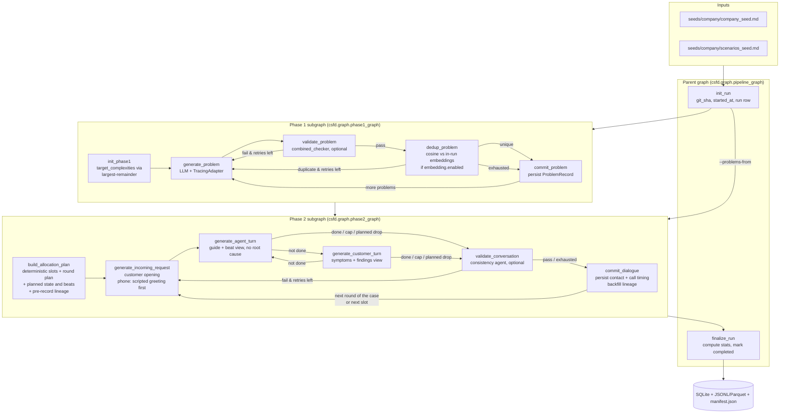

# csfd — Customer-Service Fake Data

> Synthetic, schema-grounded, multi-turn customer-service tickets for benchmarking RAG, classification, and agent-based pipelines.

Real support tickets are hard to share: they contain customer data, are unevenly distributed across issue types, and rarely record the path from root cause to resolution. `csfd` generates controlled synthetic datasets that keep that structure without private records, for:

- **RAG evaluation** — can a system retrieve the right context and answer grounded customer questions?
- **Routing and triage** — benchmark classifiers on exact ticket-type, customer-tier, and tone distributions.
- **Agent workflow testing** — replay incoming requests and multi-turn resolutions against support agents.
- **Regression datasets** — pin a benchmark to its config, prompts, models, and git SHA.

## What the generator produces

Each run writes these artifacts (file list under [Benchmark consumption](#benchmark-consumption)):

- **`problems`** — the Phase 1 Problem Database: synthetic root causes with symptoms, category, complexity, a canonical **diagnosis plan**, and the **viable outcomes** a case about the problem can end in ([Ground truth and honest outcomes](#ground-truth-and-honest-outcomes)).
- **`incoming_requests`** — the customer's opening message per contact. This is what a system under test would receive.
- **`resolutions`** — the full multi-turn conversation per contact, with its honest outcome (`problem_state`, `contact_ending`, `commitments`, each next to what was planned).
- **`lineage`** — one row per case linking its problem, request, and resolution, plus the case's seeded [facts](#case-facts) and plan.
- **`agent_traces`** — one audit row per LLM call: prompt version, model, latency, checker verdict.
- **`transcripts/`** — the conversations as plain-text email threads or call transcripts, one folder per case ([Conversation formats](#conversation-formats)).
- **`documents/`** (preview, off by default) — supporting documents such as manuals and troubleshooting articles as Word and PDF files with machine-readable sidecars, plus retrieval-evaluation files ([Supporting documents](#supporting-documents-preview)).

Show a system only `incoming_requests` (or the transcripts) for online-style evaluation; use `problems`, `lineage`, and the traces offline to explain each example.

## Inputs

A run is driven by **seed files** (the fictional business) and **config files** (how much data, in what proportions, with which models). Same seeds + same config + same `run_seed` give the same allocation plan ([Reproducibility](#reproducibility)).

### Seed files (`seeds/<company>/`)

Each company is one folder, selected with `seeds.company` in YAML or `--company` on `csfd generate` (`--company-seed` / `--scenarios-seed` take explicit file paths instead). Add a folder to retarget the generator without touching code.

- **`company_seed.md`** — the company profile: identity, products, what typically goes wrong, customer segments, service organisation. Its `## Case facts` section is what each case's [facts](#case-facts) are drawn from:
  - `### Assets` — a `Model | Description | Serial format` table. Give models a letter prefix and digits (`CF-600`) so the identifier check can recognise the family and catch invented variants; in serial formats `#` is a digit and `?` an upper-case letter. Phase 1 also gets this table as the product catalogue.
  - `### Caller roles` and `### Site locales` — bullet lists.

  A seed without the section still works, but its cases get no machine or caller role.
- **`scenarios_seed.md`** — the scenario catalogue: one `## Category — Title` section per scenario (tier, the customer's opening request, the agent's first move, what goes wrong today, sample-data hints). Phase 1 builds its problems against it.

Two invented companies ship (no real company, product or trademark names):

| `--company` | Company | Domain | Machines in the case-facts catalogue |
|---|---|---|---|
| `kalvora` (default) | **Kalvora Dental** | Dental laboratory and practice equipment plus restorative materials | CF-600 firing furnace, CP-800 press furnace, SX-1500 sintering furnace, MV-450 / MV-650 milling units, LQ-220 curing light |
| `norrholt` | **Norrholt Glass Machinery** | Glass-container (bottle and jar) forming | FX-608 / FX-612 IS forming machines, GF-350 gob feeder, TC-400 forming controls, VQ-220 ware inspection |

`csfd init` scaffolds a stub company at `seeds/my_company/` (use it with `--company my_company`).

### Config files (`config/`)

- **`config/default.yaml`** — the base config, always loaded; its comments document each key. Sections:
  - `seeds` — seeds folder and company (`--seeds-dir`, `--company`).
  - `pipeline` — `version`, `run_seed` (`--seed`), and the per-run budget.
  - `agents` — the two LLM buckets, `generator` and `combined_checker` (`provider`, `model`, `temperature`, `max_tokens`, `timeout_s`). Every LLM node routes to one of them.
  - `problem_database` — Phase 1: `count` (`--problems`) and `complexity_proportions` (`simple` / `medium` / `complex`).
  - `tickets` — Phase 2: `total` cases (`--tickets`), `type_proportions`, `tier_proportions`, `tone_proportions_per_type`, `outcome_proportions`, `assignment_strategy` (`complexity_weighted` or `uniform`), `dialogue.turn_cap`, `channel` / `phone.disfluency` / `calendar` ([Conversation formats](#conversation-formats)), and `rounds` ([Multi-call cases](#multi-call-cases-rounds)). Conversation length is emergent; `dialogue.turn_cap` (default 20) is only a safety ceiling.
  - `validation` — whether the checker runs after each generation, and `max_retries`.
  - `storage` — SQLite and export paths, and the `transcripts` layout ([Transcript export](#transcript-export)).
  - `documents` — [supporting documents](#supporting-documents-preview): `enabled` (default `false`), `builders`, `formats` (`docx`, `pdf`), `pdf_standard` (`ua-1`, `a-2b`, `none`).
  - `embedding` — Phase 1 near-duplicate rejection. **On by default**: accepted problems are embedded through an OpenAI-compatible endpoint (local Ollama at `http://localhost:11434/v1`, model `embeddinggemma:300m`) and rejected when the cosine similarity to a problem already committed in the run is `>= threshold`. `text_template` is `title_summary`, `title_summary_background`, or `title_summary_symptoms_root_cause`. Without a reachable Ollama, set `enabled: false` or use `--profile dev`.
- **`config/profiles/*.yaml`** — overlays merged on top via `--profile <name>` ([Configuration profiles](#configuration-profiles)).
- **`.env`** — credentials and endpoints (`ANTHROPIC_API_KEY`, `LOCAL_BASE_URL`, …); see `.env.example`. Never recorded in the run.

## Quickstart

```bash
uv sync
cp .env.example .env    # fill in ANTHROPIC_API_KEY or LOCAL_BASE_URL (not needed for the claude-cli / codex-cli profiles)
```

Commands below use `uv run csfd`; with `.venv` activated, plain `csfd` works too. `csfd generate` calls real models (per `agents` in `config/default.yaml` or a `--profile`) and, unless `embedding.enabled` is false, a local Ollama for dedup. `--profile dev` is a small smoke run (3 problems, 6 cases, no dedup). `generate` creates the SQLite schema itself; `csfd db-migrate` only does that step on its own and is safe to re-run.

```bash
uv run csfd generate --profile dev --seed 42                        # prints the run id
uv run csfd generate --seed 42 --problems 10 --tickets 100          # default company: kalvora
uv run csfd generate --company norrholt --seed 42 --problems 10 --tickets 100
```

`--channel` picks the conversation format (`email`, the default, or `phone`, with `--disfluency none|light|moderate`); `--rounds N` makes every case N related contacts:

```bash
uv run csfd generate --channel phone --seed 42 --problems 5 --tickets 20
uv run csfd generate --channel phone --rounds 3 --seed 42 --problems 5 --tickets 10   # 10 cases x 3 calls
```

Then export by run id:

```bash
uv run csfd export <run_id> --format transcripts   # data/exports/<run_id>/transcripts/
uv run csfd export <run_id> --format jsonl         # one .jsonl per table + manifest.json (the default)
uv run csfd export <run_id> --format parquet       # the same tables as .parquet
uv run csfd export <run_id> --format both          # jsonl + parquet
uv run csfd export <run_id> --format all           # jsonl + parquet + transcripts
uv run csfd inspect <run_id>                       # row counts per artifact
```

A transcripts export holds `cases.jsonl` and one `case_NNNNNN/` folder per case with `case.json` and one file per contact (`email_01.txt`, … or `call_01.txt`, …); see [Transcript export](#transcript-export). `manifest.json` is written only by exports that include `jsonl`.

## Architecture

`csfd generate` runs a **deterministic, proportion-based LangGraph pipeline**: you set how many problems and cases you want and their breakdown by complexity, ticket type, tier, tone, and outcome, and it produces exactly those counts (largest-remainder rounding; outcomes as exactly as each problem's viable outcomes allow). A parent graph (`src/csfd/graph/pipeline_graph.py`) runs `init_run` → Phase 1 subgraph → Phase 2 subgraph → `finalize_run`; all three share one `PipelineState`. The run id is the LangGraph `thread_id`, so checkpoints and database rows describe the same unit of work.

- **Phase 1 — Problem Database** (`phase1_graph.py`) generates `problem_database.count` problems, one at a time, each with its diagnosis plan and viable outcomes. It is the pool of root causes that Phase 2 allocates across cases.
- **Phase 2 — Requests and resolutions** (`phase2_graph.py`) fixes every case's problem, ticket type, tier, tone, facts, and plan before any LLM call, then generates each contact as a turn-based dialogue between two information-asymmetric agents: a customer who sees only what a customer would, and a service agent who is **not told the root cause** and must diagnose it from a troubleshooting guide. A consistency agent reviews each transcript. Length is emergent: simple problems close in 2–3 turns; expect roughly 4–10 turn calls plus one review call per contact.


```mermaid
flowchart TB
    subgraph Seeds["Inputs"]
        C[seeds/company/company_seed.md]
        S[seeds/company/scenarios_seed.md]
    end
    subgraph PARENT["Parent graph (csfd.graph.pipeline_graph)"]
        IR[init_run<br>git_sha, started_at, run row]
        FR[finalize_run<br>compute stats, mark completed]
    end
    subgraph P1["Phase 1 subgraph (csfd.graph.phase1_graph)"]
        IP[init_phase1<br>target_complexities via<br>largest-remainder]
        GP[generate_problem<br>LLM + TracingAdapter]
        VP[validate_problem<br>combined_checker, optional]
        DP[dedup_problem<br>cosine vs in-run embeddings<br>if embedding.enabled]
        CP[commit_problem<br>persist ProblemRecord]
        IP --> GP
        GP --> VP
        VP -->|fail & retries left| GP
        VP -->|pass| DP
        DP -->|unique| CP
        DP -->|duplicate & retries left| GP
        DP -->|exhausted| CP
        CP -->|more problems| GP
    end
    subgraph P2["Phase 2 subgraph (csfd.graph.phase2_graph)"]
        BAP[build_allocation_plan<br>deterministic slots + round plan<br>+ planned state and beats<br>+ pre-record lineage]
        GIR[generate_incoming_request<br>customer opening<br>phone: scripted greeting first]
        GAT[generate_agent_turn<br>guide + beat view, no root cause]
        GCT[generate_customer_turn<br>symptoms + findings view]
        VC[validate_conversation<br>consistency agent, optional]
        CD[commit_dialogue<br>persist contact + call timing<br>backfill lineage]
        BAP --> GIR
        GIR --> GAT
        GAT -->|not done| GCT
        GCT -->|not done| GAT
        GAT -->|done / cap / planned drop| VC
        GCT -->|done / cap / planned drop| VC
        VC -->|fail & retries left| GIR
        VC -->|pass / exhausted| CD
        CD -->|next round of the case<br>or next slot| GIR
    end
    Seeds --> IR
    IR --> P1
    IR -->|--problems-from| P2
    P1 --> P2
    P2 --> FR
    FR --> EX[(SQLite + JSONL/Parquet + manifest.json)]
```

`csfd render-graphs` writes the exact node-level graphs to `docs/diagrams/*.mmd`.

### Step by step

1. **Bootstrap.** The CLI loads `config/default.yaml` plus any `--profile`, applies CLI overrides, creates the schema if needed, and starts the parent graph with the new run id.
2. **`init_run`** inserts the `runs` row with its provenance ([Reproducibility](#reproducibility)).
3. **`init_phase1`** turns `complexity_proportions` into an exact list of target complexities, e.g. 10 problems at `0.6 / 0.3 / 0.1` give 6 `simple`, 3 `medium`, 1 `complex`.
4. **`generate_problem`** renders the problem prompt and calls the `generator` model through `TracingAdapter`, which writes one `agent_traces` row per call.
5. **`validate_problem`** (if `validation.enabled`) runs the `combined_checker`; its trace links to the generator's via `parent_trace_id`. The checker also validates the diagnosis plan and viable outcomes (`diagnosis_plan_invalid`, `viable_outcomes_invalid`). A `fail` with retries left regenerates; once retries run out, the last candidate is kept with `warning:retries_exhausted`.
6. **`dedup_problem`** (if `embedding.enabled`) rejects a near-duplicate with a synthetic `near_duplicate_of_committed_problem` verdict, so the next attempt sees the matched title and summary. It shares the retry budget; on exhaustion the problem is kept with `warning:dedup_exhausted`.
7. **`commit_problem`** persists the `ProblemRecord`, then loops until every target complexity is done.
8. **`build_allocation_plan`** (`csfd.allocator`) turns `tickets.total` and the type / tier / tone proportions into the full slot list, draws each case's [facts](#case-facts), plans its rounds, final problem state, and per-contact diagnosis beats ([Ground truth](#ground-truth-and-honest-outcomes)), applies any [case plan](#case-plans-and-problem-reuse), and pre-records the `lineage` rows. Nothing later changes these decisions.
9. **The dialogue.** `generate_incoming_request` writes the customer's opening; `generate_agent_turn` and `generate_customer_turn` then alternate, one LLM call each, until the speaker who just spoke flags `done`, the contact reaches its planned drop, or `dialogue.turn_cap` is hit (`warning:turn_cap_hit`).
10. **`validate_conversation`** (if `validation.enabled`) runs the consistency agent over the transcript: pass, pass with edits (rewritten in place, `info:consistency_edited`), or fail. Code checks also fail an attempt whose transcript names a different model or serial number than the case record, or whose reached state or ending differs from the plan. A fail re-rolls the whole contact within the same retry budget; with validation off, the contact is flagged `warning:validation_skipped`.
11. **`commit_dialogue`** stores the `incoming_requests` and `resolutions` rows (turns, commitments, outcome, timing) and backfills `lineage`. It then moves to the case's next round, the next slot, or ends Phase 2.
12. **`finalize_run`** writes `stats_json` and `completed_at` and marks the run completed.

Every LLM call writes exactly one `agent_traces` row, and Phase 2 never makes allocation decisions on the fly.

## Conversation formats

`tickets.channel` (or `csfd generate --channel`) selects one format per run; a mixed email and phone run is not supported yet.

| Value | Conversation | Transcript file |
|---|---|---|
| `email` (default) | Written tickets: the customer's opening email (subject + body), then dated written replies | `email_NN.txt`, an email thread |
| `phone` | Spoken calls: scripted greeting, verification, troubleshooting, closing; per-utterance timestamps | `call_NN.txt`, a call transcript |

Everything else (the dialogue loop, information asymmetry, consistency review, allocation plan, and [multi-contact cases](#multi-call-cases-rounds)) is identical for both; only the prompts and the recorded timing differ. The model is never asked for times: each contact's `started_at` is a seeded weekday, business-hours slot inside `tickets.calendar`, and `resolutions` records `channel`, `agent_name`, `end_reason`, `started_at`, `ended_at`, and `duration_s`.

### Phone calls

- **Call flow.** Turn 1 is the agent's scripted greeting, picked by seed (no LLM call); turn 2 is the caller's opening, whose call reason is logged in `incoming_requests.subject`. The agent then verifies the caller and machine (model, serial, site), troubleshoots one step at a time, agrees the next step, and closes. It cannot see the machine and has to ask.
- **Speech.** `tickets.phone.disfluency` (`--disfluency`): `none`, `light` (default), or `moderate` filler words, restarts, and cut-ins; callers get more than agents. The consistency checker keeps them rather than tidying the speech.
- **Transcript tags.** Only `[hold]` (agent, back from a hold the caller agreed to), `[pause]`, `[inaudible]` (caller), and a trailing `--` for a cut-off are allowed; the checker removes any other bracketed tag. `[hold]` adds a 30–180 s gap and renders as `(caller on hold, HH:MM:SS)`, `[pause]` adds a short gap, and `--` makes the next turn overlap.
- **Timing.** At commit, `csfd.calls.estimate_turn_timings` derives each utterance's `start_s` / `end_s` from its word count (about 150 wpm), seeded response latencies, holds, and pauses, and stores them in `turns_json`.

### Email threads

- **Dates.** At commit, `csfd.calls.estimate_email_times` gives each message a seeded `sent_at`: support replies after 5 minutes to 4 hours, customers after 3 minutes to 8 hours, moved into business hours. When another contact of the case follows, the thread is compressed (in working minutes, so messages stay in business hours) to finish well before it.
- **Rendering.** Each message gets `From` / `To` / `Date` / `Subject` headers (`Re:` on replies), the body, and a one-line quote of the message it answers. Addresses use reserved `.example` domains; the support desk is named after the run's company.

### Transcript export

`csfd export <run_id> --format transcripts` (or `--format all`) writes one folder per case:

```text
data/exports/<run_id>/transcripts/
  cases.jsonl              # one line per case: metadata + utterances (start_s/end_s or sent_at)
  case_000001/
    case.json              # problem_id, tier, tone, case_facts, and per-contact timing and outcome
    call_01.txt            # one file per contact (email_01.txt on the email channel)
```

By default each file is a `key: value` header, a blank line, then the conversation. Call lines carry `[HH:MM:SS]` offsets (`--no-timestamps` drops them); later contacts of a case add `since_previous_call:` / `since_previous_thread:` to the header. A real call from a small `claude_code_cli` run (the second contact of a Kalvora Dental case, shortened with `[…]`):

```text
CALL TRANSCRIPT
case_id: 0c9dd966-…:000001
call: 2 of 2
channel: phone (inbound)
started_at: 2026-01-09T13:30:22+00:00
ended_at: 2026-01-09T13:32:49+00:00
duration: 00:02:26
since_previous_call: 4h 33m
caller: Customer-premium-0001 (premium tier)
agent: Agent-l2-0001 (L2 Support)

[00:00:00] AGENT: Hi, thanks for calling Kalvora Dental. This is Agent-l2-0001, how can I help you today?
[00:00:06] CUSTOMER: Hi, it's Customer-premium-0001 again, dental assistant at Boechat in Chevalley, calling about the SX-1500, serial ending 062-WO. […] I checked the furnace's system screen and it shows program set P-2025.1. […]
[00:00:38] AGENT: Thanks for that, and sorry it's been such a frustrating morning. So P-2025.1 is what's currently installed, which tells me the newer program set with the Zirvelle sintering program isn't on there yet. I'd like to walk you through installing that update now through Kalvora Connect, is that all right?
[…]
[00:02:08] CUSTOMER: Okay, hold on, let me sinter one now.[pause] Alright, it's out and cooled down enough to check, and... yeah, actually this one looks even, no patchy spots, and the shade matches the reference on the box. That's a relief, finally.
```

An email thread has the same header (with `thread:` and `subject:`), then one block per message:

```text
From: Customer-enterprise-0001 <customer-enterprise-0001@customer.example>
To: Norrholt Glass Machinery Support <support@norrholt-glass-machinery.example>
Date: Mon, 26 Jan 2026 09:22:22 +0000
Subject: Follow-up: FX-612 invert parts list still pending – 3 days on

Hello,

Following up on my ticket from Friday about the invert mechanism rebuild parts list and drawings for our FX-612 (serial FX612-7979-RV) […]

----------------------------------------
From: Agent-l1-0001, Norrholt Glass Machinery Support <support@norrholt-glass-machinery.example>
To: Customer-enterprise-0001 <customer-enterprise-0001@customer.example>
Date: Mon, 26 Jan 2026 10:50:02 +0000
Subject: Re: Follow-up: FX-612 invert parts list still pending – 3 days on

Thanks for confirming that — I've cross-checked our equipment records against serial FX612-7979-RV […]

On Mon, 26 Jan 2026 at 09:22, Customer-enterprise-0001 wrote:
> Hello,
```

The transcript text holds no ground truth: join `case.json`'s `problem_id` against `problems.jsonl` to score a downstream report against the root cause.

Two options change the layout for downstream parsers, set under `storage.transcripts` in YAML or with `--speaker-style` / `--header-style` on `csfd export`:

| Option | Values |
|---|---|
| `speaker_style` | `upper` (default: `AGENT:` / `CUSTOMER:`), `title` (`Agent:` / `Customer:`), `role` (`Agent:` / `Caller (maintenance technician):`, from the case's caller role). Calls only; emails keep their `From:` / `To:` lines. |
| `header_style` | `csfd` (default: the header above), `wissant` (only `call_id:` / `call_date:`, or `thread_id:` / `thread_date:` for email, closed by `---`: the block wissant's call-transcript adapter reads), `none` (the conversation only). |

```text
call_id: CSFD-0C9DD966-1-2
call_date: 2026-01-09
---
[00:00:00] Agent: Hi, thanks for calling Kalvora Dental. This is Agent-l2-0001, how can I help you today?
[00:00:06] Caller (dental assistant): Hi, it's Customer-premium-0001 again, dental assistant at Boechat in Chevalley, calling about the SX-1500, serial ending 062-WO. […]
```

## Case facts

Before any dialogue, every case gets a seeded record of facts (`csfd.facts`), so both speakers talk about the same machine instead of inventing one:

- **Asset** — a model from the company seed's `### Assets` table (a model the problem already names wins; otherwise a seeded pick) and a serial number in that model's format.
- **Site** — the customer's company, city, and country, drawn with [Faker](https://faker.readthedocs.io/) in one of the seed's `### Site locales`.
- **Caller role** — one of the seed's `### Caller roles`.

Customer prompts get what a customer knows (their role, site, and the model and serial on the nameplate); agent prompts get what a CRM shows (account, contact role, installed machine). The consistency checker sees the record, and a code check fails any attempt whose transcript names a different catalogue-family model or serial number; the re-roll tells both speakers which identifier was wrong. The record is stored in `lineage.case_facts_json` and exported in `case.json` / `cases.jsonl`.

## Ground truth and honest outcomes

A case's ground truth exists before its conversation, so every dialogue traces back to a problem with known symptoms, root cause, and fix, which its contacts reveal partly or fully.

**Diagnosis plan (Phase 1, `csfd.diagnosis`).** Each problem carries a canonical plan written like a knowledge-base troubleshooting guide:

- `candidate_causes` (the prompts ask for 2–4), each with its own fix (`resolution_steps`, `parts`, `verification`, `verification_finding`, `workaround`, `preventive_action`), exactly one marked `is_root_cause`;
- ordered `checks` (1–5): `how_to_check`, the `finding` the customer observes, which candidates it `rules_out`, and which check `confirms_cause`;
- `safety` notes.

The problem also lists its `viable_outcomes`: the problem states a case about it can realistically end in (for example `not_a_fault` only for handling problems, `pending_part` only if a part is needed).

**The agent diagnoses instead of being told.** The service agent never sees the root cause, background, or resolution hint. It gets every candidate cause with its fix, in a seeded order, and the checks without their results, so it has to run the checks to know which fix applies. It learns how the contact is planned to end only after it reports the diagnosis done (`diagnosis_done` on its turn, never rendered). The customer gets the finding of each check planned so far and reports it only when asked. The consistency checker sees the whole plan and fails a dialogue whose agent names a cause before the confirming finding, or whose customer reports a different result.

**Beats per contact.** `plan_beats` spreads the checks up to the confirming one over the case's contacts. A `follow_up` contact runs its checks and agrees the next one as the customer's own test (the next contact opens with its result); a `dropped` contact is cut off and runs none; the final contact finishes. If a contact did not actually end with its agreed next step, its checks move to the next contact that is not a planned drop. States that stop short (`pending_customer_test`, `escalated_open`, `abandoned`) never run the confirming check.

**Honest outcomes (`csfd.outcomes`).** Each case is planned to end in one `problem_state`, drawn from `tickets.outcome_proportions` within its problem's viable outcomes:

| `problem_state` | Meaning | Planned `contact_ending` |
|---|---|---|
| `fixed_verified` | fixed, and the customer confirmed it works | `customer_satisfied` |
| `fixed_unverified` | fix applied, confirmation still to come | `customer_satisfied` |
| `workaround` | the customer can work, the cause is not removed | `customer_satisfied` |
| `pending_visit` / `pending_part` | a technician visit is booked / a part is on its way | `agreed_next_step` |
| `pending_customer_test` | the customer runs a check and reports back | `agreed_next_step` |
| `escalated_open` | handed to a higher tier, still open | `agreed_next_step` |
| `not_a_fault` | the machine works as designed | `customer_satisfied` |
| `abandoned` | the customer gave up before it was solved | `customer_frustrated` |

A `follow_up` contact is planned to leave the case `pending_customer_test`; a `dropped` one leaves no state (`contact_ending` `dropped`). The consistency checker reports the state the text actually reached, and a state or ending that differs from the plan fails the attempt. On exhaustion the reached state is stored with `warning:retries_exhausted`; with validation disabled the planned state is stored with `warning:validation_skipped`.

Each turn also records its speaker's promises as `commitments` (`{who, what, due}`), never rendered and checked against the text. `resolutions` stores `problem_state`, `planned_problem_state`, `contact_ending`, `planned_contact_ending`, and `commitments_json`; `lineage` stores the planned `problem_state` and `case_plan_json` (per contact: end mode, planned ending, checks, agreed next check, whether the cause is reached). `resolved` is derived: true only for a `fixed_*` state on a case's last contact.

## Case plans and problem reuse

Proportions set totals; a golden case often needs one specific combination. `csfd generate --plan cases.yaml` pins cases explicitly (`csfd.case_plan`):

```yaml
cases:
  - problem: 0                 # index into the run's problems, or a problem id (with --problems-from)
    ticket_type: l2
    tier: enterprise
    tone: frustrated
    end_modes: [follow_up]     # how contacts 1..N-1 end; implies contacts: 2
    problem_state: pending_visit
  - tone: polite               # everything left out is filled from the proportions
```

The number of entries is the number of cases. The proportional plan is built for that many cases, then each entry overrides what it pins. `contacts` can also be set directly (it must equal `len(end_modes) + 1` when both are given). A pinned `problem_state` wins over the problem's viable outcomes. The plan is recorded in `runs.config_snapshot_json`.

`--problems-from <run_id>` reuses the committed problems (with their diagnosis plans) of an earlier run in the same database: Phase 1 is skipped and the run is stored with `phase='phase2'` and that `parent_run_id`. The earlier run must use the same company seed. With the same `--seed` and plan slot, the case facts come out identical too, so the same case can be rendered in another channel:

```bash
uv run csfd generate --company kalvora --problems 3 --tickets 3                   # prints <run_a>
uv run csfd generate --company kalvora --problems-from <run_a> --channel phone --plan cases.yaml
```

## Multi-call cases (rounds)

A consumer often needs several contacts about the same problem, such as a caller who hangs up, tries something, and calls back. Each allocation slot is a **case** (one `lineage` row, one `ticket_uid`) that can span N **rounds** (contacts) sharing the problem, customer, tier, tone, and `case_uid`.

```yaml
tickets:
  total: 20                  # cases
  rounds:
    proportions: {1: 0.5, 2: 0.3, 3: 0.2}   # 10 x 1 call, 6 x 2 calls, 4 x 3 calls = 34 calls
    callback_reasons: {follow_up: 0.7, dropped: 0.3}
    gap_hours: [2, 72]
```

`--rounds N` is shorthand for `proportions: {N: 1.0}`; the default `{1: 1.0}` is one contact per case.

- **Planned up front.** `csfd.rounds` assigns contact counts (largest-remainder rounding, seeded shuffle) and plans each contact's start (a log-uniform gap from `gap_hours`, moved into business hours) and how each non-final contact ends.
- **Non-final rounds** end without closing the case. `follow_up`: both speakers work toward a next step that needs time, by default the next diagnosis check run by the customer. `dropped`: the contact cuts off after a seeded number of turns (`end_reason="dropped"`, no warning), rendered as `(call disconnected)` or, for email, `(no further reply in this thread)`.
- **The final round** ends the case in its planned problem state ([Ground truth](#ground-truth-and-honest-outcomes)).
- **Continuity.** From round 2, both speakers get the earlier transcripts, the time since the last contact, and how each earlier contact actually ended, so a later round never claims a next step that was never agreed. The consistency checker checks continuity too.
- **Retries** re-roll only the current round; committed rounds are never regenerated.

Storage:

- Every contact is one `incoming_requests` row and one `resolutions` row, with `case_uid` (= `lineage.ticket_uid`), `round_index`, and `round_count`. Round 1 keeps the `<ticket_uid>:req` / `:res` uids; later rounds add `:rNN`. Only a case's final contact can be `resolved = true`.
- `lineage` links to **round 1**, so the gold-tuple join in [Benchmark consumption](#benchmark-consumption) yields first contacts. For all of them, join on `case_uid`:

  ```sql
  SELECT l.ticket_uid AS case_uid, res.round_index, res.round_count, res.started_at,
         res.end_reason, res.resolved, res.turns_json
  FROM lineage l
  JOIN resolutions res ON res.case_uid = l.ticket_uid
  WHERE l.run_id = :run_id
  ORDER BY l.slot_index, res.round_index;
  ```

- `case.json` lists each contact's timing, `gap_since_previous_s`, `end_reason`, `problem_state` and `contact_ending` (each next to its planned value), `commitments`, and `resolved`. Feed a whole case folder to a consumer that builds one report from many calls.

## Supporting documents (preview)

Supporting documents are the manuals, troubleshooting articles, parts lists and similar files a support agent would look things up in. They are the document collection a future RAG system (one that searches documents, then answers from what it found) will retrieve from while resolving a case. This release ships the storage, rendering and export; the builders that write real documents come later, so a normal run produces no documents yet. The feature is **off by default** (`documents.enabled: false`).

- **Build.** `csfd documents <run_id>` runs the builders named in `documents.builders` (`csfd.documents.build.BUILDERS`) over a finished run's problems and cases, and stores the documents and their retrieval links, replacing any earlier build of that run. It refuses to run unless a profile sets `documents.enabled: true`, and it calls no model itself.
- **Model.** Each document is stored as a typed tree (`csfd.documents.ir.DocumentIR`): numbered sections holding paragraphs, signal-word safety messages, numbered procedures with expected results, lists, captioned tables and captioned figures. A section's id (`sec-6.2`) is the same anchor in every exported format. Document ids do not contain the run id (`kalvora-dental:KD-SM-CF600-EN:en:rev-C`), so a library can later be shared across runs; rows are keyed by `(run_id, doc_id)`.
- **Ground truth.** A builder returns links "case → document section → grade": `resolves` (2), `supports` (1), `equivalent` (the grade of the section it matches) and `hard_negative` (0, a plausible but wrong section). It may also record where a case's answer lives (`documents`, `partial`, or `agent_knowledge` when the fix is known only to the agent). Builders receive per-cause coverage (`documented`, `partial`, `agent_only`) and must not document an `agent_only` cause. None of this is written into documents or transcripts.
- **Export.** `csfd export <run_id> --format documents` (also part of `--format all`) renders what was built; a run without documents exports nothing:

```text
data/exports/<run_id>/documents/
  index.jsonl                    # one line per document: ids, type, tier, revision, status, files + sha256
  docs/KD-SM-CF600-EN_revC/
    KD-SM-CF600-EN_revC.docx     # python-docx: real heading styles, captions, bookmarks, alt text, "Page X of Y"
    KD-SM-CF600-EN_revC.pdf      # Typst: outline, tagged, PDF/UA-1 by default (documents.pdf_standard)
    KD-SM-CF600-EN_revC.md       # Markdown sidecar, headings carry {#sec-6.2} anchors
    KD-SM-CF600-EN_revC.json     # IR + one chunk per section (text, heading path, PDF pages) + figures
    assets/fig-3-1.svg, .png
  rag/
    corpus.jsonl                 # BEIR layout: one row per section, _id = <doc_id>#<section_id>
    queries.jsonl                # one row per case: the customer's opening message, _id = q:<case_uid>
    qrels/test.tsv               # query-id, corpus-id, integer grade (2 resolves, 1 supports)
    qrels/test.resolves.tsv      # only the grade-2 pairs
    qrels_detailed.jsonl         # every link with relation, basis, contact, hard negatives
  manifest.json                  # sha256 of every file
```

Rendering is deterministic: the PDF uses only Typst's built-in fonts and the issue date as its creation date, and the DOCX package is written with fixed timestamps, so exporting the same documents twice gives identical bytes.

## LangGraph Studio

```bash
uv run langgraph dev
```

This serves the parent graph from `langgraph.json` (built in `src/csfd/graph/studio.py`) at `http://127.0.0.1:2024` and opens Studio in the browser, with both phase subgraphs nested, per-node input/output inspection, time-travel debugging, and state edits. Graph nodes write through the `aiosqlite`-backed store (`src/csfd/storage/db_async.py`), so persistence does not trip `blockbuster`'s sync-I/O trap. CLI runs checkpoint through `csfd.graph.checkpointer.async_sqlite_checkpointer`.

## Reproducibility

Given the same config, `run_seed`, and a fresh database, `csfd` reproduces the **allocation plan and slot-by-slot lineage**, but **not the generated text**: temperatures are nonzero and provider models drift. Two such runs produce identical `lineage` rows `(slot_index, problem_id, ticket_type, customer_tier, customer_tone)`; only run-scoped UUIDs (`run_id` and the prefix of `problem_id` / `ticket_uid`) differ.

Also drawn from `(run_seed, slot_index)` plus `tickets.calendar` / `tickets.rounds`, never the wall clock:

- each case's [facts](#case-facts), contact count, planned problem state, and per-contact diagnosis beats;
- each contact's `started_at`, agent name, and planned ending (including where a dropped contact cuts off);
- the phone channel's scripted greeting.

Per-utterance timestamps, `ended_at`, and `duration_s` are derived from the generated text, so they vary only when it does. With `uniform` assignment, `run_seed` also drives the allocator's tie-breaking shuffle; `complexity_weighted` splits slots by fixed rank weights and needs no seed.

Every run records:

- on the `runs` row: `run_seed`, `pipeline_version` (bumped on schema-breaking changes), `git_sha` (`git rev-parse HEAD` at start, NULL outside a git repo), `config_snapshot_json` (the resolved `problem_database`, `tickets`, `validation`, and `embedding` sections, the company name and seed slug, the case plan, and the `--problems-from` run), and `stats_json` (counts by type, tier, tone, complexity, quality flag, problem state, contact ending, contacts per case, and channel);
- on each `agent_traces` row: `prompt_id` (a sha256 prefix of the Jinja template source, so it changes only when a template is edited), `model_provider`, `model_id`, `attempt`, `latency_ms`, and for checkers `verdict` / `verdict_issues_json`. `tokens_in` / `tokens_out` come from LangChain's `usage_metadata` where the provider reports it (Anthropic, OpenAI-compatible); the fake model and the Claude and Codex CLI wrappers leave them NULL.

The model config (`agents`) is not in the snapshot; the models actually used are on every trace. `model_id` is the model *name* (e.g. `claude-sonnet-4-6`), not the provider's snapshot, so a provider update under the same name changes output without changing provenance; pin a snapshot id in your profile for stricter provenance. Embedding scores depend on the Ollama model and version, so a candidate very close to `embedding.threshold` can flip across upgrades.

**Schema changes.** The schema (`src/csfd/storage/migrations/schema.sql`) is created with `CREATE ... IF NOT EXISTS` and never upgraded in place. `db-migrate`, `generate`, and `export` stop with an error naming any missing column; a changed `CHECK` constraint (for example a newly allowed `model_provider`) is not detected. After upgrading `csfd`, delete or move the SQLite file (default `data/runs.sqlite`) and run `csfd db-migrate`.

## Benchmark consumption

The "gold tuple" join over `problems`, `incoming_requests`, `resolutions`, and `lineage` (for multi-contact cases this yields the first contact; see [Multi-call cases](#multi-call-cases-rounds) for every contact):

```sql
SELECT p.id AS problem_id,
       p.title, p.summary, p.complexity, p.category,
       l.slot_index, l.customer_tier, l.customer_tone,
       ir.request_uid, ir.subject, ir.body,
       res.resolution_uid, res.turns_json, res.turn_count, res.resolved,
       res.problem_state, res.contact_ending, res.commitments_json
FROM lineage l
JOIN problems p           ON p.id = l.problem_id
JOIN incoming_requests ir ON ir.id = l.incoming_request_id
JOIN resolutions res      ON res.id = l.resolution_id
WHERE l.run_id = :run_id
ORDER BY l.slot_index;
```

Exports under `data/exports/<run_id>/`:

- `problems.jsonl` / `.parquet` — Problem Database rows, with `diagnosis_plan_json` and `viable_outcomes_json` (for a `--problems-from` run, the reused problems its cases are about)
- `incoming_requests`, `resolutions`, `lineage` — as described in [What the generator produces](#what-the-generator-produces)
- `agent_traces` — every LLM call
- `problem_embeddings` — per-problem dedup vector (`problem_id`, `model`, `dim`, `vector: list[float]`)
- `manifest.json` — SHA-256 of every JSONL file (JSONL exports only)
- `transcripts/` — see [Transcript export](#transcript-export) (`--format transcripts` or `all` only)
- `documents/` — see [Supporting documents](#supporting-documents-preview) (`--format documents` or `all`, only when the run has documents)

## Configuration profiles

Overlays under `config/profiles/`, selected with `--profile <name>` on `generate` and `export`:

| Profile | Models | Dedup |
|---|---|---|
| `claude-only` | Anthropic API for both buckets (empty overlay, same as the default) | on |
| `claude-cli` | the local `claude` CLI (subscription auth, no API key); needs `claude` on `$PATH` and a logged-in session | on |
| `codex-cli` | the local `codex` CLI (ChatGPT subscription auth); needs `codex` on `$PATH` and `codex login`. Each call runs `codex exec` read-only, with approvals off, no session persistence, and `~/.codex/config.toml` ignored | on |
| `local-only` | Ollama (`qwen3:14b`) for both buckets | on |
| `mixed` | Claude Sonnet generates, a local `llama3.1:8b` checks | on |
| `dev` | default models; 3 problems, 6 cases, smaller budget | off |

"On" means the profile inherits `embedding.enabled: true` from `default.yaml` and needs a local Ollama serving `embeddinggemma:300m`. For example, one problem with four phone calls through the Codex subscription:

```bash
uv run csfd generate --profile codex-cli --channel phone --problems 1 --tickets 4
uv run csfd export <run_id> --format transcripts
```

## CLI

`uv run csfd <command> --help` lists every option.

| Command | Purpose |
|---|---|
| `csfd init` | scaffold `seeds/my_company/`, `data/`, and `.env.example` (existing files are kept) |
| `csfd db-migrate [--sqlite-path PATH]` | create the SQLite schema (idempotent; `generate` also does this) |
| `csfd generate [--profile P] [--seed N] [--problems M] [--tickets T]` | run the pipeline; prints the run id |
| `csfd generate --company NAME` (or `--seeds-dir`, `--company-seed`, `--scenarios-seed`) | pick the seeds ([Seed files](#seed-files-seedscompany)) |
| `csfd generate --channel email\|phone [--disfluency none\|light\|moderate]` | conversation format ([Conversation formats](#conversation-formats)) |
| `csfd generate --rounds N` | every case becomes N related contacts ([Multi-call cases](#multi-call-cases-rounds)) |
| `csfd generate --plan cases.yaml` / `--problems-from RUN_ID` | pin cases; reuse an earlier run's problems ([Case plans](#case-plans-and-problem-reuse)) |
| `csfd export RUN_ID [--format jsonl\|parquet\|both\|transcripts\|documents\|all] [--profile P]` | write `data/exports/<run_id>/` (default `jsonl`) |
| `csfd export RUN_ID --format transcripts [--no-timestamps] [--speaker-style S] [--header-style H]` | transcript layout ([Transcript export](#transcript-export)) |
| `csfd inspect RUN_ID` | print row counts per artifact |
| `csfd documents RUN_ID [--profile P]` | build supporting documents for a finished run (needs `documents.enabled: true`; [Supporting documents](#supporting-documents-preview)) |
| `csfd render-graphs` | regenerate `docs/diagrams/*.mmd` |

## Tests

Tests use a fake chat model and stubbed embeddings, so they spend nothing. The pre-PR checks (the same ones CI and `.no-mistakes.yaml` run) are listed in [`AGENTS.md`](AGENTS.md#commit--pull-request-guidelines). Live LLM tests are marked `live_llm` and excluded from normal runs. The retry sub-loop is covered end-to-end by `tests/integration/test_pipeline_retry.py`.

## Planned improvements

Each can land as an isolated PR without disturbing the determinism guarantees above.

1. **Noise agents for diversity.** Every problem and resolution comes from one generator prompt against the same seed material, so output clusters around the model's mode. A seeded "noise" step before the generator (customer voice, urgency, partial information, typos, regional phrasing) would stress routing, retrieval, and agent handling of messy input, with its choices derived from `(run_seed, slot_index)`.
2. **Richer call realism.**
   - a `channel_proportions` mix of email and phone within one run;
   - warm transfers inside a call (a second agent, e.g. L1 to L2);
   - a callback answered by a different agent (today every round of a case gets the same one);
   - escalating the ticket tier between rounds;
   - an optional, seeded ASR-noise pass on exported transcripts.

## License

[Apache-2.0](LICENSE).
