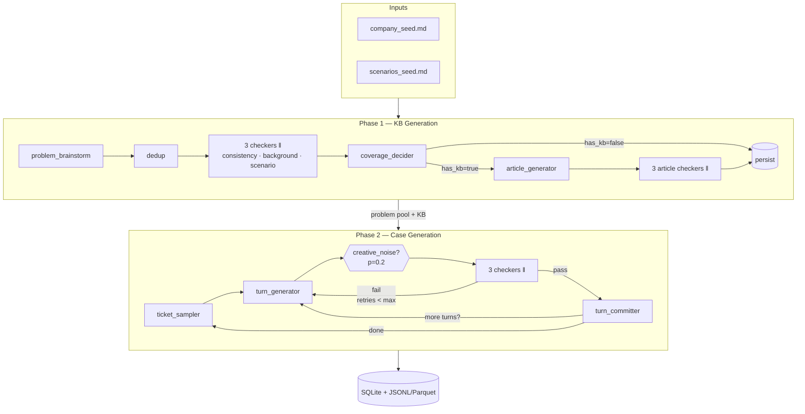

# CSFD Integration & Polish Implementation Plan (Plan 5 of 5)

> **For agentic workers:** REQUIRED SUB-SKILL: superpowers:subagent-driven-development.

**Goal:** Turn the assembled Phase 1 + Phase 2 building blocks into a complete, runnable, portfolio-ready repo. After Plan 5: `uv sync && csfd generate --profile dev` runs the full pipeline end-to-end; `langgraph dev` opens LangGraph Studio against the live graphs; README walks a reviewer through the design; GitHub Actions runs the test suite on every PR with zero API spend.

**Architecture:**
- **Runtime graphs** wire `AgentFactory`, `Database`, and `Phase2Config` into the Phase 1 and Phase 2 nodes via `functools.partial`. These are the graphs that execute work.
- **Imperative orchestrators** in `csfd/graph/compose.py` loop over problems / tickets, invoking the runtime graph per item. Shared `SqliteSaver` checkpointer enables resume.
- **Verdict accumulation** — `verdicts` reducer keeps appending; routing helpers look at the last 3 (most recent attempt). No graph-level reset needed.
- **LangGraph Studio** sees the *runtime* graphs (with real nodes), enabling step-through inspection of any run.
- **CLI** (`csfd ...`) wraps the orchestrators behind Typer commands.
- **CI** runs unit + integration tests via cassettes/FakeChatModel — zero external API calls.

**Tech Stack:** Builds on Plans 1+2+3+4. Adds: `functools.partial` for node binding, `langgraph-checkpoint-sqlite.SqliteSaver`, Typer commands, `langgraph.json` for Studio, GitHub Actions matrix, mermaid render script.

**Working directory:** `/Users/joao.augusto/Documents/Customer Service Fake Data`

---

## File Structure (Plan 5 scope)

| Path | Responsibility |
|---|---|
| `src/csfd/graph/runtime_phase1.py` | `build_runtime_phase1_graph(factory, db, cfg)` — wired single-problem subgraph |
| `src/csfd/graph/runtime_phase2.py` | `build_runtime_phase2_graph(factory, db, cfg)` — wired single-turn subgraph |
| `src/csfd/graph/compose.py` | Imperative orchestrators: `run_phase1(...)`, `run_phase2(...)`, `make_phase1_studio_graph()`, `make_phase2_studio_graph()` |
| `src/csfd/graph/checkpointer.py` | `build_sqlite_checkpointer(path)` — shared `SqliteSaver` factory |
| `src/csfd/cli.py` | Typer app + commands: init, phase1, phase2, generate, export, inspect, render-graphs, db-migrate |
| `scripts/render_graphs.py` | Calls `compiled.get_graph().draw_mermaid()` for Phase 1 / Phase 2 / Full |
| `langgraph.json` | LangGraph Studio config — graph entrypoints |
| `.github/workflows/ci.yml` | unit + integration tests on every PR |
| `LICENSE` | Apache-2.0 |
| `CHANGELOG.md` | initial entry summarising v0.1.0 |
| `README.md` | Hero mermaid + quickstart + architecture + reproducibility + benchmark consumption + viz |
| `tests/integration/test_runtime_phase1.py` | runtime Phase 1 graph e2e with FakeChatModel |
| `tests/integration/test_runtime_phase2.py` | runtime Phase 2 graph e2e with FakeChatModel |
| `tests/integration/test_cli_smoke.py` | Typer CLI smoke (uses `CliRunner`) |

Out of scope: VCR live cassettes (deferred to v2; `tests/live/` directory unused for now), HITL `interrupt()` (v2), Best-of-N (v2), HuggingFace publisher (v2).

---

## Task 1: `runtime_phase1.py` — wired single-problem Phase 1 graph

**Files:**
- Create: `src/csfd/graph/runtime_phase1.py`
- Test: `tests/integration/test_runtime_phase1.py`

**Step 1: Failing test** at `tests/integration/test_runtime_phase1.py`:

```python
from datetime import UTC, datetime
from pathlib import Path
from uuid import uuid4

import pytest

from csfd.agents.base import Verdict
from csfd.agents.factory import AgentFactory
from csfd.graph.runtime_phase1 import build_runtime_phase1_graph
from csfd.models.fake import FakeChatModel
from csfd.phases.phase1_kb.state import (
    CoverageDecision,
    KBArticleDraft,
    KBState,
    ProblemDraft,
)
from csfd.prompts.registry import PromptRegistry
from csfd.seeds.company import parse_company_seed
from csfd.seeds.scenarios import parse_scenarios_seed
from csfd.settings import AgentLLMConfig
from csfd.storage.db import Database
from csfd.storage.migrations.runner import apply_migrations
from csfd.storage.repository import (
    KBArticleRepo,
    ProblemRepo,
    RunRecord,
    RunRepo,
)


def _factory(canned: dict) -> AgentFactory:
    reg = PromptRegistry(root=Path("prompts"))
    reg.load()
    cfg = AgentLLMConfig(provider="anthropic", model="claude-haiku-4-5", temperature=0.5)
    return AgentFactory(
        prompts=reg,
        llm_builder=lambda _c: FakeChatModel(structured=canned),
        agent_configs={
            n: cfg for n in (
                "problem_brainstorm", "problem_consistency", "problem_background",
                "problem_scenario", "coverage_judge", "article_writer",
                "article_consistency", "article_background", "article_scenario",
            )
        },
    )


@pytest.mark.asyncio
async def test_runtime_phase1_full_loop_persists_problem_and_article(
    tmp_db_path: Path,
) -> None:
    db = Database(path=tmp_db_path)
    apply_migrations(db)
    run_id = str(uuid4())
    RunRepo(db).create(RunRecord(
        id=run_id, phase="phase1", parent_run_id=None, status="running",
        started_at=datetime.now(UTC), completed_at=None, run_seed=1,
        pipeline_version="0.1.0", git_sha=None, config_snapshot_json="{}",
        stats_json=None, error_summary=None,
    ))

    factory = _factory({
        ProblemDraft: ProblemDraft(
            title="Cannot reset password",
            description="Customer locked out", category="auth", severity="medium",
        ),
        CoverageDecision: CoverageDecision(
            has_kb=True, reasoning="ok", confidence="high",
        ),
        KBArticleDraft: KBArticleDraft(
            title="Recover login", content_markdown="## Step 1",
            troubleshooting_steps=[{"step": "x", "expected_result": "y"}],
        ),
        Verdict: Verdict(checker="x", passed=True),
    })

    graph = build_runtime_phase1_graph(
        factory=factory, db=db, max_retries=2, kb_target_rate=1.0,
    )
    initial = KBState(
        run_id=run_id, run_seed=1,
        company=parse_company_seed(Path("tests/fixtures/tiny_company_seed.md")),
        scenarios=parse_scenarios_seed(Path("tests/fixtures/tiny_scenarios_seed.md")),
    )
    await graph.ainvoke(initial)

    problems = ProblemRepo(db).list_for_run(run_id)
    assert len(problems) == 1
    assert problems[0].has_kb is True
    article = KBArticleRepo(db).get_by_problem(problems[0].id)
    assert article is not None
    assert article.title == "Recover login"
```

**Step 2: Confirm failure** — `uv run pytest tests/integration/test_runtime_phase1.py -v` → ImportError.

**Step 3: Implement `src/csfd/graph/runtime_phase1.py`**

```python
"""Runtime-wired Phase 1 LangGraph — single-problem subgraph that runs end-to-end."""
from __future__ import annotations

from functools import partial
from typing import Any
from uuid import uuid4

from langgraph.graph import END, START, StateGraph
from langgraph.graph.state import CompiledStateGraph

from csfd.agents.factory import AgentFactory
from csfd.phases.phase1_kb.nodes import (
    article_writer_node,
    coverage_decider_node,
    persist_article_node,
    persist_problem_node,
    problem_background_check_node,
    problem_brainstorm_node,
    problem_consistency_check_node,
    problem_scenario_check_node,
    seed_load_node,
)
from csfd.phases.phase1_kb.routing import (
    aggregate_verdicts,
    dispatch_problem_checkers,
    route_problem_verdict,
)
from csfd.phases.phase1_kb.state import (
    CommittedArticle,
    CommittedProblem,
    KBState,
)
from csfd.storage.db import Database


def _last_n_verdicts(state: KBState, n: int) -> list[Any]:
    return state.verdicts[-n:] if len(state.verdicts) >= n else state.verdicts


def _route_problem(state: KBState, *, max_retries: int) -> str:
    """Look at only the most recent 3 verdicts when routing — verdicts accumulate."""
    last3 = _last_n_verdicts(state, 3)
    snapshot = KBState(
        run_id=state.run_id, run_seed=state.run_seed,
        company=state.company, scenarios=state.scenarios,
        verdicts=last3, retry_attempt=state.retry_attempt,
    )
    return route_problem_verdict(snapshot, max_retries=max_retries)


async def _commit_problem_node(
    state: KBState, *, db: Database, kb_target_rate: float,
) -> dict[str, Any]:
    """Run coverage decider on the single current draft, then persist."""
    if state.current_problem_draft is None:
        raise ValueError("commit_problem_node called without current_problem_draft")
    pc = CommittedProblem(
        id=str(uuid4()),
        draft=state.current_problem_draft,
        has_kb=False,
        coverage_reasoning="",
        coverage_confidence="low",
    )
    snapshot = state.model_copy(update={"problems_committed": [pc]})
    return {"problems_committed": [pc], "current_problem_id": pc.id}


def _bump_retry(state: KBState) -> dict[str, Any]:  # noqa: ARG001
    return {"retry_attempt": state.retry_attempt + 1}


async def _coverage_then_persist(
    state: KBState,
    *,
    factory: AgentFactory,
    db: Database,
    target_rate: float,
) -> dict[str, Any]:
    if not state.problems_committed:
        return {}
    update = await coverage_decider_node(state, factory=factory, target_rate=target_rate)
    state = state.model_copy(update=update)
    pc = state.problems_committed[-1]
    persist_problem_node(state, db=db, problem=pc)
    return {"problems_committed": state.problems_committed}


async def _write_article_if_covered(
    state: KBState, *, factory: AgentFactory,
) -> dict[str, Any]:
    if not state.problems_committed:
        return {}
    pc = state.problems_committed[-1]
    if not pc.has_kb:
        return {"skip_article": True}
    update = await article_writer_node(state, factory=factory, problem=pc)
    return update


async def _persist_article(
    state: KBState, *, db: Database,
) -> dict[str, Any]:
    if state.current_article_draft is None or not state.problems_committed:
        return {}
    pc = state.problems_committed[-1]
    if not pc.has_kb:
        return {}
    article = CommittedArticle(
        id=str(uuid4()), problem_id=pc.id, draft=state.current_article_draft,
    )
    persist_article_node(state, db=db, article=article)
    return {"articles_committed": [article]}


def _route_after_problem_commit(state: KBState) -> str:
    pc = state.problems_committed[-1] if state.problems_committed else None
    return "write_article" if pc is not None and pc.has_kb else "done"


def build_runtime_phase1_graph(
    *,
    factory: AgentFactory,
    db: Database,
    max_retries: int,
    kb_target_rate: float,
) -> CompiledStateGraph:
    """Build (and compile) a runtime Phase 1 graph that processes ONE problem
    end-to-end: brainstorm → 3 parallel checkers → aggregate → route → commit
    (or regenerate) → coverage decision → optional article write → persist.

    The outer multi-problem loop lives in `csfd.graph.compose.run_phase1`."""
    g = StateGraph(KBState)

    g.add_node("seed_load", seed_load_node)
    g.add_node("problem_brainstorm", partial(problem_brainstorm_node, factory=factory))
    g.add_node(
        "problem_consistency_check",
        partial(problem_consistency_check_node, factory=factory),
    )
    g.add_node(
        "problem_background_check",
        partial(problem_background_check_node, factory=factory),
    )
    g.add_node(
        "problem_scenario_check",
        partial(problem_scenario_check_node, factory=factory),
    )
    g.add_node("problem_aggregate", aggregate_verdicts)
    g.add_node("bump_retry", _bump_retry)
    g.add_node(
        "commit_problem",
        partial(_commit_problem_node, db=db, kb_target_rate=kb_target_rate),
    )
    g.add_node(
        "coverage_persist",
        partial(_coverage_then_persist, factory=factory, db=db,
                target_rate=kb_target_rate),
    )
    g.add_node(
        "write_article",
        partial(_write_article_if_covered, factory=factory),
    )
    g.add_node("persist_article", partial(_persist_article, db=db))

    g.add_edge(START, "seed_load")
    g.add_edge("seed_load", "problem_brainstorm")
    g.add_conditional_edges(
        "problem_brainstorm",
        dispatch_problem_checkers,
        {
            "problem_consistency_check": "problem_consistency_check",
            "problem_background_check": "problem_background_check",
            "problem_scenario_check": "problem_scenario_check",
        },
    )
    g.add_edge("problem_consistency_check", "problem_aggregate")
    g.add_edge("problem_background_check", "problem_aggregate")
    g.add_edge("problem_scenario_check", "problem_aggregate")

    def _route(state: KBState) -> str:
        return _route_problem(state, max_retries=max_retries)

    g.add_conditional_edges(
        "problem_aggregate",
        _route,
        {
            "commit": "commit_problem",
            "commit_with_warning": "commit_problem",
            "regenerate": "bump_retry",
        },
    )
    g.add_edge("bump_retry", "problem_brainstorm")
    g.add_edge("commit_problem", "coverage_persist")
    g.add_conditional_edges(
        "coverage_persist",
        _route_after_problem_commit,
        {"write_article": "write_article", "done": END},
    )
    g.add_edge("write_article", "persist_article")
    g.add_edge("persist_article", END)

    return g.compile()
```

**Step 4: Verify**
- `uv run pytest tests/integration/test_runtime_phase1.py -v` → 1 pass
- Full suite green
- mypy + ruff clean

**Step 5: Commit**:
```bash
git add src/csfd/graph/runtime_phase1.py tests/integration/test_runtime_phase1.py
git commit -m "$(cat <<'EOF'
feat: add runtime-wired Phase 1 graph (single-problem subgraph)

Co-Authored-By: Claude Opus 4.7 (1M context) <noreply@anthropic.com>
EOF
)"
```

---

## Task 2: `runtime_phase2.py` — wired single-turn Phase 2 graph

**Files:**
- Create: `src/csfd/graph/runtime_phase2.py`
- Test: `tests/integration/test_runtime_phase2.py`

**Step 1: Failing test** at `tests/integration/test_runtime_phase2.py`:

```python
from datetime import UTC, datetime
from pathlib import Path
from uuid import uuid4

import pytest

from csfd.agents.base import Verdict
from csfd.agents.creative_noise import TurnModification
from csfd.agents.factory import AgentFactory
from csfd.graph.runtime_phase2 import build_runtime_phase2_graph
from csfd.models.fake import FakeChatModel
from csfd.phases.phase2_cases.state import (
    AgentPersona,
    CommittedTicket,
    CustomerPersona,
    TicketDraft,
    TicketState,
    TurnDraft,
)
from csfd.prompts.registry import PromptRegistry
from csfd.seeds.company import CompanyProfile
from csfd.settings import AgentLLMConfig
from csfd.storage.db import Database
from csfd.storage.migrations.runner import apply_migrations
from csfd.storage.repository import (
    ProblemRecord,
    ProblemRepo,
    RunRecord,
    RunRepo,
    TurnRepo,
)


def _factory(canned: dict) -> AgentFactory:
    reg = PromptRegistry(root=Path("prompts"))
    reg.load()
    cfg = AgentLLMConfig(provider="anthropic", model="claude-haiku-4-5", temperature=0.7)
    return AgentFactory(
        prompts=reg,
        llm_builder=lambda _c: FakeChatModel(structured=canned),
        agent_configs={
            n: cfg for n in (
                "turn_writer", "turn_consistency", "turn_background",
                "turn_scenario", "creative_noise",
            )
        },
    )


@pytest.mark.asyncio
async def test_runtime_phase2_single_turn_persists_with_noise(
    tmp_db_path: Path,
) -> None:
    db = Database(path=tmp_db_path)
    apply_migrations(db)
    parent_run_id = str(uuid4())
    run_id = str(uuid4())
    for rid, phase, parent in [
        (parent_run_id, "phase1", None), (run_id, "phase2", parent_run_id),
    ]:
        RunRepo(db).create(RunRecord(
            id=rid, phase=phase, parent_run_id=parent, status="running",
            started_at=datetime.now(UTC), completed_at=None, run_seed=1,
            pipeline_version="0.1.0", git_sha=None, config_snapshot_json="{}",
            stats_json=None, error_summary=None,
        ))
    pid = str(uuid4())
    ProblemRepo(db).create(ProblemRecord(
        id=pid, run_id=parent_run_id, title="t", description="d",
        category="auth", severity="medium", has_kb=False,
        coverage_reasoning="r", coverage_confidence="low",
        metadata_json=None, quality_flag=None, unresolved_issues_json=None,
        created_at=datetime.now(UTC),
    ))

    factory = _factory({
        TurnDraft: TurnDraft(
            speaker="agent", content="Diagnosing now.", intent="clarification",
        ),
        Verdict: Verdict(checker="x", passed=True),
        TurnModification: TurnModification(
            modified_content="diagnosing now (informal)",
            noise_type="typos_informal_phrasing", rationale="casual",
        ),
    })

    ticket = CommittedTicket(
        id=str(uuid4()),
        draft=TicketDraft(
            problem_id=pid, kb_article_id=None, ticket_type="l3",
            priority="high", subject="t",
            customer_persona=CustomerPersona(name="C", tier="standard", tone="neutral"),
            agent_persona=AgentPersona(name="A", tier="l3", expertise=""),
        ),
    )

    graph = build_runtime_phase2_graph(
        factory=factory, db=db, max_retries=2,
        noise_probability=1.0,
        noise_type_weights={"typos_informal_phrasing": 1.0},
    )
    initial = TicketState(
        run_id=run_id, parent_run_id=parent_run_id, run_seed=1,
        company=CompanyProfile(name="Acme", raw_markdown="# Acme"),
        current_ticket=ticket,
    )
    await graph.ainvoke(initial)

    rows = TurnRepo(db).list_for_ticket(ticket.id)
    assert len(rows) == 1
    assert rows[0].noise_applied is True
    assert rows[0].noise_type == "typos_informal_phrasing"
```

**Step 2: Confirm failure** — ImportError.

**Step 3: Implement `src/csfd/graph/runtime_phase2.py`**

```python
"""Runtime-wired Phase 2 LangGraph — single-turn subgraph."""
from __future__ import annotations

from collections.abc import Mapping
from functools import partial
from typing import Any
from uuid import uuid4

from langgraph.graph import END, START, StateGraph
from langgraph.graph.state import CompiledStateGraph

from csfd.agents.factory import AgentFactory
from csfd.phases.phase2_cases.nodes import (
    creative_noise_gate,
    creative_noise_node,
    persist_turn_node,
    turn_background_check_node,
    turn_consistency_check_node,
    turn_scenario_check_node,
    turn_writer_node,
)
from csfd.phases.phase2_cases.routing import (
    aggregate_turn_verdicts,
    dispatch_turn_checkers,
    route_turn_verdict,
)
from csfd.phases.phase2_cases.state import CommittedTurn, TicketState
from csfd.storage.db import Database


def _route_turn(state: TicketState, *, max_retries: int) -> str:
    last3 = state.verdicts[-3:] if len(state.verdicts) >= 3 else state.verdicts
    snapshot = state.model_copy(update={"verdicts": last3})
    return route_turn_verdict(snapshot, max_retries=max_retries)


def _bump_retry(state: TicketState) -> dict[str, Any]:
    return {"retry_attempt": state.retry_attempt + 1}


def _gate(state: TicketState, *, probability: float) -> str:
    return creative_noise_gate(state, probability=probability)


async def _commit_turn(state: TicketState, *, db: Database) -> dict[str, Any]:
    if state.current_turn_draft is None or state.current_ticket is None:
        return {}
    committed = CommittedTurn(
        id=str(uuid4()),
        ticket_id=state.current_ticket.id,
        turn_index=state.turn_index,
        draft=state.current_turn_draft,
    )
    persist_turn_node(state, db=db, turn=committed)
    return {
        "turns_committed": [committed],
        "turn_index": state.turn_index + 1,
    }


def build_runtime_phase2_graph(
    *,
    factory: AgentFactory,
    db: Database,
    max_retries: int,
    noise_probability: float,
    noise_type_weights: Mapping[str, float],
) -> CompiledStateGraph:
    """Build (and compile) a runtime Phase 2 graph that processes ONE turn
    end-to-end: write → optional creative-noise → 3 parallel checkers →
    aggregate → route → commit (or regenerate).

    The outer per-ticket turn loop and per-problem ticket loop live in
    `csfd.graph.compose.run_phase2`."""
    g = StateGraph(TicketState)

    g.add_node("turn_writer", partial(turn_writer_node, factory=factory))
    g.add_node(
        "creative_noise",
        partial(creative_noise_node, factory=factory,
                noise_type_weights=noise_type_weights),
    )
    g.add_node(
        "turn_consistency_check",
        partial(turn_consistency_check_node, factory=factory),
    )
    g.add_node(
        "turn_background_check",
        partial(turn_background_check_node, factory=factory),
    )
    g.add_node(
        "turn_scenario_check",
        partial(turn_scenario_check_node, factory=factory),
    )
    g.add_node("turn_aggregate", aggregate_turn_verdicts)
    g.add_node("bump_retry", _bump_retry)
    g.add_node("commit_turn", partial(_commit_turn, db=db))

    g.add_edge(START, "turn_writer")
    g.add_conditional_edges(
        "turn_writer",
        partial(_gate, probability=noise_probability),
        {"apply_noise": "creative_noise", "skip_noise": "turn_aggregate"},
    )
    g.add_edge("creative_noise", "turn_aggregate")
    # NOTE: turn_aggregate also serves as the dispatch entrypoint via Send
    g.add_conditional_edges(
        "turn_aggregate",
        dispatch_turn_checkers,
        {
            "turn_consistency_check": "turn_consistency_check",
            "turn_background_check": "turn_background_check",
            "turn_scenario_check": "turn_scenario_check",
        },
    )
    g.add_edge("turn_consistency_check", "commit_turn")
    g.add_edge("turn_background_check", "commit_turn")
    g.add_edge("turn_scenario_check", "commit_turn")

    def _route(state: TicketState) -> str:
        return _route_turn(state, max_retries=max_retries)

    g.add_conditional_edges(
        "commit_turn",
        _route,
        {
            "commit": END,
            "commit_with_warning": END,
            "regenerate": "bump_retry",
        },
    )
    g.add_edge("bump_retry", "turn_writer")

    return g.compile()
```

Note: in the runtime Phase 2 graph, `turn_aggregate` does the Send fan-out (different from the structural subgraph that had a separate `turn_check_dispatch`). The commit happens after the 3 checkers fan in — there's no separate `turn_route` node because the routing logic runs as a conditional edge directly from `commit_turn` (which sees the verdicts).

If LangGraph rejects this topology (e.g., needs explicit aggregate before commit), adapt by adding a `turn_post_aggregate` no-op node between checkers and `commit_turn`. Trust the test to catch the issue.

**Step 4: Verify**
- `uv run pytest tests/integration/test_runtime_phase2.py -v` → 1 pass
- Full suite green
- mypy + ruff clean

**Step 5: Commit**:
```bash
git add src/csfd/graph/runtime_phase2.py tests/integration/test_runtime_phase2.py
git commit -m "$(cat <<'EOF'
feat: add runtime-wired Phase 2 graph (single-turn subgraph)

Co-Authored-By: Claude Opus 4.7 (1M context) <noreply@anthropic.com>
EOF
)"
```

---

## Task 3: `compose.py` orchestrators + `checkpointer.py`

**Files:**
- Create: `src/csfd/graph/checkpointer.py`
- Create: `src/csfd/graph/compose.py`
- Test: `tests/integration/test_compose_orchestrators.py`

**Step 1: Failing test** at `tests/integration/test_compose_orchestrators.py`:

```python
from datetime import UTC, datetime
from pathlib import Path
from uuid import uuid4

import pytest

from csfd.agents.base import Verdict
from csfd.agents.creative_noise import TurnModification
from csfd.agents.factory import AgentFactory
from csfd.graph.compose import run_phase1, run_phase2
from csfd.models.fake import FakeChatModel
from csfd.phases.phase1_kb.state import (
    CoverageDecision,
    KBArticleDraft,
    ProblemDraft,
)
from csfd.phases.phase2_cases.state import TurnDraft
from csfd.prompts.registry import PromptRegistry
from csfd.seeds.company import parse_company_seed
from csfd.seeds.scenarios import parse_scenarios_seed
from csfd.settings import (
    AgentLLMConfig,
    Phase1Config,
    Phase2Config,
    TicketsPerProblem,
    TicketTypeWeights,
)
from csfd.storage.db import Database
from csfd.storage.migrations.runner import apply_migrations
from csfd.storage.repository import (
    ProblemRepo,
    TicketRepo,
    TurnRepo,
)


def _all_agents_factory(canned: dict) -> AgentFactory:
    reg = PromptRegistry(root=Path("prompts"))
    reg.load()
    cfg = AgentLLMConfig(provider="anthropic", model="claude-haiku-4-5",
                         temperature=0.5)
    return AgentFactory(
        prompts=reg,
        llm_builder=lambda _c: FakeChatModel(structured=canned),
        agent_configs={
            n: cfg for n in (
                "problem_brainstorm", "problem_consistency", "problem_background",
                "problem_scenario", "coverage_judge", "article_writer",
                "article_consistency", "article_background", "article_scenario",
                "turn_writer", "turn_consistency", "turn_background",
                "turn_scenario", "creative_noise",
            )
        },
    )


@pytest.mark.asyncio
async def test_run_phase1_generates_n_problems(tmp_db_path: Path) -> None:
    db = Database(path=tmp_db_path)
    apply_migrations(db)
    factory = _all_agents_factory({
        ProblemDraft: ProblemDraft(
            title="P", description="d", category="c", severity="low",
        ),
        CoverageDecision: CoverageDecision(
            has_kb=True, reasoning="ok", confidence="high",
        ),
        KBArticleDraft: KBArticleDraft(
            title="A", content_markdown="x",
            troubleshooting_steps=[{"step": "s", "expected_result": "r"}],
        ),
        Verdict: Verdict(checker="x", passed=True),
    })
    cfg = Phase1Config(
        problem_count=3, kb_coverage_target_rate=1.0,
        dedup_similarity_threshold=0.999,  # near-identical drafts deduped
        dedup_method="lexical",
    )
    run_id = await run_phase1(
        factory=factory, db=db, phase1_cfg=cfg, run_seed=42, max_retries=2,
        company=parse_company_seed(Path("tests/fixtures/tiny_company_seed.md")),
        scenarios=parse_scenarios_seed(Path("tests/fixtures/tiny_scenarios_seed.md")),
        pipeline_version="0.1.0",
    )
    problems = ProblemRepo(db).list_for_run(run_id)
    # All problems share the canned title/desc so only one survives dedup
    assert len(problems) >= 1


@pytest.mark.asyncio
async def test_run_phase2_chains_off_phase1(tmp_db_path: Path) -> None:
    db = Database(path=tmp_db_path)
    apply_migrations(db)
    factory = _all_agents_factory({
        ProblemDraft: ProblemDraft(
            title="P", description="d", category="c", severity="low",
        ),
        CoverageDecision: CoverageDecision(
            has_kb=False, reasoning="no", confidence="high",
        ),
        KBArticleDraft: KBArticleDraft(
            title="A", content_markdown="x",
            troubleshooting_steps=[{"step": "s", "expected_result": "r"}],
        ),
        Verdict: Verdict(checker="x", passed=True),
        TurnDraft: TurnDraft(
            speaker="agent", content="hi", intent="resolution",
        ),
        TurnModification: TurnModification(
            modified_content="hi (informal)",
            noise_type="typos_informal_phrasing", rationale="casual",
        ),
    })
    p1_cfg = Phase1Config(
        problem_count=2, kb_coverage_target_rate=0.0,
        dedup_similarity_threshold=0.999, dedup_method="lexical",
    )
    p2_cfg = Phase2Config(
        tickets_per_problem=TicketsPerProblem(has_kb=(1, 1), no_kb=(1, 1)),
        ticket_type_weights=TicketTypeWeights(
            has_kb={"l1": 1.0}, no_kb={"l3": 1.0},
        ),
        creative_noise_probability=0.0,
        noise_type_weights={"typos_informal_phrasing": 1.0},
        min_turns_per_ticket=1, max_turns_per_ticket=1,
    )
    p1_run = await run_phase1(
        factory=factory, db=db, phase1_cfg=p1_cfg, run_seed=1, max_retries=2,
        company=parse_company_seed(Path("tests/fixtures/tiny_company_seed.md")),
        scenarios=parse_scenarios_seed(Path("tests/fixtures/tiny_scenarios_seed.md")),
        pipeline_version="0.1.0",
    )
    p2_run = await run_phase2(
        factory=factory, db=db, phase2_cfg=p2_cfg, run_seed=1, max_retries=2,
        parent_run_id=p1_run,
        company=parse_company_seed(Path("tests/fixtures/tiny_company_seed.md")),
        pipeline_version="0.1.0",
    )
    with db.connect() as conn:
        tickets = conn.execute(
            "SELECT id, ticket_type FROM tickets WHERE run_id = ?", (p2_run,),
        ).fetchall()
    assert len(tickets) >= 1
    # All no-KB → all tickets must be L3
    for row in tickets:
        assert row["ticket_type"] == "l3"
```

**Step 2: Confirm failure** — ImportError.

**Step 3: Implement `src/csfd/graph/checkpointer.py`**:

```python
"""Shared SqliteSaver factory for cross-phase LangGraph checkpoint persistence."""
from __future__ import annotations

import sqlite3
from pathlib import Path

from langgraph.checkpoint.sqlite import SqliteSaver


def build_sqlite_checkpointer(db_path: Path | str) -> SqliteSaver:
    """Construct a SqliteSaver wrapping a shared SQLite connection.

    The connection is opened with `check_same_thread=False` so async LangGraph
    invocations (which may hop event-loop threads) can reuse it safely. The
    underlying file is the same `runs.sqlite` used by the application repos —
    LangGraph's `checkpoints` / `writes` tables live alongside `runs`,
    `problems`, etc."""
    conn = sqlite3.connect(str(db_path), check_same_thread=False)
    return SqliteSaver(conn)
```

**Step 4: Implement `src/csfd/graph/compose.py`**:

```python
"""Imperative orchestrators that loop the runtime graphs over problems / tickets."""
from __future__ import annotations

import json
from datetime import UTC, datetime
from uuid import uuid4

from csfd.agents.factory import AgentFactory
from csfd.graph.runtime_phase1 import build_runtime_phase1_graph
from csfd.graph.runtime_phase2 import build_runtime_phase2_graph
from csfd.phases.phase1_kb.nodes import load_kb_node as _unused_p1_load  # noqa: F401
from csfd.phases.phase1_kb.state import KBState
from csfd.phases.phase2_cases.nodes import (
    load_kb_node,
    persist_ticket_node,
    ticket_init_node,
    ticket_sampler_node,
)
from csfd.phases.phase2_cases.sampler import sample_ticket_count
from csfd.phases.phase2_cases.state import TicketState
from csfd.seeds.company import CompanyProfile
from csfd.seeds.scenarios import ScenarioCatalogue
from csfd.settings import Phase1Config, Phase2Config
from csfd.storage.db import Database
from csfd.storage.repository import RunRecord, RunRepo
from csfd.utils.rng import derive_rng


async def run_phase1(
    *,
    factory: AgentFactory,
    db: Database,
    phase1_cfg: Phase1Config,
    run_seed: int,
    max_retries: int,
    company: CompanyProfile,
    scenarios: ScenarioCatalogue,
    pipeline_version: str,
) -> str:
    """Orchestrate Phase 1: loop the runtime graph for `phase1_cfg.problem_count`
    iterations, then return the run id."""
    run_id = str(uuid4())
    RunRepo(db).create(RunRecord(
        id=run_id, phase="phase1", parent_run_id=None, status="running",
        started_at=datetime.now(UTC), completed_at=None, run_seed=run_seed,
        pipeline_version=pipeline_version, git_sha=None,
        config_snapshot_json=phase1_cfg.model_dump_json(),
        stats_json=None, error_summary=None,
    ))
    graph = build_runtime_phase1_graph(
        factory=factory, db=db, max_retries=max_retries,
        kb_target_rate=phase1_cfg.kb_coverage_target_rate,
    )
    for _ in range(phase1_cfg.problem_count):
        state = KBState(
            run_id=run_id, run_seed=run_seed,
            company=company, scenarios=scenarios,
        )
        await graph.ainvoke(state)
    RunRepo(db).update_status(run_id, status="completed", completed=True)
    return run_id


async def run_phase2(
    *,
    factory: AgentFactory,
    db: Database,
    phase2_cfg: Phase2Config,
    run_seed: int,
    max_retries: int,
    parent_run_id: str,
    company: CompanyProfile,
    pipeline_version: str,
) -> str:
    """Orchestrate Phase 2: load KB from parent run; for each problem, sample
    a target ticket count, then for each ticket loop the runtime per-turn graph
    until min_turns ≤ committed ≤ max_turns."""
    run_id = str(uuid4())
    RunRepo(db).create(RunRecord(
        id=run_id, phase="phase2", parent_run_id=parent_run_id, status="running",
        started_at=datetime.now(UTC), completed_at=None, run_seed=run_seed,
        pipeline_version=pipeline_version, git_sha=None,
        config_snapshot_json=phase2_cfg.model_dump_json(),
        stats_json=None, error_summary=None,
    ))

    # Seed initial state with parent KB
    seed_state = TicketState(
        run_id=run_id, parent_run_id=parent_run_id, run_seed=run_seed,
        company=company,
    )
    seed_update = await load_kb_node(seed_state, db=db)
    pool = seed_update["problem_pool"]
    kb_by_problem = seed_update["kb_by_problem"]

    graph = build_runtime_phase2_graph(
        factory=factory, db=db, max_retries=max_retries,
        noise_probability=phase2_cfg.creative_noise_probability,
        noise_type_weights=phase2_cfg.noise_type_weights,
    )

    for problem in pool:
        count_rng = derive_rng(run_seed, f"ticket_count:{problem.id}")
        range_inclusive = (
            phase2_cfg.tickets_per_problem.has_kb if problem.has_kb
            else phase2_cfg.tickets_per_problem.no_kb
        )
        n_tickets = sample_ticket_count(count_rng, range_inclusive=range_inclusive)
        for ticket_i in range(n_tickets):
            # Build per-ticket state
            base_state = TicketState(
                run_id=run_id, parent_run_id=parent_run_id, run_seed=run_seed,
                company=company,
                problem_pool=[problem],
                kb_by_problem={problem.id: kb_by_problem[problem.id]}
                if problem.id in kb_by_problem else {},
            )
            update = await ticket_sampler_node(base_state, cfg=phase2_cfg)
            tt = update["ticket_type"]
            kb_id = (
                kb_by_problem[problem.id].id if problem.id in kb_by_problem else None
            )
            init_update = await ticket_init_node(
                base_state, problem=problem, ticket_type=tt, kb_article_id=kb_id,
            )
            state = base_state.model_copy(update=init_update)
            assert state.current_ticket is not None
            persist_ticket_node(state, db=db, ticket=state.current_ticket)

            # Inner turn loop
            while len(state.turns_committed) < phase2_cfg.max_turns_per_ticket:
                update = await graph.ainvoke(state)
                # graph.ainvoke returns a dict-style state; convert back
                state = TicketState.model_validate(update)
                if len(state.turns_committed) >= phase2_cfg.min_turns_per_ticket:
                    if len(state.turns_committed) >= phase2_cfg.max_turns_per_ticket:
                        break
                # Continue: the next ainvoke kicks off another turn
                # Safety guard: prevent infinite loops on degenerate state
                if state.current_turn_draft is not None:
                    state = state.model_copy(update={
                        "current_turn_draft": None,
                        "verdicts": [],
                        "retry_attempt": 0,
                    })

    RunRepo(db).update_status(run_id, status="completed", completed=True)
    return run_id


def studio_phase1_graph_stub() -> object:
    """Studio entrypoint stub — Plan 5 Task 4 wires this to a real factory."""
    raise NotImplementedError(
        "Use `csfd.graph.compose.make_phase1_studio_graph` once wired."
    )
```

The `studio_phase1_graph_stub` placeholder will be replaced in Task 4 (langgraph.json) once we know how Studio resolves the graph factory.

**Step 5: Verify**
- `uv run pytest tests/integration/test_compose_orchestrators.py -v` → 2 pass
- Full suite green
- mypy + ruff clean

**Step 6: Commit**:
```bash
git add src/csfd/graph/checkpointer.py src/csfd/graph/compose.py tests/integration/test_compose_orchestrators.py
git commit -m "$(cat <<'EOF'
feat: add Phase 1/2 orchestrators + SqliteSaver checkpointer

Co-Authored-By: Claude Opus 4.7 (1M context) <noreply@anthropic.com>
EOF
)"
```

---

## Task 4: LangGraph Studio entrypoints + `langgraph.json`

**Files:**
- Modify: `src/csfd/graph/compose.py` (replace `studio_phase1_graph_stub` with real factories)
- Modify: `src/csfd/graph/__init__.py` (re-exports)
- Create: `langgraph.json`
- Test: `tests/integration/test_studio_entrypoints.py`

**Step 1: Failing test** at `tests/integration/test_studio_entrypoints.py`:

```python
import json
from pathlib import Path


def test_langgraph_json_exists_and_is_valid() -> None:
    p = Path("langgraph.json")
    assert p.exists()
    data = json.loads(p.read_text())
    assert "graphs" in data
    assert "phase1" in data["graphs"]
    assert "phase2" in data["graphs"]
    # Module paths reference real files
    for name, ref in data["graphs"].items():
        module_path, _, _attr = ref.partition(":")
        # Strip leading "./" if present
        local = module_path[2:] if module_path.startswith("./") else module_path
        assert Path(local).exists(), f"graph entry {name} → {local} missing"


def test_studio_factory_functions_exist_and_return_graph() -> None:
    from csfd.graph.compose import (
        make_phase1_studio_graph,
        make_phase2_studio_graph,
    )
    g1 = make_phase1_studio_graph()
    g2 = make_phase2_studio_graph()
    # Compiled graphs expose `.get_graph()`
    assert hasattr(g1, "get_graph")
    assert hasattr(g2, "get_graph")
    # Mermaid render proves the graph is well-formed
    assert "turn" in g2.get_graph().draw_mermaid() or "writer" in g2.get_graph().draw_mermaid()
```

**Step 2: Confirm failure** — `uv run pytest tests/integration/test_studio_entrypoints.py -v` → ImportError / missing langgraph.json.

**Step 3: Replace `studio_phase1_graph_stub` and add factories** to `src/csfd/graph/compose.py`:

```python
from csfd.models.registry import build_llm
from csfd.prompts.registry import PromptRegistry
from csfd.settings import load_settings
from csfd.storage.db import Database


def _factory_from_settings() -> AgentFactory:
    settings = load_settings()
    reg = PromptRegistry(root=Path("prompts"))
    reg.load()
    return AgentFactory(
        prompts=reg,
        llm_builder=build_llm,
        agent_configs=settings.agents,
    )


def make_phase1_studio_graph():  # type: ignore[no-untyped-def]
    """LangGraph Studio entrypoint — exposes the runtime Phase 1 graph."""
    settings = load_settings()
    factory = _factory_from_settings()
    db = Database(path=Path(settings.storage.sqlite_path))
    return build_runtime_phase1_graph(
        factory=factory, db=db,
        max_retries=settings.pipeline.budget.max_retries_per_artifact,
        kb_target_rate=settings.phase1.kb_coverage_target_rate,
    )


def make_phase2_studio_graph():  # type: ignore[no-untyped-def]
    """LangGraph Studio entrypoint — exposes the runtime Phase 2 graph."""
    settings = load_settings()
    factory = _factory_from_settings()
    db = Database(path=Path(settings.storage.sqlite_path))
    return build_runtime_phase2_graph(
        factory=factory, db=db,
        max_retries=settings.pipeline.budget.max_retries_per_artifact,
        noise_probability=settings.phase2.creative_noise_probability,
        noise_type_weights=settings.phase2.noise_type_weights,
    )
```

Add `from pathlib import Path` if not already imported. Delete the obsolete `studio_phase1_graph_stub`.

Update `src/csfd/graph/__init__.py`:

```python
"""csfd.graph — runtime graphs, orchestrators, and shared checkpointer."""
from csfd.graph.checkpointer import build_sqlite_checkpointer
from csfd.graph.compose import (
    make_phase1_studio_graph,
    make_phase2_studio_graph,
    run_phase1,
    run_phase2,
)
from csfd.graph.runtime_phase1 import build_runtime_phase1_graph
from csfd.graph.runtime_phase2 import build_runtime_phase2_graph

__all__ = [
    "build_runtime_phase1_graph",
    "build_runtime_phase2_graph",
    "build_sqlite_checkpointer",
    "make_phase1_studio_graph",
    "make_phase2_studio_graph",
    "run_phase1",
    "run_phase2",
]
```

**Step 4: Create `langgraph.json`** at repo root:

```json
{
  "dependencies": ["."],
  "graphs": {
    "phase1": "./src/csfd/graph/compose.py:make_phase1_studio_graph",
    "phase2": "./src/csfd/graph/compose.py:make_phase2_studio_graph"
  },
  "env": ".env"
}
```

**Step 5: Verify**
- `uv run pytest tests/integration/test_studio_entrypoints.py -v` → 2 pass
- Full suite green
- mypy + ruff clean

**Step 6: Commit**:
```bash
git add src/csfd/graph/compose.py src/csfd/graph/__init__.py langgraph.json tests/integration/test_studio_entrypoints.py
git commit -m "$(cat <<'EOF'
feat: add LangGraph Studio entrypoints + langgraph.json

Co-Authored-By: Claude Opus 4.7 (1M context) <noreply@anthropic.com>
EOF
)"
```

---

## Task 5: CLI scaffolding — `csfd init` + `csfd db migrate`

**Files:**
- Create: `src/csfd/cli.py`
- Test: `tests/integration/test_cli_init.py`

**Step 1: Failing test** at `tests/integration/test_cli_init.py`:

```python
from pathlib import Path

from typer.testing import CliRunner

from csfd.cli import app


runner = CliRunner()


def test_cli_init_scaffolds_directories(tmp_path: Path, monkeypatch) -> None:  # type: ignore[no-untyped-def]
    monkeypatch.chdir(tmp_path)
    result = runner.invoke(app, ["init"])
    assert result.exit_code == 0, result.output
    assert (tmp_path / "seeds").exists()
    assert (tmp_path / "data").exists()
    assert (tmp_path / ".env.example").exists()


def test_cli_db_migrate_creates_tables(tmp_path: Path, monkeypatch) -> None:  # type: ignore[no-untyped-def]
    monkeypatch.chdir(tmp_path)
    (tmp_path / "data").mkdir(exist_ok=True)
    result = runner.invoke(app, ["db-migrate", "--sqlite-path", str(tmp_path / "data" / "test.sqlite")])
    assert result.exit_code == 0, result.output
    # Migration created tables
    import sqlite3
    with sqlite3.connect(str(tmp_path / "data" / "test.sqlite")) as conn:
        rows = conn.execute(
            "SELECT name FROM sqlite_master WHERE type='table'"
        ).fetchall()
    table_names = {r[0] for r in rows}
    assert "runs" in table_names
    assert "problems" in table_names
    assert "kb_articles" in table_names
    assert "tickets" in table_names
    assert "turns" in table_names
    assert "agent_traces" in table_names
```

**Step 2: Confirm failure** — `uv run pytest tests/integration/test_cli_init.py -v` → ImportError on `csfd.cli`.

**Step 3: Implement `src/csfd/cli.py`**

```python
"""CSFD CLI — Typer commands."""
from __future__ import annotations

from pathlib import Path

import typer

from csfd.storage.db import Database
from csfd.storage.migrations.runner import apply_migrations

app = typer.Typer(help="Customer-Service Fake Data — synthetic CS ticket generator.")
db_app = typer.Typer(help="Database utilities.")
app.add_typer(db_app, name="db")


_DEFAULT_ENV = """\
# Anthropic API key — required when any agent uses provider=anthropic
ANTHROPIC_API_KEY=

# OpenAI-compatible local endpoint (Ollama / llama-server / vLLM) — optional
LOCAL_BASE_URL=http://localhost:11434/v1
LOCAL_API_KEY=local

# LangSmith — optional, enables hosted tracing
LANGSMITH_API_KEY=
LANGSMITH_PROJECT=csfd
"""


_COMPANY_SEED_STUB = """\
# Company seed

Replace this stub with your company background: products, policies, tone of voice,
customer segments, KB style conventions.
"""


_SCENARIOS_SEED_STUB = """\
# Scenarios seed

Replace this stub with the scenario catalogue: categories, situational hints,
ticket-type expectations.
"""


@app.command()
def init() -> None:
    """Scaffold seeds/, data/, and an .env.example template in the current dir."""
    Path("seeds").mkdir(exist_ok=True)
    Path("data").mkdir(exist_ok=True)
    Path("data/exports").mkdir(exist_ok=True)
    company = Path("seeds/company_seed.md")
    if not company.exists():
        company.write_text(_COMPANY_SEED_STUB, encoding="utf-8")
    scenarios = Path("seeds/scenarios_seed.md")
    if not scenarios.exists():
        scenarios.write_text(_SCENARIOS_SEED_STUB, encoding="utf-8")
    env = Path(".env.example")
    if not env.exists():
        env.write_text(_DEFAULT_ENV, encoding="utf-8")
    typer.echo("Initialized seeds/, data/, .env.example.")


@db_app.command("migrate")
@app.command("db-migrate")
def db_migrate(
    sqlite_path: str = typer.Option(
        "data/runs.sqlite", "--sqlite-path", help="Path to SQLite database",
    ),
) -> None:
    """Apply pending SQL migrations to the runs database."""
    path = Path(sqlite_path)
    path.parent.mkdir(parents=True, exist_ok=True)
    db = Database(path=path)
    apply_migrations(db)
    typer.echo(f"Applied migrations to {path}.")
```

Note: registering the same callable for both `db migrate` and `db-migrate` lets tests target either form.

**Step 4: Verify**
- `uv run pytest tests/integration/test_cli_init.py -v` → 2 pass
- Full suite green
- mypy + ruff clean

**Step 5: Commit**:
```bash
git add src/csfd/cli.py tests/integration/test_cli_init.py
git commit -m "$(cat <<'EOF'
feat: add CLI scaffolding with init and db-migrate commands

Co-Authored-By: Claude Opus 4.7 (1M context) <noreply@anthropic.com>
EOF
)"
```

---

## Task 6: CLI — `csfd phase1 run` + `csfd phase2 run` + `csfd generate`

**Files:**
- Modify (append): `src/csfd/cli.py`
- Test: `tests/integration/test_cli_run.py`

**Step 1: Failing test** at `tests/integration/test_cli_run.py`:

```python
from pathlib import Path
from unittest.mock import patch

import pytest
from typer.testing import CliRunner

from csfd.cli import app

runner = CliRunner()


@pytest.fixture
def fake_run_phase1():  # type: ignore[no-untyped-def]
    async def _fake(**_kwargs) -> str:  # type: ignore[no-untyped-def]
        return "fake-phase1-run-id"
    with patch("csfd.cli.run_phase1", new=_fake):
        yield


@pytest.fixture
def fake_run_phase2():  # type: ignore[no-untyped-def]
    async def _fake(**_kwargs) -> str:  # type: ignore[no-untyped-def]
        return "fake-phase2-run-id"
    with patch("csfd.cli.run_phase2", new=_fake):
        yield


def test_phase1_run_command_emits_run_id(
    fake_run_phase1, tmp_path: Path, monkeypatch,  # type: ignore[no-untyped-def]
) -> None:
    monkeypatch.chdir(Path(__file__).resolve().parents[2])
    result = runner.invoke(
        app, ["phase1", "run", "--profile", "dev", "--seed", "1", "--problems", "1"],
    )
    assert result.exit_code == 0, result.output
    assert "fake-phase1-run-id" in result.output


def test_generate_command_chains_both_phases(
    fake_run_phase1, fake_run_phase2, monkeypatch,  # type: ignore[no-untyped-def]
) -> None:
    monkeypatch.chdir(Path(__file__).resolve().parents[2])
    result = runner.invoke(
        app, ["generate", "--profile", "dev", "--seed", "1", "--problems", "1"],
    )
    assert result.exit_code == 0, result.output
    assert "fake-phase1-run-id" in result.output
    assert "fake-phase2-run-id" in result.output
```

**Step 2: Confirm failure** — `uv run pytest tests/integration/test_cli_run.py -v` → fails (commands don't exist yet).

**Step 3: Append to `src/csfd/cli.py`**

Add new imports + Typer sub-apps + commands:

```python
import asyncio
import secrets

from csfd.agents.factory import AgentFactory
from csfd.graph.compose import run_phase1, run_phase2
from csfd.models.registry import build_llm
from csfd.prompts.registry import PromptRegistry
from csfd.seeds.company import parse_company_seed
from csfd.seeds.scenarios import parse_scenarios_seed
from csfd.settings import load_settings

phase1_app = typer.Typer(help="Phase 1 (KB generation) commands.")
phase2_app = typer.Typer(help="Phase 2 (case generation) commands.")
app.add_typer(phase1_app, name="phase1")
app.add_typer(phase2_app, name="phase2")


def _build_factory(profile: str | None) -> tuple["AgentFactory", "PromptRegistry"]:
    settings = load_settings(profile=profile)
    reg = PromptRegistry(root=Path("prompts"))
    reg.load()
    factory = AgentFactory(
        prompts=reg, llm_builder=build_llm, agent_configs=settings.agents,
    )
    return factory, reg


@phase1_app.command("run")
def phase1_run(
    profile: str | None = typer.Option(None, "--profile"),
    seed: int | None = typer.Option(None, "--seed"),
    problems: int | None = typer.Option(None, "--problems"),
    coverage_rate: float | None = typer.Option(None, "--coverage-rate"),
    seeds_dir: str = typer.Option("seeds", "--seeds-dir"),
) -> None:
    """Run Phase 1 (KB generation) end-to-end."""
    settings = load_settings(profile=profile)
    if problems is not None:
        settings.phase1.problem_count = problems
    if coverage_rate is not None:
        settings.phase1.kb_coverage_target_rate = coverage_rate
    run_seed = seed if seed is not None else secrets.randbits(31)
    factory, _ = _build_factory(profile)
    from csfd.storage.db import Database as _Db
    from csfd.storage.migrations.runner import apply_migrations as _apply
    db = _Db(path=Path(settings.storage.sqlite_path))
    _apply(db)
    company = parse_company_seed(Path(seeds_dir) / "company_seed.md")
    scenarios = parse_scenarios_seed(Path(seeds_dir) / "scenarios_seed.md")
    run_id = asyncio.run(run_phase1(
        factory=factory, db=db, phase1_cfg=settings.phase1, run_seed=run_seed,
        max_retries=settings.pipeline.budget.max_retries_per_artifact,
        company=company, scenarios=scenarios,
        pipeline_version=settings.pipeline.version,
    ))
    typer.echo(run_id)


@phase2_app.command("run")
def phase2_run(
    profile: str | None = typer.Option(None, "--profile"),
    seed: int | None = typer.Option(None, "--seed"),
    parent_run_id: str = typer.Option(..., "--parent-run-id"),
    seeds_dir: str = typer.Option("seeds", "--seeds-dir"),
) -> None:
    """Run Phase 2 (case generation) chained off a prior Phase 1 run."""
    settings = load_settings(profile=profile)
    run_seed = seed if seed is not None else secrets.randbits(31)
    factory, _ = _build_factory(profile)
    from csfd.storage.db import Database as _Db
    db = _Db(path=Path(settings.storage.sqlite_path))
    company = parse_company_seed(Path(seeds_dir) / "company_seed.md")
    run_id = asyncio.run(run_phase2(
        factory=factory, db=db, phase2_cfg=settings.phase2, run_seed=run_seed,
        max_retries=settings.pipeline.budget.max_retries_per_artifact,
        parent_run_id=parent_run_id, company=company,
        pipeline_version=settings.pipeline.version,
    ))
    typer.echo(run_id)


@app.command()
def generate(
    profile: str | None = typer.Option(None, "--profile"),
    seed: int | None = typer.Option(None, "--seed"),
    problems: int | None = typer.Option(None, "--problems"),
    seeds_dir: str = typer.Option("seeds", "--seeds-dir"),
) -> None:
    """Run both Phase 1 and Phase 2 sequentially; print both run ids."""
    settings = load_settings(profile=profile)
    if problems is not None:
        settings.phase1.problem_count = problems
    run_seed = seed if seed is not None else secrets.randbits(31)
    factory, _ = _build_factory(profile)
    from csfd.storage.db import Database as _Db
    from csfd.storage.migrations.runner import apply_migrations as _apply
    db = _Db(path=Path(settings.storage.sqlite_path))
    _apply(db)
    company = parse_company_seed(Path(seeds_dir) / "company_seed.md")
    scenarios = parse_scenarios_seed(Path(seeds_dir) / "scenarios_seed.md")

    async def _both() -> tuple[str, str]:
        p1 = await run_phase1(
            factory=factory, db=db, phase1_cfg=settings.phase1, run_seed=run_seed,
            max_retries=settings.pipeline.budget.max_retries_per_artifact,
            company=company, scenarios=scenarios,
            pipeline_version=settings.pipeline.version,
        )
        p2 = await run_phase2(
            factory=factory, db=db, phase2_cfg=settings.phase2, run_seed=run_seed,
            max_retries=settings.pipeline.budget.max_retries_per_artifact,
            parent_run_id=p1, company=company,
            pipeline_version=settings.pipeline.version,
        )
        return p1, p2

    p1, p2 = asyncio.run(_both())
    typer.echo(p1)
    typer.echo(p2)
```

**Step 4: Verify**
- `uv run pytest tests/integration/test_cli_run.py -v` → 2 pass
- Full suite green
- mypy + ruff clean

**Step 5: Commit**:
```bash
git add src/csfd/cli.py tests/integration/test_cli_run.py
git commit -m "$(cat <<'EOF'
feat: add CLI commands phase1 run, phase2 run, generate

Co-Authored-By: Claude Opus 4.7 (1M context) <noreply@anthropic.com>
EOF
)"
```

---

## Task 7: CLI — `csfd export` + `csfd inspect`

**Files:**
- Modify (append): `src/csfd/cli.py`
- Test: `tests/integration/test_cli_export_inspect.py`

**Step 1: Failing test** at `tests/integration/test_cli_export_inspect.py`:

```python
import json
from datetime import UTC, datetime
from pathlib import Path
from uuid import uuid4

from typer.testing import CliRunner

from csfd.cli import app
from csfd.storage.db import Database
from csfd.storage.migrations.runner import apply_migrations
from csfd.storage.repository import (
    ProblemRecord,
    ProblemRepo,
    RunRecord,
    RunRepo,
)

runner = CliRunner()


def _seed_run(db_path: Path) -> str:
    db = Database(path=db_path)
    apply_migrations(db)
    rid = str(uuid4())
    RunRepo(db).create(RunRecord(
        id=rid, phase="phase1", parent_run_id=None, status="completed",
        started_at=datetime.now(UTC), completed_at=datetime.now(UTC),
        run_seed=1, pipeline_version="0.1.0", git_sha=None,
        config_snapshot_json="{}", stats_json=None, error_summary=None,
    ))
    ProblemRepo(db).create(ProblemRecord(
        id=str(uuid4()), run_id=rid, title="t", description="d",
        category="c", severity="low", has_kb=True,
        coverage_reasoning="r", coverage_confidence="high",
        metadata_json=None, quality_flag=None, unresolved_issues_json=None,
        created_at=datetime.now(UTC),
    ))
    return rid


def test_export_writes_jsonl(tmp_path: Path) -> None:
    db_path = tmp_path / "runs.sqlite"
    rid = _seed_run(db_path)
    out = tmp_path / "exports"
    result = runner.invoke(app, [
        "export", rid, "--format", "jsonl",
        "--sqlite-path", str(db_path), "--out", str(out),
    ])
    assert result.exit_code == 0, result.output
    files = list(out.glob(f"{rid}/*.jsonl"))
    assert any(f.name == "problems.jsonl" for f in files)
    body = (out / rid / "problems.jsonl").read_text().strip()
    parsed = json.loads(body)
    assert parsed["title"] == "t"


def test_inspect_prints_summary(tmp_path: Path) -> None:
    db_path = tmp_path / "runs.sqlite"
    rid = _seed_run(db_path)
    result = runner.invoke(app, [
        "inspect", rid, "--sqlite-path", str(db_path),
    ])
    assert result.exit_code == 0, result.output
    assert rid in result.output
    assert "problems" in result.output.lower()
```

**Step 2: Confirm failure** — fails.

**Step 3: Append to `src/csfd/cli.py`**

```python
from csfd.storage.exporters import export_run_to_jsonl, export_run_to_parquet
from csfd.storage.repository import (
    KBArticleRepo,
    ProblemRepo,
    RunRepo,
    TicketRepo,
    TurnRepo,
)


@app.command()
def export(
    run_id: str = typer.Argument(...),
    format: str = typer.Option(  # noqa: A002
        "jsonl", "--format", help="jsonl | parquet | both",
    ),
    sqlite_path: str = typer.Option("data/runs.sqlite", "--sqlite-path"),
    out: str = typer.Option("data/exports", "--out"),
) -> None:
    """Export a run's artifacts to JSONL and/or Parquet under <out>/<run_id>/."""
    from csfd.storage.db import Database as _Db
    db = _Db(path=Path(sqlite_path))
    out_dir = Path(out) / run_id
    out_dir.mkdir(parents=True, exist_ok=True)
    formats = {format} if format != "both" else {"jsonl", "parquet"}
    if "jsonl" in formats:
        export_run_to_jsonl(db, run_id=run_id, out_dir=out_dir)
    if "parquet" in formats:
        export_run_to_parquet(db, run_id=run_id, out_dir=out_dir)
    typer.echo(f"Exported run {run_id} to {out_dir}.")


@app.command()
def inspect(
    run_id: str = typer.Argument(...),
    sqlite_path: str = typer.Option("data/runs.sqlite", "--sqlite-path"),
) -> None:
    """Print a summary of a run: counts per artifact type + sample problems."""
    from csfd.storage.db import Database as _Db
    db = _Db(path=Path(sqlite_path))
    run = RunRepo(db).get(run_id)
    problems = ProblemRepo(db).list_for_run(run_id)
    kbs = sum(1 for p in problems if KBArticleRepo(db).get_by_problem(p.id))
    # Ticket / turn counts via direct SQL
    with db.connect() as conn:
        ticket_count = conn.execute(
            "SELECT COUNT(*) AS n FROM tickets WHERE run_id = ?", (run_id,),
        ).fetchone()["n"]
        turn_count = conn.execute(
            """SELECT COUNT(*) AS n FROM turns t
               JOIN tickets ti ON ti.id = t.ticket_id
               WHERE ti.run_id = ?""", (run_id,),
        ).fetchone()["n"]
    typer.echo(f"Run: {run.id} ({run.phase}, {run.status})")
    typer.echo(f"  problems:   {len(problems)}")
    typer.echo(f"  kb_articles:{kbs}")
    typer.echo(f"  tickets:    {ticket_count}")
    typer.echo(f"  turns:      {turn_count}")
```

This task assumes `csfd.storage.exporters` exposes `export_run_to_jsonl(db, *, run_id, out_dir)` and `export_run_to_parquet(...)`. Check the existing file — if the signatures differ, adapt the cli call to match. Existing exporters were built in Plan 1.

If exporters.py doesn't have `export_run_to_jsonl` / `export_run_to_parquet` named that way, look at what IS exported and use those names. Plan 1's exporter signature should be discoverable via `uv run python -c "import csfd.storage.exporters as e; print(dir(e))"`.

**Step 4: Verify**
- `uv run pytest tests/integration/test_cli_export_inspect.py -v` → 2 pass
- Full suite green
- mypy + ruff clean

**Step 5: Commit**:
```bash
git add src/csfd/cli.py tests/integration/test_cli_export_inspect.py
git commit -m "$(cat <<'EOF'
feat: add CLI export and inspect commands

Co-Authored-By: Claude Opus 4.7 (1M context) <noreply@anthropic.com>
EOF
)"
```

---

## Task 8: CLI — `csfd render-graphs` + `scripts/render_graphs.py`

**Files:**
- Create: `scripts/__init__.py`
- Create: `scripts/render_graphs.py`
- Modify (append): `src/csfd/cli.py`
- Test: `tests/integration/test_cli_render_graphs.py`

**Step 1: Failing test** at `tests/integration/test_cli_render_graphs.py`:

```python
from pathlib import Path

from typer.testing import CliRunner

from csfd.cli import app

runner = CliRunner()


def test_render_graphs_writes_mermaid_files(tmp_path: Path, monkeypatch) -> None:  # type: ignore[no-untyped-def]
    monkeypatch.chdir(tmp_path)
    result = runner.invoke(app, ["render-graphs", "--out", str(tmp_path / "docs/diagrams")])
    assert result.exit_code == 0, result.output
    assert (tmp_path / "docs/diagrams/phase1.mmd").exists()
    assert (tmp_path / "docs/diagrams/phase2.mmd").exists()
    text = (tmp_path / "docs/diagrams/phase1.mmd").read_text()
    assert "problem" in text or "brainstorm" in text
```

**Step 2: Confirm failure** — fails.

**Step 3: Implement `scripts/render_graphs.py`**

```python
"""Generate mermaid diagrams from the structural Phase 1/2 subgraphs."""
from __future__ import annotations

from pathlib import Path

from csfd.phases.phase1_kb.subgraph import build_phase1_graph
from csfd.phases.phase2_cases.subgraph import build_phase2_graph


def render_all(out_dir: Path) -> dict[str, Path]:
    """Render mermaid diagrams for Phase 1 and Phase 2 structural subgraphs.

    Returns a mapping of graph name → path written."""
    out_dir.mkdir(parents=True, exist_ok=True)
    written: dict[str, Path] = {}

    g1 = build_phase1_graph(max_retries=3, dedup_threshold=0.85, kb_target_rate=0.7)
    p1 = out_dir / "phase1.mmd"
    p1.write_text(g1.get_graph().draw_mermaid(), encoding="utf-8")
    written["phase1"] = p1

    g2 = build_phase2_graph(
        max_retries=3, creative_noise_probability=0.2,
        min_turns=2, max_turns=6,
    )
    p2 = out_dir / "phase2.mmd"
    p2.write_text(g2.get_graph().draw_mermaid(), encoding="utf-8")
    written["phase2"] = p2

    return written
```

Empty `scripts/__init__.py` is just `""""""` so `scripts` is importable.

Append to `src/csfd/cli.py`:

```python
@app.command("render-graphs")
def render_graphs(
    out: str = typer.Option("docs/diagrams", "--out"),
) -> None:
    """Regenerate docs/diagrams/*.mmd from the structural subgraphs."""
    from scripts.render_graphs import render_all
    written = render_all(Path(out))
    for name, path in written.items():
        typer.echo(f"  {name} → {path}")
```

**Step 4: Verify**
- `uv run pytest tests/integration/test_cli_render_graphs.py -v` → 1 pass
- Full suite green
- mypy + ruff clean

**Step 5: Commit**:
```bash
git add scripts/__init__.py scripts/render_graphs.py src/csfd/cli.py tests/integration/test_cli_render_graphs.py
git commit -m "$(cat <<'EOF'
feat: add render-graphs CLI command + scripts/render_graphs.py

Co-Authored-By: Claude Opus 4.7 (1M context) <noreply@anthropic.com>
EOF
)"
```

---

## Task 9: LICENSE + CHANGELOG + README

**Files:**
- Create: `LICENSE` (Apache-2.0 standard text)
- Create: `CHANGELOG.md`
- Create: `README.md` (replace any minimal stub)
- Modify: `docs/diagrams/.gitkeep` (ensure directory committed)

**Step 1: Write `LICENSE`** — copy the full Apache License 2.0 text from https://www.apache.org/licenses/LICENSE-2.0.txt. The standard Apache-2.0 license body is well-known and must be the verbatim canonical text. After the standard preamble, add an `APPENDIX` section noting the copyright holder line "Copyright 2026 Joao Augusto".

**Step 2: Write `CHANGELOG.md`**:

```markdown
# Changelog

All notable changes to this project will be documented in this file.

The format is based on [Keep a Changelog](https://keepachangelog.com/en/1.1.0/),
and this project adheres to [Semantic Versioning](https://semver.org/spec/v2.0.0.html).

## [0.1.0] — 2026-05-15

### Added
- Two-phase synthetic customer-service ticket pipeline.
  - **Phase 1**: problem brainstorming, 3-checker parallelization (Consistency,
    Background, Scenario), coverage decider with target-rate balancing, KB
    article generation, retry-with-feedback loop bounded by `max_retries`.
  - **Phase 2**: ticket sampling with hard `has_kb=False → L3` routing, per-turn
    writer, probabilistic creative-noise injection, 3-checker per-turn validation,
    retry-with-feedback loop, multi-turn ticket assembly.
- 5 generic agent roles: Generator, Consistency, Background, Scenario,
  CreativeNoise — bound to specific (prompt, schema, llm) instances at graph
  nodes.
- LangGraph state machines with `Send`-based fan-out, `Annotated[list, operator.add]`
  fan-in reducers, and content-hashed Jinja2 prompt registry.
- Pluggable LLM providers — Anthropic (`ChatAnthropic`) and OpenAI-compatible
  endpoints (`ChatOpenAI` → Ollama / llama-server / vLLM) — assignable per agent
  via YAML profiles.
- SQLite-based persistence with six application tables plus LangGraph's own
  checkpoint store.
- JSONL + Parquet exporters under `data/exports/<run_id>/`.
- CLI commands: `init`, `db migrate`, `phase1 run`, `phase2 run`, `generate`,
  `export`, `inspect`, `render-graphs`.
- LangGraph Studio integration via `langgraph.json`.
- Apache-2.0 license.
- GitHub Actions CI on Python 3.12 / 3.13.
```

**Step 3: Write `README.md`**:

```markdown
# csfd — Customer-Service Fake Data

> Synthetic, schema-grounded, multi-turn customer-service tickets for benchmarking RAG, classification, and agent-based pipelines.

A production-grade LangGraph multi-agent system composing the **Evaluator-Optimizer** and **Parallelization (sectioning)** patterns from Anthropic's *Building Effective Agents* into a reproducible two-phase pipeline:

1. **Phase 1 — Knowledge Foundation**: brainstorm problems, decide KB coverage, write KB articles for covered problems.
2. **Phase 2 — Case Generation**: sample (problem, ticket_type) pairs, generate multi-turn conversations.

Hard routing rule: **`problem.has_kb=False ⇒ ticket_type=L3`** (technical/domain specialist) — by construction, the dataset has both KB-grounded and KB-absent paths for RAG benchmarking.

## Quickstart

```bash
uv sync
cp .env.example .env             # populate ANTHROPIC_API_KEY or LOCAL_BASE_URL
csfd init                        # scaffolds seeds/, data/, .env.example
# Edit seeds/company_seed.md and seeds/scenarios_seed.md
csfd db migrate                  # creates runs.sqlite
csfd generate --profile dev --seed 42 --problems 10
```

## LangGraph Studio

```bash
uv sync
langgraph dev
```

Studio opens at http://localhost:8123 with the Phase 1 and Phase 2 graphs exposed for time-travel debugging, per-node input/output inspection, and manual state edits.

## Architecture



See [`docs/superpowers/specs/2026-05-15-customer-service-fake-data-design.md`](docs/superpowers/specs/2026-05-15-customer-service-fake-data-design.md) for the full design.

## Reproducibility

Every run is identified by a UUID and stamps:
- `run_seed` — all sampling derives from `derive_rng(seed, label)`
- `pipeline.version` — semver bumped on schema-breaking changes
- `git_sha` — captured at run start
- `config_snapshot_json` — fully-resolved merged YAML
- `prompt_id` — sha256 prefix of the prompt template content used for each agent invocation, recorded in `agent_traces.prompt_id`

Pin an exported benchmark to its full provenance with one SQL query against `runs.config_snapshot_json` ⋈ `agent_traces.prompt_id`.

## Benchmark consumption

The "gold tuple" join for downstream RAG benchmarks:

```sql
SELECT p.id AS problem_id, p.title, p.has_kb,
       kb.id AS kb_article_id, kb.content_markdown,
       t.id AS ticket_id, t.ticket_type, t.status,
       tu.turn_index, tu.speaker, tu.content
FROM problems p
LEFT JOIN kb_articles kb ON kb.problem_id = p.id
JOIN tickets t ON t.problem_id = p.id
JOIN turns tu ON tu.ticket_id = t.id
WHERE p.run_id = :phase1_run_id
ORDER BY t.id, tu.turn_index;
```

Or use the exports under `data/exports/<run_id>/`:
- `problems.jsonl(.parquet)`
- `kb_articles.jsonl(.parquet)`
- `tickets.jsonl(.parquet)`
- `turns.jsonl(.parquet)`
- `agent_traces.jsonl(.parquet)` — every LLM call, with prompt_id, tokens, latency, cost

## Configuration profiles

Pre-built profiles under `config/profiles/`:
- `claude-only.yaml` — every agent on Anthropic
- `local-only.yaml` — every agent on Ollama (recommend ≥70B for JSON-schema decoding)
- `mixed.yaml` — Generator on Claude, checkers on local Llama
- `dev.yaml` — small problem count, low temperature, fast iteration

```bash
csfd generate --profile mixed
```

## CLI reference

| Command | Purpose |
|---|---|
| `csfd init` | scaffold `seeds/`, `data/`, `.env.example` |
| `csfd db migrate` | apply pending SQL migrations to `runs.sqlite` |
| `csfd phase1 run --seed N --problems M` | run Phase 1 only |
| `csfd phase2 run --parent-run-id UUID` | run Phase 2 chained off a prior Phase 1 |
| `csfd generate --seed N --problems M` | run both phases |
| `csfd export RUN_ID --format jsonl\|parquet\|both` | dump to `data/exports/<run_id>/` |
| `csfd inspect RUN_ID` | print summary stats |
| `csfd render-graphs` | regenerate `docs/diagrams/*.mmd` |

All commands honour `--profile <name>` to select a YAML overlay.

## Tests

```bash
uv run pytest -v      # unit + integration; FakeChatModel, no API spend
uv run mypy src tests # strict
uv run ruff check src tests
```

Live LLM tests are gated behind the `live_llm` marker — opt in with `-m live_llm`.

## License

[Apache-2.0](LICENSE).
```

**Step 4: Ensure `docs/diagrams/` exists**

```bash
mkdir -p docs/diagrams
touch docs/diagrams/.gitkeep
```

**Step 5: Verify**
- `uv run pytest -q` — no regressions
- mypy + ruff clean

**Step 6: Commit**:
```bash
git add LICENSE CHANGELOG.md README.md docs/diagrams/.gitkeep
git commit -m "$(cat <<'EOF'
docs: add LICENSE (Apache-2.0), CHANGELOG, and README

Co-Authored-By: Claude Opus 4.7 (1M context) <noreply@anthropic.com>
EOF
)"
```

---

## Task 10: GitHub Actions CI workflow

**Files:**
- Create: `.github/workflows/ci.yml`

**Step 1: Write `.github/workflows/ci.yml`**:

```yaml
name: CI

on:
  pull_request:
    branches: [main]
  push:
    branches: [main]

jobs:
  test:
    name: test (py${{ matrix.python-version }})
    runs-on: ubuntu-latest
    strategy:
      fail-fast: false
      matrix:
        python-version: ["3.12", "3.13"]
    steps:
      - uses: actions/checkout@v4
      - name: Install uv
        uses: astral-sh/setup-uv@v3
        with:
          enable-cache: true
      - name: Set up Python ${{ matrix.python-version }}
        run: uv python install ${{ matrix.python-version }}
      - name: Sync dependencies
        run: uv sync --all-extras --dev
      - name: ruff (check)
        run: uv run ruff check src tests
      - name: ruff (format)
        run: uv run ruff format --check src tests
      - name: mypy
        run: uv run mypy src tests
      - name: pytest
        run: uv run pytest -q --tb=short
```

**Step 2: Verify the YAML parses**

```bash
uv run python -c "import yaml, pathlib; yaml.safe_load(pathlib.Path('.github/workflows/ci.yml').read_text()); print('ok')"
```

**Step 3: Commit**:
```bash
git add .github/workflows/ci.yml
git commit -m "$(cat <<'EOF'
ci: add GitHub Actions workflow (ruff, mypy, pytest on 3.12 + 3.13)

Co-Authored-By: Claude Opus 4.7 (1M context) <noreply@anthropic.com>
EOF
)"
```

---

## Task 11: Top-level `csfd` package re-exports

**Files:**
- Modify: `src/csfd/__init__.py`

**Step 1: Update `src/csfd/__init__.py`**:

```python
"""csfd — Customer Service Fake Data."""
from csfd.graph.compose import run_phase1, run_phase2
from csfd.settings import AppSettings, load_settings

__version__ = "0.1.0"

__all__ = [
    "AppSettings",
    "__version__",
    "load_settings",
    "run_phase1",
    "run_phase2",
]
```

**Step 2: Verify**

```bash
uv run python -c "from csfd import __version__, run_phase1, run_phase2; print(__version__)"
```

**Step 3: Commit**:
```bash
git add src/csfd/__init__.py
git commit -m "$(cat <<'EOF'
feat: expose run_phase1, run_phase2, load_settings at csfd top level

Co-Authored-By: Claude Opus 4.7 (1M context) <noreply@anthropic.com>
EOF
)"
```

---

## Task 12: Full-suite verification + repo polish

- [ ] **Step 1**: Final `uv run pytest -v` — every test passes
- [ ] **Step 2**: `uv run mypy src tests` — clean
- [ ] **Step 3**: `uv run ruff check src tests` + `uv run ruff format --check src tests` — clean
- [ ] **Step 4**: `uv run python -c "from csfd import run_phase1, run_phase2; print('ok')"` — prints `ok`
- [ ] **Step 5**: `uv run csfd --help` — Typer help renders without error
- [ ] **Step 6**: `uv run python -c "import json, pathlib; data = json.loads(pathlib.Path('langgraph.json').read_text()); print(list(data['graphs']))"` — prints `['phase1', 'phase2']`
- [ ] **Step 7**: If any format/cleanup commits needed, make them:
  ```bash
  git add -A
  git commit -m "chore: final polish for v0.1.0"
  ```
- [ ] **Step 8**: Capture final summary:
  - `git log --oneline | head -40`
  - Total pytest count
  - Source file count
  - Test file count

## Plan 5 completion criteria

- [ ] All 12 tasks complete; every test passes.
- [ ] `langgraph dev` (manual smoke; document in README that this requires `pip install langgraph-cli`) can start.
- [ ] `csfd --help`, `csfd init`, `csfd db migrate`, `csfd render-graphs` all work.
- [ ] README, LICENSE, CHANGELOG present.
- [ ] GitHub Actions workflow file passes `yaml.safe_load`.
- [ ] mypy strict + ruff clean across the whole repo.

Plan 5 done. **Project is portfolio-ready for the github.com showcase.**
