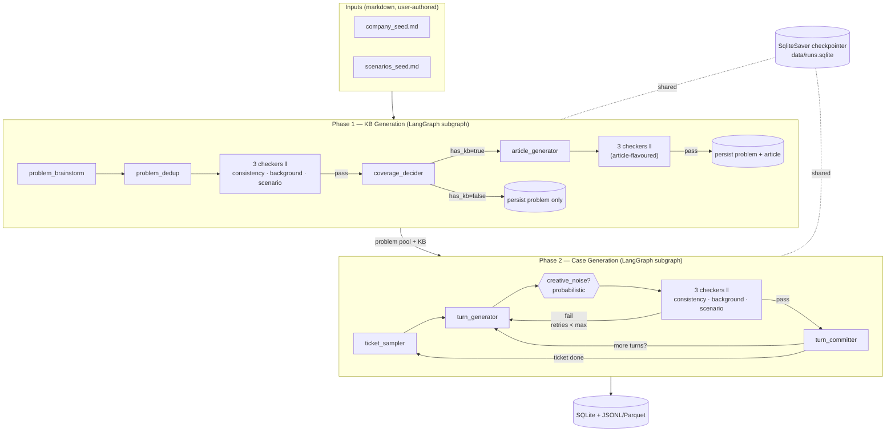
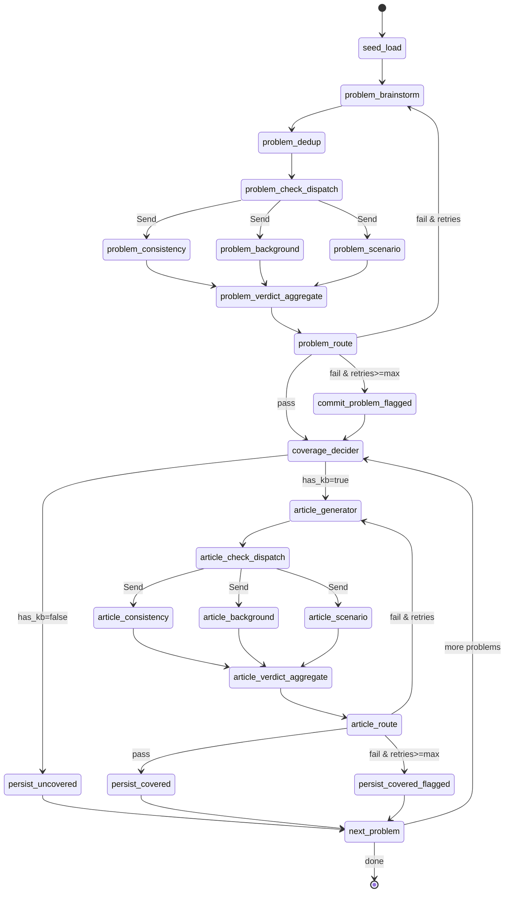
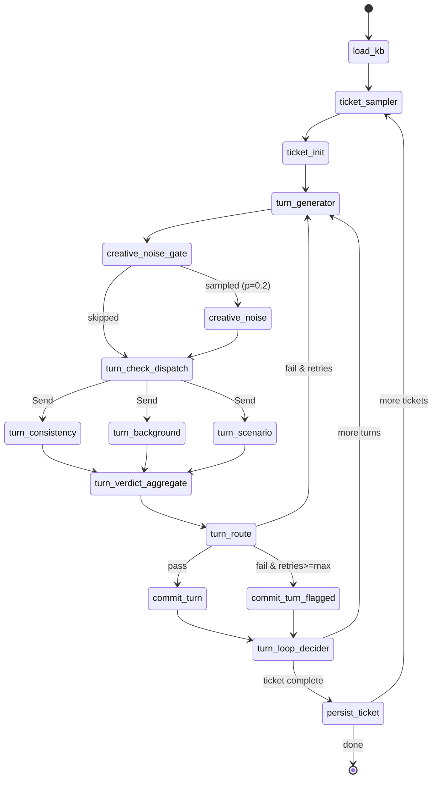

# Customer Service Fake Data — Design Spec

| | |
|---|---|
| **Status** | Draft for review |
| **Date** | 2026-05-15 |
| **Project codename** | `csfd` (customer-service-fake-data) |
| **License (planned)** | Apache-2.0 |
| **Target audience** | Open-source portfolio repo demonstrating production-grade multi-agent LangGraph |

---

## 1. Purpose & Scope

### 1.1 Goal
Generate **synthetic customer-service ticket interactions** for downstream benchmarking. The system must produce a **general-purpose corpus** rich enough to evaluate classification, RAG, multi-turn agent behaviour, and summarization from the same dataset.

### 1.2 Inputs (user-authored, plain markdown)
- **`seeds/company_seed.md`** — company background: products, policies, tone-of-voice, customer segments, KB style conventions.
- **`seeds/scenarios_seed.md`** — scenario catalogue: categories, situational hints, ticket-type expectations.

### 1.3 Outputs
- A **SQLite database** (`data/runs.sqlite`) containing every artifact, every checkpoint, and every agent invocation trace.
- **JSONL / Parquet exports** per artifact type (`problems`, `kb_articles`, `tickets`, `turns`, `agent_traces`) under `data/exports/<run-id>/`.

### 1.4 Pipeline shape — two phases
- **Phase 1 — Knowledge Foundation**: generate a problem pool; per-problem decide KB coverage (target rate, default 0.7); write KB articles for covered problems. Output: a versioned, queryable KB grounded in the company seed.
- **Phase 2 — Case generation**: sample (problem, ticket_type) pairs, generate multi-turn conversations. Hard routing rule: **`problem.has_kb = False` ⇒ `ticket_type = L3`** (technical/domain specialist). Otherwise sample ticket_type from configurable weights.

### 1.5 Ticket types (default mix when KB present)
| Type | Weight | Persona |
|---|---|---|
| `docs_request` | 10% | Customer asks for documentation; agent provides links + summary |
| `l1` | 55% | First-line rep; quick resolution; high reliance on KB |
| `l2` | 25% | Escalated; structured troubleshooting; KB + judgment |
| `l3` | 10% | Domain specialist; novel/edge-case resolution |

For `has_kb=False` problems: `l3=100%`.

### 1.6 LLM support
- **Anthropic Claude** via `langchain_anthropic.ChatAnthropic`.
- **Local Llama-family** via `langchain_openai.ChatOpenAI` pointed at an OpenAI-compatible endpoint (Ollama / `llama-server` / vLLM).
- **Per-agent provider/model assignment** in config; mix-and-match supported (e.g., Claude for the Generator, local Llama for the checkers).

### 1.7 Out of scope (v2 backlog, captured in §16)
- Hosted persistence (Postgres swap for SQLite)
- Human-in-the-loop interrupts (architecture preserves the seam)
- Best-of-N generation
- Calibrated checker weights
- Streamlit/web dataset browser
- Post-resolution KB articles from L3 outcomes feeding back into the KB
- Multi-language code-switching in Creative/Noise (mentioned as a noise type but disabled by default)

---

## 2. High-Level Architecture



The parent graph (`src/csfd/graph/compose.py`) composes `phase1` and `phase2` as siblings sharing a single `SqliteSaver` checkpointer. Either phase can be invoked independently via the CLI; a chained `generate` command runs both with `phase1.run_id` flowing into `phase2.parent_run_id`.

### 2.1 Pattern provenance
This design is the composition of two canonical Anthropic workflow patterns from *Building Effective Agents*:

- **Parallelization (sectioning)** — the three orthogonal checkers (Consistency / Background / Scenario) run independently on the same artifact and their verdicts fan in.
- **Evaluator-optimizer** — aggregated verdict routes back to the Generator with structured issues until a passing artifact is produced (or the retry budget is exhausted).

Both phases are **workflows**, not agents — the code paths are predefined. This is a deliberate choice for reproducibility; the architecture preserves a seam for an `interrupt()` call between aggregation and routing should HITL be added later.

---

## 3. Workflow Design

### 3.1 Phase 1 — KB Generation subgraph



### 3.2 Phase 2 — Case Generation subgraph



### 3.3 Fan-out / fan-in mechanics

- **Dispatch** uses LangGraph's `Send` API. The dispatch function returns a list of `Send(node_name, per_call_state)`, giving each checker its own isolated input. Even with N=3 fixed, this is preferred over three static parallel edges — it composes cleanly if a 4th checker is added.
- **Fan-in** uses an `Annotated[list[Verdict], operator.add]` reducer on `state.verdicts`. The aggregator node waits for all three to land, then routes.
- **Reset on retry** uses `langgraph.types.Overwrite(value=[])` to clear the accumulated verdicts before re-entering the generator — bypassing the `add` reducer.

### 3.4 Verdict aggregation

Default policy: **strict_all_pass**. The aggregator passes iff every checker passes. The three checkers are orthogonal in concern (internal consistency vs. company background vs. scenario fidelity), so any single failure represents a real defect — quorum voting would paper over genuine bugs.

A `quorum_2_of_3` policy is configurable but disabled by default; weighted scoring is v2 (requires calibration data).

### 3.5 Retry policy

- `max_retries_per_artifact: 3` (default).
- On retry the Generator receives the **full structured issue list** from the failing verdicts, formatted into its prompt.
- **Convergence guard**: if the issue list hash is identical on two consecutive attempts, the loop bails early with `ConvergenceError` (treated as retry exhaustion).
- On exhaustion, `retry_exhaustion_policy: commit_with_warning` (default) persists the artifact with `quality_flag = max_retries_exhausted` (or `convergence_failure`) and the unresolved issues in `unresolved_issues_json`. Alternative `skip` is configurable but discouraged — it wastes spent tokens and produces less useful data.

### 3.6 Routing rule (Phase 2)

```python
# Pseudo-code of ticket_sampler logic
def sample_ticket_type(problem: Problem, rng: Random, cfg: Phase2Config) -> TicketType:
    if not problem.has_kb:
        return TicketType.L3                          # hard rule
    return weighted_choice(cfg.ticket_type_weights.has_kb, rng)
```

The L3-without-KB persona instructs the Generator that the rep is a domain specialist improvising without KB support; turns therefore reflect deeper diagnostic work, hypothesis testing, novel resolution paths.

---

## 4. Folder Structure

```
customer-service-fake-data/
├── README.md
├── LICENSE                                # Apache-2.0
├── CHANGELOG.md
├── pyproject.toml                         # uv-managed; pydantic~=2.x pinned
├── uv.lock
├── .env.example
├── .gitignore
├── .pre-commit-config.yaml
├── langgraph.json                         # for `langgraph dev` Studio
│
├── seeds/                                 # user-authored
│   ├── company_seed.md
│   └── scenarios_seed.md
│
├── prompts/                               # Jinja2 templates; hashed at load time
│   ├── phase1/
│   │   ├── problem_generator.md.j2
│   │   ├── coverage_judge.md.j2
│   │   ├── article_generator.md.j2
│   │   ├── article_consistency.md.j2
│   │   ├── article_background.md.j2
│   │   └── article_scenario.md.j2
│   └── phase2/
│       ├── turn_generator.md.j2
│       ├── turn_consistency.md.j2
│       ├── turn_background.md.j2
│       ├── turn_scenario.md.j2
│       └── creative_noise.md.j2
│
├── config/
│   ├── default.yaml
│   └── profiles/
│       ├── dev.yaml
│       ├── claude-only.yaml
│       ├── local-only.yaml                # all agents on Ollama
│       └── mixed.yaml                     # generator=claude, checkers=local
│
├── src/csfd/
│   ├── __init__.py
│   ├── cli.py                             # Typer commands
│   ├── settings.py                        # Pydantic Settings (env + yaml + profile)
│   │
│   ├── models/                            # LangChain chat model wrappers
│   │   ├── __init__.py
│   │   ├── registry.py                    # build_llm(agent_cfg) -> BaseChatModel
│   │   └── providers.py                   # ChatAnthropic/ChatOpenAI factories
│   │
│   ├── seeds/                             # markdown parsers → typed objects
│   │   ├── __init__.py
│   │   ├── company.py                     # CompanyProfile
│   │   └── scenarios.py                   # ScenarioCatalogue
│   │
│   ├── ticket_types/
│   │   ├── __init__.py
│   │   └── definitions.py                 # Enum + per-type metadata
│   │
│   ├── prompts/                           # prompt loader + content hashing
│   │   ├── __init__.py
│   │   └── registry.py                    # PromptHandle, load_all()
│   │
│   ├── agents/                            # 5 generic ROLES
│   │   ├── __init__.py
│   │   ├── base.py                        # AgentRole ABC + AgentContext + Verdict + Issue
│   │   ├── generator.py
│   │   ├── consistency.py
│   │   ├── background.py
│   │   ├── scenario.py
│   │   └── creative_noise.py
│   │
│   ├── phases/
│   │   ├── __init__.py
│   │   ├── phase1_kb/
│   │   │   ├── __init__.py
│   │   │   ├── state.py                   # KBState (Pydantic)
│   │   │   ├── nodes.py                   # node functions
│   │   │   ├── routing.py                 # conditional edge logic
│   │   │   └── subgraph.py                # build_phase1_graph()
│   │   └── phase2_cases/
│   │       ├── __init__.py
│   │       ├── state.py                   # TicketState
│   │       ├── nodes.py
│   │       ├── routing.py
│   │       └── subgraph.py
│   │
│   ├── graph/
│   │   ├── __init__.py
│   │   ├── compose.py                     # build_full_graph() with shared SqliteSaver
│   │   ├── checkpointer.py                # SqliteSaver wiring
│   │   └── shared.py                      # cross-phase helpers
│   │
│   ├── storage/
│   │   ├── __init__.py
│   │   ├── db.py                          # connection mgmt
│   │   ├── migrations/
│   │   │   ├── 001_runs.sql
│   │   │   ├── 002_problems_and_kb.sql
│   │   │   ├── 003_tickets_and_turns.sql
│   │   │   └── 004_agent_traces.sql
│   │   ├── repository.py                  # *Repo classes (read/write/idempotent upsert)
│   │   └── exporters.py                   # to_jsonl(), to_parquet()
│   │
│   ├── observability/
│   │   ├── __init__.py
│   │   ├── logging.py                     # structlog config (JSON, OTel-friendly)
│   │   ├── tracing.py                     # stream_mode=updates persister
│   │   └── langsmith.py                   # opt-in LangSmith setup
│   │
│   ├── budget/
│   │   ├── __init__.py
│   │   ├── tracker.py                     # token + USD budgets per run
│   │   └── breaker.py                     # pybreaker circuit breaker
│   │
│   ├── errors.py                          # typed exception hierarchy
│   └── utils/
│       ├── __init__.py
│       ├── retry.py                       # tenacity wrappers
│       ├── rng.py                         # seeded Random helpers
│       └── hashing.py                     # content hashing for prompts/dedup
│
├── tests/
│   ├── conftest.py                        # fake LLM client, tiny seeds fixture
│   ├── unit/
│   │   ├── test_agents.py
│   │   ├── test_routing.py
│   │   ├── test_storage.py
│   │   ├── test_prompts.py
│   │   ├── test_seeds.py
│   │   └── test_budget.py
│   ├── integration/
│   │   ├── cassettes/                     # pytest-recording VCR (committed)
│   │   ├── test_phase1_e2e_tiny.py
│   │   └── test_phase2_e2e_tiny.py
│   ├── live/
│   │   └── test_live_smoke.py             # @pytest.mark.live_llm
│   └── fixtures/
│       ├── tiny_company_seed.md
│       ├── tiny_scenarios_seed.md
│       └── kb_run_fixture.sqlite
│
├── scripts/
│   ├── init_db.py
│   ├── render_graphs.py                   # generates mermaid for docs/README
│   └── dry_run.py
│
├── data/                                  # gitignored
│   ├── runs.sqlite
│   └── exports/
│
├── docs/
│   ├── ARCHITECTURE.md
│   ├── PHASES.md
│   ├── AGENTS.md
│   ├── DATA_SCHEMA.md
│   ├── PROMPTS.md
│   ├── BENCHMARKS.md                      # how to consume exports
│   ├── diagrams/                          # generated mermaid (auto)
│   └── superpowers/specs/                 # this document lives here
│
├── examples/
│   └── run_demo.md                        # end-to-end walkthrough
│
└── .github/
    ├── workflows/
    │   ├── ci.yml                         # unit + cassette integration on every PR
    │   ├── live-llm.yml                   # label-gated; re-records cassettes
    │   └── render-diagrams.yml            # rebuild docs/diagrams/*.mmd on push
    └── ISSUE_TEMPLATE/
```

---

## 5. Agent Roles

### 5.1 The five roles

| Role | Purpose | Augmented? | Temperature | Phase 1 instances | Phase 2 instances |
|---|---|---|---|---|---|
| `Generator` | Produce a structured artifact | **Yes** (sees KB / persona / run history as relevant) | 0.7–0.9 | `problem_brainstorm`, `coverage_judge`, `article_writer` | `turn_writer` |
| `Consistency` | Artifact is internally non-contradictory | No (artifact-only) | 0.1 | `problem_consistency`, `article_consistency` | `turn_consistency` |
| `Background` | Respects `company_seed` + prior committed artifacts | Partially (sees seed + prior artifacts) | 0.1 | `problem_background`, `article_background` | `turn_background` |
| `Scenario` | Stays true to assigned scenario | No (artifact + scenario only) | 0.1 | `problem_scenario`, `article_scenario` | `turn_scenario` |
| `CreativeNoise` | Probabilistic complexity injection | No (turn + noise menu only) | 0.95 | — (disabled by default in P1) | `creative_noise` |

Only the **Generator** is fully "augmented" per Anthropic's pattern. Checkers receive minimal context — this maximises evaluator independence and makes each checker individually testable.

### 5.2 `AgentRole` interface

```python
# src/csfd/agents/base.py
from abc import ABC, abstractmethod
from typing import Any
from pydantic import BaseModel

class Issue(BaseModel):
    severity: Literal["error", "warning"]
    location: str               # "ticket.turn[2].assistant_message" or "problem.description"
    rule_violated: str          # "L1_must_not_mention_internal_tools"
    explanation: str
    suggested_fix: str | None = None

class Verdict(BaseModel):
    checker: str                # "consistency" | "background" | "scenario"
    passed: bool
    issues: list[Issue] = []

class AgentContext(BaseModel):
    inputs: dict[str, Any]
    prior_committed: dict[str, Any] = {}   # e.g., prior turns in this ticket
    retry_attempt: int = 0
    prior_verdicts: list[Verdict] = []     # issues from last failed attempt

class AgentRole(ABC):
    name: str
    prompt: PromptHandle                   # template + version (content hash)
    output_schema: type[BaseModel]
    llm: BaseChatModel                     # bound via .with_structured_output(output_schema)

    @abstractmethod
    async def invoke(self, ctx: AgentContext) -> BaseModel: ...
```

Concrete classes (`Generator`, `Checker`, `CreativeNoise`) all extend this base. `Checker` always emits a `Verdict`; `Generator` emits the artifact's Pydantic schema; `CreativeNoise` emits a turn-modification record.

### 5.3 Structured issue feedback (the #1 quality lever)

The Generator's retry prompt template enumerates issues verbatim:

```
Prior attempt failed validation. Address each issue:

[error] turn[2].assistant_message
  Rule violated: L1_must_not_mention_internal_tools
  Why: mentioned internal Jira ticket ID "INT-4421"
  Fix: replace with a customer-visible reference or remove

[warning] turn[2].assistant_message
  Rule violated: tone_company_voice
  Why: tone is too informal ("hey!") for this company's KB style
  Fix: rephrase per the tone guidelines in company_seed.md §3
```

Free-text critique is meaningfully less actionable; structured issues with `(severity, location, rule_violated, suggested_fix)` are what gets surfaced to the LLM.

### 5.4 Coverage decider (special Generator instance)

The `coverage_judge` is a Generator instance that outputs:

```python
class CoverageDecision(BaseModel):
    has_kb: bool
    reasoning: str             # why this problem would/wouldn't be documented
    confidence: Literal["low", "medium", "high"]
```

After judging all problems in a Phase 1 batch, a deterministic top-up/trim step adjusts to hit `phase1.kb_coverage_target_rate` (default 0.7) by flipping borderline (`confidence=low`) cases. This blends LLM judgment with explicit rate control.

### 5.5 Creative/Noise menu

Configurable list (sampled with replacement, weighted):

| Noise type | Description | Default weight |
|---|---|---|
| `typos_informal_phrasing` | Customer typos, casual language, abbreviations | 0.25 |
| `tangential_complaint` | Customer adds an unrelated secondary issue | 0.15 |
| `incomplete_info` | Customer omits key details; rep must probe | 0.20 |
| `agent_self_correction` | Rep makes a minor mistake, catches and corrects | 0.10 |
| `sentiment_flip` | Customer frustration shifts mid-conversation | 0.15 |
| `wrong_kb_citation` | Customer cites an incorrect KB article (great for RAG robustness) | 0.10 |
| `code_switch_language` | Multi-language injection | 0.05 (off by default; flag-gated) |

The applied `noise_type` is persisted on the turn (`turns.noise_applied=true`, `turns.noise_type=...`) so benchmarks can stratify by noise category.

---

## 6. Data Model

### 6.1 LangGraph state (in-memory, Pydantic v2)

```python
# phases/phase1_kb/state.py
class KBState(BaseModel):
    run_id: UUID
    run_seed: int
    company: CompanyProfile                    # immutable
    scenarios: ScenarioCatalogue               # immutable
    problems_committed: list[Problem] = []
    current_problem: Problem | None = None
    current_article_draft: KBArticleDraft | None = None
    verdicts: Annotated[list[Verdict], operator.add] = []   # cleared via Overwrite on retry
    retry_attempt: int = 0
    stats: PhaseStats

# phases/phase2_cases/state.py
class TicketState(BaseModel):
    run_id: UUID
    parent_run_id: UUID                        # the Phase 1 run providing the KB
    run_seed: int
    company: CompanyProfile
    problem_pool: list[Problem]
    kb_by_problem: dict[UUID, KBArticle]
    current_ticket: TicketDraft | None = None
    turns_committed: list[Turn] = []
    current_turn_draft: Turn | None = None
    noise_applied: bool = False
    noise_type: str | None = None
    verdicts: Annotated[list[Verdict], operator.add] = []
    retry_attempt: int = 0
    stats: PhaseStats
```

### 6.2 SQLite schema

Six application tables plus LangGraph's own `checkpoints` / `writes` (managed by `SqliteSaver`).

#### `runs`
```sql
CREATE TABLE runs (
    id                  TEXT PRIMARY KEY,                  -- UUID4
    phase               TEXT NOT NULL,                     -- 'phase1' | 'phase2' | 'full'
    parent_run_id       TEXT REFERENCES runs(id),          -- non-null for phase2 reusing a phase1
    status              TEXT NOT NULL,                     -- 'pending'|'running'|'completed'|'failed'|'aborted_budget'
    started_at          TIMESTAMP NOT NULL,
    completed_at        TIMESTAMP,
    run_seed            INTEGER NOT NULL,
    pipeline_version    TEXT NOT NULL,                     -- from config.pipeline.version
    git_sha             TEXT,                              -- captured at run start
    config_snapshot_json TEXT NOT NULL,                    -- full resolved YAML
    stats_json          TEXT,                              -- counts, total_tokens, cost_usd
    error_summary       TEXT
);
CREATE INDEX idx_runs_phase ON runs(phase);
CREATE INDEX idx_runs_parent ON runs(parent_run_id);
```

#### `problems`
```sql
CREATE TABLE problems (
    id                  TEXT PRIMARY KEY,
    run_id              TEXT NOT NULL REFERENCES runs(id),
    title               TEXT NOT NULL,
    description         TEXT NOT NULL,
    category            TEXT NOT NULL,
    severity            TEXT NOT NULL,                     -- 'low'|'medium'|'high'|'critical'
    has_kb              INTEGER NOT NULL,                  -- 0/1
    coverage_reasoning  TEXT,
    coverage_confidence TEXT,                              -- 'low'|'medium'|'high'
    metadata_json       TEXT,                              -- tags, products, segments
    quality_flag        TEXT,                              -- NULL|'max_retries_exhausted'|'convergence_failure'
    unresolved_issues_json TEXT,
    created_at          TIMESTAMP NOT NULL
);
CREATE INDEX idx_problems_run ON problems(run_id);
CREATE INDEX idx_problems_has_kb ON problems(has_kb);
```

#### `kb_articles`
```sql
CREATE TABLE kb_articles (
    id                  TEXT PRIMARY KEY,
    run_id              TEXT NOT NULL REFERENCES runs(id),
    problem_id          TEXT NOT NULL UNIQUE REFERENCES problems(id),   -- 1:1
    title               TEXT NOT NULL,
    content_markdown    TEXT NOT NULL,
    content_hash        TEXT NOT NULL,                     -- sha256(content)
    troubleshooting_steps_json TEXT NOT NULL,              -- ordered list[{step, expected_result}]
    prerequisites_json  TEXT,
    metadata_json       TEXT,
    version             INTEGER NOT NULL DEFAULT 1,
    quality_flag        TEXT,
    unresolved_issues_json TEXT,
    created_at          TIMESTAMP NOT NULL
);
```

#### `tickets`
```sql
CREATE TABLE tickets (
    id                  TEXT PRIMARY KEY,
    run_id              TEXT NOT NULL REFERENCES runs(id),
    problem_id          TEXT NOT NULL REFERENCES problems(id),
    kb_article_id       TEXT REFERENCES kb_articles(id),   -- NULL when problem.has_kb=false
    ticket_type         TEXT NOT NULL,                     -- 'docs_request'|'l1'|'l2'|'l3'
    priority            TEXT NOT NULL,
    status              TEXT NOT NULL,                     -- 'resolved'|'unresolved'|'escalated'
    subject             TEXT NOT NULL,
    customer_persona_json TEXT NOT NULL,
    agent_persona_json  TEXT NOT NULL,
    ground_truth_json   TEXT,                              -- resolution_summary, kb refs, escalation path
    metadata_json       TEXT,
    quality_flag        TEXT,
    unresolved_issues_json TEXT,
    created_at          TIMESTAMP NOT NULL,
    resolved_at         TIMESTAMP
);
CREATE INDEX idx_tickets_run ON tickets(run_id);
CREATE INDEX idx_tickets_problem ON tickets(problem_id);
CREATE INDEX idx_tickets_type ON tickets(ticket_type);
```

#### `turns`
```sql
CREATE TABLE turns (
    id                  TEXT PRIMARY KEY,
    ticket_id           TEXT NOT NULL REFERENCES tickets(id),
    turn_index          INTEGER NOT NULL,                  -- 0-based
    speaker             TEXT NOT NULL,                     -- 'customer'|'agent'|'system'
    speaker_persona     TEXT,                              -- supports mid-ticket handoff
    content             TEXT NOT NULL,
    intent              TEXT,                              -- 'question'|'clarification'|'resolution'|'escalation'|'thanks'|'closing'
    kb_references_json  TEXT,                              -- list of kb_article ids referenced this turn
    noise_applied       INTEGER NOT NULL DEFAULT 0,        -- 0/1
    noise_type          TEXT,
    quality_flag        TEXT,
    created_at          TIMESTAMP NOT NULL,
    UNIQUE(ticket_id, turn_index)
);
CREATE INDEX idx_turns_ticket ON turns(ticket_id);
```

#### `agent_traces` — the bill of materials
```sql
CREATE TABLE agent_traces (
    id                  TEXT PRIMARY KEY,
    run_id              TEXT NOT NULL REFERENCES runs(id),
    thread_id           TEXT NOT NULL,                     -- LangGraph thread (= run_id by default)
    node_name           TEXT NOT NULL,                     -- e.g., 'turn_writer', 'turn_consistency'
    agent_role          TEXT NOT NULL,                     -- 'generator'|'consistency'|'background'|'scenario'|'creative_noise'
    artifact_type       TEXT NOT NULL,                     -- 'problem'|'kb_article'|'ticket_turn'|'coverage_decision'
    artifact_id         TEXT,                              -- nullable when artifact not yet committed
    attempt             INTEGER NOT NULL DEFAULT 0,
    prompt_id           TEXT NOT NULL,                     -- content-hash of prompt template used
    input_json          TEXT NOT NULL,                     -- AgentContext serialised
    output_json         TEXT,                              -- LLM response (parsed/structured)
    verdict             TEXT,                              -- 'pass'|'fail' for checkers
    verdict_issues_json TEXT,
    model_provider      TEXT NOT NULL,                     -- 'anthropic'|'openai_compat'
    model_id            TEXT NOT NULL,                     -- versioned, e.g. 'claude-sonnet-4-7-20260301'
    tokens_in           INTEGER,
    tokens_out          INTEGER,
    cost_usd_estimated  REAL,
    latency_ms          INTEGER,
    parent_trace_id     TEXT REFERENCES agent_traces(id),  -- for nested calls
    status              TEXT NOT NULL,                     -- 'ok'|'transport_error'|'schema_error'|'budget_error'
    error_class         TEXT,
    error_message       TEXT,
    created_at          TIMESTAMP NOT NULL
);
CREATE INDEX idx_traces_run ON agent_traces(run_id);
CREATE INDEX idx_traces_artifact ON agent_traces(artifact_type, artifact_id);
CREATE INDEX idx_traces_role ON agent_traces(agent_role);
CREATE INDEX idx_traces_prompt ON agent_traces(prompt_id);
```

### 6.3 The "gold tuple" for benchmark consumers

```sql
SELECT
    p.id AS problem_id, p.title, p.has_kb,
    kb.id AS kb_article_id, kb.content_markdown,
    t.id AS ticket_id, t.ticket_type, t.status,
    tu.turn_index, tu.speaker, tu.content
FROM problems p
LEFT JOIN kb_articles kb ON kb.problem_id = p.id
JOIN tickets t ON t.problem_id = p.id
JOIN turns tu ON tu.ticket_id = t.id
WHERE p.run_id = :phase1_run_id
ORDER BY t.id, tu.turn_index;
```

This is the join a downstream benchmark builder will run. Designing the schema so this query is one join graph (and that `has_kb=false ⇒ ticket_type=l3`) is the entire reason the phasing exists.

### 6.4 Exporters

`src/csfd/storage/exporters.py` writes per-run JSONL and Parquet under `data/exports/<run_id>/`:
- `problems.jsonl(.parquet)`
- `kb_articles.jsonl(.parquet)`
- `tickets.jsonl(.parquet)`
- `turns.jsonl(.parquet)`
- `agent_traces.jsonl(.parquet)`
- `manifest.json` — run metadata + file checksums

A `huggingface_dataset.py` adapter (small, optional) wraps the JSONL into a `datasets.Dataset` for HF ecosystem consumers.

---

## 7. LLM Providers & Configuration

### 7.1 LangChain chat model layer

```python
# src/csfd/models/registry.py
from langchain_anthropic import ChatAnthropic
from langchain_openai import ChatOpenAI
from langchain_core.language_models import BaseChatModel

def build_llm(agent_cfg: AgentLLMConfig) -> BaseChatModel:
    if agent_cfg.provider == "anthropic":
        return ChatAnthropic(
            model=agent_cfg.model,
            temperature=agent_cfg.temperature,
            max_tokens=agent_cfg.max_tokens or 4096,
            timeout=agent_cfg.timeout_s,
        )
    if agent_cfg.provider == "openai_compat":
        return ChatOpenAI(
            model=agent_cfg.model,
            base_url=agent_cfg.base_url,             # e.g. http://localhost:11434/v1
            api_key=agent_cfg.api_key or "local",
            temperature=agent_cfg.temperature,
            timeout=agent_cfg.timeout_s,
        )
    raise ValueError(f"Unknown provider: {agent_cfg.provider}")
```

Every agent binds its output schema:
```python
llm = build_llm(cfg).with_structured_output(VerdictSchema, method="json_schema")
verdict: Verdict = await llm.ainvoke(prompt_messages)
```

For local Llama models, JSON-schema-constrained decoding requires Ollama `format=json` mode or llama.cpp grammar — both are supported via the OpenAI-compatible `with_structured_output(method="json_schema")` path.

### 7.2 Config file structure

```yaml
# config/default.yaml
pipeline:
  version: "0.1.0"
  run_seed: null                      # autogen if null
  budget:
    max_tokens_per_run: 5_000_000
    max_usd_per_run: 10.0
    max_retries_per_artifact: 3

agents:
  generator:
    provider: anthropic
    model: claude-sonnet-4-7
    temperature: 0.85
    max_tokens: 4096
    timeout_s: 60
  consistency:    { provider: anthropic, model: claude-haiku-4-5, temperature: 0.1, timeout_s: 30 }
  background:     { provider: anthropic, model: claude-haiku-4-5, temperature: 0.1, timeout_s: 30 }
  scenario:       { provider: anthropic, model: claude-haiku-4-5, temperature: 0.1, timeout_s: 30 }
  creative_noise: { provider: anthropic, model: claude-sonnet-4-7, temperature: 0.95, timeout_s: 45 }
  coverage_judge: { provider: anthropic, model: claude-haiku-4-5, temperature: 0.2, timeout_s: 30 }

phase1:
  problem_count: 100
  kb_coverage_target_rate: 0.7
  dedup_similarity_threshold: 0.88
  dedup_method: lexical               # 'lexical' (TF-IDF cosine, default — stdlib-only)
                                      # | 'embedding' (opt-in; implementation picks the model)

phase2:
  tickets_per_problem:                # [min, max] inclusive integer range; uniform sample per problem
    has_kb: [3, 5]
    no_kb: [1, 2]
  ticket_type_weights:
    has_kb: { docs_request: 0.10, l1: 0.55, l2: 0.25, l3: 0.10 }
    no_kb:  { l3: 1.0 }
  creative_noise_probability: 0.20
  noise_type_weights:
    typos_informal_phrasing: 0.25
    tangential_complaint: 0.15
    incomplete_info: 0.20
    agent_self_correction: 0.10
    sentiment_flip: 0.15
    wrong_kb_citation: 0.10
    code_switch_language: 0.05
  voting_policy: strict_all_pass      # 'strict_all_pass' | 'quorum_2_of_3'
  retry_exhaustion_policy: commit_with_warning  # 'commit_with_warning' | 'skip'
  min_turns_per_ticket: 2
  max_turns_per_ticket: 12

observability:
  structlog_json: true
  langsmith_enabled: false            # auto-on if LANGSMITH_API_KEY is set
  persist_stream_updates: true        # write LangGraph 'updates' events to agent_traces

storage:
  sqlite_path: "data/runs.sqlite"
  exports_dir: "data/exports"
  exports_format: ["jsonl", "parquet"]
```

### 7.3 Profile overlays

```yaml
# config/profiles/local-only.yaml — every agent on Ollama
agents:
  generator:      { provider: openai_compat, model: llama3.3:70b, base_url: http://localhost:11434/v1, temperature: 0.85 }
  consistency:    { provider: openai_compat, model: llama3.3:70b, base_url: http://localhost:11434/v1, temperature: 0.1 }
  background:     { provider: openai_compat, model: llama3.3:70b, base_url: http://localhost:11434/v1, temperature: 0.1 }
  scenario:       { provider: openai_compat, model: llama3.3:70b, base_url: http://localhost:11434/v1, temperature: 0.1 }
  creative_noise: { provider: openai_compat, model: llama3.3:70b, base_url: http://localhost:11434/v1, temperature: 0.95 }
  coverage_judge: { provider: openai_compat, model: llama3.3:70b, base_url: http://localhost:11434/v1, temperature: 0.2 }
```

```yaml
# config/profiles/mixed.yaml — generation on Claude, checkers local
agents:
  generator:      { provider: anthropic, model: claude-sonnet-4-7 }
  consistency:    { provider: openai_compat, model: llama3.1:8b, base_url: http://localhost:11434/v1 }
  background:     { provider: openai_compat, model: llama3.1:8b, base_url: http://localhost:11434/v1 }
  scenario:       { provider: openai_compat, model: llama3.1:8b, base_url: http://localhost:11434/v1 }
```

Settings loader merges `default.yaml ← profile.yaml ← env vars` via Pydantic Settings.

### 7.4 Environment variables

| Var | Purpose | Required |
|---|---|---|
| `ANTHROPIC_API_KEY` | Claude access | when any agent uses `provider: anthropic` |
| `LOCAL_BASE_URL` | Override OpenAI-compat endpoint | optional |
| `LOCAL_API_KEY` | Override OpenAI-compat API key | optional (defaults to `"local"`) |
| `LANGSMITH_API_KEY` | Enables LangSmith tracing | optional |
| `LANGSMITH_PROJECT` | LangSmith project name | optional |

---

## 8. Prompt Registry

### 8.1 Layout & loading

Templates live under `prompts/<phase>/<role>.md.j2`. The registry walks this tree at startup:

```python
@dataclass(frozen=True)
class PromptHandle:
    name: str                          # "phase2.turn_generator"
    template: jinja2.Template
    source: str                        # raw template text
    version: str                       # sha256(source.strip())[:12]

class PromptRegistry:
    def __init__(self, root: Path): ...
    def get(self, name: str) -> PromptHandle: ...
    def all(self) -> dict[str, PromptHandle]: ...
```

### 8.2 Why content-hash versioning

Every `agent_traces` row stores `prompt_id = handle.version`. A reviewer can:

- Pin an exported benchmark dataset to the exact prompt versions that produced it.
- Diff between two runs to see whether a quality regression coincides with a prompt change.
- Reproduce a single ticket months later even after the prompt template has been edited.

This is the **single most important reproducibility lever** in the project.

### 8.3 Template structure

Each prompt template is a minimal Jinja2 file with explicit input variables. Example:

```jinja
{# prompts/phase2/turn_generator.md.j2 #}
You are simulating a {{ persona.tier }} support representative for {{ company.name }}.

Company background (relevant excerpts):
{{ company_background_snippet }}


Knowledge-base article available to this rep:
---
{{ kb_article.title }}
{{ kb_article.content_markdown }}
---

NOTE: No KB article exists for this problem. As an L3 specialist, you must rely on
domain knowledge and structured diagnosis.


Customer profile: {{ customer_persona | tojson }}
Ticket type: {{ ticket_type }}
Scenario hint: {{ scenario.summary }}

Conversation so far:

[{{ t.speaker }}]: {{ t.content }}



Your previous attempt was rejected. Address each issue:

- [{{ i.severity }}] {{ i.location }} — {{ i.rule_violated }}: {{ i.explanation }}
  Fix: {{ i.suggested_fix or "(use judgment)" }}



Generate the next turn as a JSON object matching the TurnDraft schema.
```

---

## 9. Cost Guards & Error Handling

### 9.1 Typed exception hierarchy

```python
# src/csfd/errors.py
class PipelineError(Exception): ...

class TransportError(PipelineError):
    """Network-level: 5xx, timeout, connection reset. Retried at call layer."""

class SchemaValidationError(PipelineError):
    """LLM output failed Pydantic validation. Routed to generator retry with feedback."""
    def __init__(self, errors: list[ValidationError], raw_output: str): ...

class BudgetExceededError(PipelineError):
    """Token/cost budget hit. Run aborts; committed artifacts persist."""

class ConvergenceError(PipelineError):
    """Verdict-issue list identical 2x in a row. Triggers retry_exhaustion_policy."""
```

### 9.2 Retry policy

- **Transport-level**: `tenacity` with `@retry(stop=stop_after_attempt(5), wait=wait_exponential_jitter(initial=1, max=30), retry=retry_if_exception_type(TransportError))` on every LLM call.
- **Schema-level**: validation failures become a synthetic `Verdict(passed=False, issues=[Issue(...)])` injected into `prior_verdicts`, then the graph routes back to the generator. No tenacity at this layer.
- **Budget-level**: `pybreaker` circuit breaker around the LLM client trips on 5xx rate > 30% over 60s, surfacing as `TransportError`.

### 9.3 Budget tracker

```python
# src/csfd/budget/tracker.py
class BudgetTracker:
    def __init__(self, max_tokens: int, max_usd: float): ...
    def record(self, tokens_in: int, tokens_out: int, model_id: str) -> None:
        ...                                  # accumulates and checks limits
    def check(self) -> None:
        if self.tokens_used > self.max_tokens or self.usd_used > self.max_usd:
            raise BudgetExceededError(self.stats())
```

Wrapped around every LLM call via a middleware decorator. Updates flow into the run's `stats_json` and per-call `agent_traces.cost_usd_estimated`.

### 9.4 Idempotency

Every persistence node performs `INSERT ... ON CONFLICT DO NOTHING` (or repo-level "exists check"). LangGraph's checkpointer handles graph-level resume; the persistence layer ensures resuming a graph after a crash doesn't double-insert rows.

---

## 10. Determinism & Observability

### 10.1 Reproducibility primitives

- **`run_seed`** sampled at run start (or pinned via CLI: `csfd phase2 run --seed 42`). Stored in `runs.run_seed`. All non-LLM randomness (problem dedup, persona sampling, creative-noise type selection, ticket-type weighted sampling) derives from this seed.
- **Per-call seeding**: where the LLM exposes a seed parameter (OpenAI-compatible endpoints often do), we pass `hash((run_seed, node_name, attempt))`. Anthropic doesn't expose a model seed, so determinism there is bounded to the prompting/sampling layer.
- **Config snapshot**: at run start, the fully-resolved merged YAML + git SHA + pipeline version are written to `runs.config_snapshot_json` and `runs.git_sha`.
- **Model version capture**: Anthropic returns the full versioned model string (`claude-sonnet-4-7-20260301`) — that's what's recorded in `agent_traces.model_id`, not the alias.

### 10.2 Logging

`structlog` configured for JSON output, integrated with stdlib for ecosystem compatibility:

```python
# src/csfd/observability/logging.py
structlog.configure(
    processors=[
        structlog.contextvars.merge_contextvars,
        structlog.processors.add_log_level,
        structlog.processors.TimeStamper(fmt="iso"),
        structlog.processors.StackInfoRenderer(),
        structlog.processors.format_exc_info,
        structlog.processors.JSONRenderer(),
    ],
    wrapper_class=structlog.stdlib.BoundLogger,
)
```

Context vars carry `run_id`, `thread_id`, `node_name`, `agent_role`, `attempt` — every log line in a run is correlatable without manual stitching.

### 10.3 LangGraph trace persistence

`stream_mode="updates"` events are persisted to `agent_traces` as the primary log. Each update is a per-node delta with built-in parent linkage — effectively a pre-built trace tree, no manual instrumentation required.

```python
async for event in graph.astream(inputs, config, stream_mode=["updates", "messages"]):
    if event_type == "updates":
        trace_repo.write(build_trace_row(event))
```

### 10.4 LangSmith (opt-in)

```python
if settings.observability.langsmith_enabled or os.getenv("LANGSMITH_API_KEY"):
    os.environ["LANGCHAIN_TRACING_V2"] = "true"
    os.environ["LANGCHAIN_PROJECT"] = settings.observability.langsmith_project or "csfd"
```

Zero-cost no-op when the env var is absent. Local SQLite remains the source of truth either way.

---

## 11. Visualization

Three layers, increasing setup cost:

### 11.1 Static mermaid diagrams (auto-generated)

`scripts/render_graphs.py` calls `compiled_graph.get_graph().draw_mermaid()` and writes:
- `docs/diagrams/phase1.mmd`
- `docs/diagrams/phase2.mmd`
- `docs/diagrams/full.mmd`

Embedded in `README.md` and `docs/ARCHITECTURE.md`. A CI workflow (`.github/workflows/render-diagrams.yml`) regenerates on every push to `main` and commits if changed — diagrams never drift from code.

### 11.2 LangGraph Studio (`langgraph dev`)

```json
// langgraph.json
{
  "dependencies": ["."],
  "graphs": {
    "phase1": "./src/csfd/phases/phase1_kb/subgraph.py:graph",
    "phase2": "./src/csfd/phases/phase2_cases/subgraph.py:graph",
    "full":   "./src/csfd/graph/compose.py:graph"
  },
  "env": ".env"
}
```

Reviewer workflow: `uv sync && langgraph dev` → browser opens to live DAG with:
- Per-node input/output inspection
- Time-travel replay of any past run via `thread_id`
- Manual state edits to test edge cases (force `has_kb=False`, watch L3 routing)
- Stream of LLM tokens and state updates

This is the headline showcase feature; README leads with the `langgraph dev` quickstart.

### 11.3 LangSmith (opt-in, see §10.4)

---

## 12. Testing Strategy

### 12.1 Unit tests (`tests/unit/`)
- Fake LLM client (`FakeChatModel`) returns canned `Verdict` / artifact responses.
- Cover: routing logic, verdict aggregation, retry feedback construction, dedup, weighted sampling, repo idempotency, prompt loading + hashing, seed parsers.
- Target: every pure-Python decision point reachable without an LLM.

### 12.2 Integration tests (`tests/integration/`)
- `pytest-recording` (VCR) cassettes committed to git.
- Two tiny seed corpora (`tests/fixtures/tiny_company_seed.md`, `tiny_scenarios_seed.md`).
- `test_phase1_e2e_tiny.py` — produces ~5 problems, ~3 articles; asserts schema, routing rule, coverage rate.
- `test_phase2_e2e_tiny.py` — produces 2 tickets per path (with-KB and no-KB); asserts L3 routing for no-KB, asserts noise stratification.
- Both run on every PR with **zero API spend** and **zero secret leakage** on fork PRs.

### 12.3 Live LLM tests (`tests/live/`)
- Marked `@pytest.mark.live_llm`.
- Gated on a `live-llm` label on the PR, or pushes to `main`.
- Re-record cassettes when prompts/schema change.

### 12.4 Gold-set checker calibration (one-shot eval script)
- `scripts/eval_checker_calibration.py` — runs the three checkers against a hand-labelled "known-good" tickets fixture; reports per-checker false-positive rate.
- Not part of CI; documented in `docs/AGENTS.md` for periodic manual runs.

---

## 13. Tooling & Repo Polish

| Concern | Choice | Rationale |
|---|---|---|
| Dependency mgmt | **uv** | 2026 consensus; fast; single binary; auto-venv |
| Linter/formatter | **ruff** (single tool) | Replaces black/isort/flake8 |
| Type checker | **mypy --strict** | Max ecosystem compatibility; pyright as alt |
| Logging | **structlog** | JSON + OTel-friendly; fast |
| Pre-commit | ruff + mypy + check-yaml + check-added-large-files | Standard |
| Commits | Conventional Commits (`feat:`, `fix:`, …) | Reviewer-friendly history |
| Docs | README + `docs/*.md` + mermaid | mkdocs is overkill |
| License | Apache-2.0 | Explicit patent grant |
| CI | GitHub Actions matrix on Python 3.12 / 3.13 with `setup-uv@v3` | Standard |
| Pinned versions | `pydantic ~=2.x`; explicit minimums for `langgraph`, `langchain-anthropic`, `langchain-openai`, `langgraph-checkpoint-sqlite` set during implementation | Prevent silent major-version drift |

### 13.1 README structure (in order)

1. **Hero mermaid** — the composed Phase 1 + Phase 2 diagram.
2. **30-second pitch** — what this generates, why it matters for benchmarks.
3. **Quickstart** — `uv sync` → `cp .env.example .env` → `csfd generate --profile dev` → `langgraph dev`.
4. **Architecture** — link to `docs/ARCHITECTURE.md`; embed Phase 1 / Phase 2 mermaid.
5. **Reproducibility** — `--seed` flag, `prompt_id` content hashing, config snapshots.
6. **Benchmark consumption** — sample JOIN query (§6.3) + dataset card.
7. **Visualization** — screenshots of `langgraph dev`.
8. **Configuration** — link to `docs/PROMPTS.md` and `config/profiles/*`.
9. **Testing & CI** — badges + how cassettes work.
10. **Roadmap** — link to §16.
11. **License** — Apache-2.0.

---

## 14. CLI Surface

```
csfd init                                     # scaffold seeds/, .env, runs.sqlite migrations
csfd phase1 run [--profile <name>] [--seed <int>] [--problems <N>] [--coverage-rate <0..1>]
csfd phase2 run [--profile <name>] [--seed <int>] [--parent-run-id <uuid>] [--tickets <N>]
csfd generate  [--profile <name>] [--seed <int>] [--problems <N>] [--tickets-per-problem <range>]
csfd export <run-id> [--format jsonl|parquet|both] [--out <dir>]
csfd inspect <run-id>                         # summary stats + sample tickets
csfd render-graphs                            # rebuild docs/diagrams/*.mmd
csfd db migrate                               # apply pending migrations
```

Each command is a Typer subcommand in `src/csfd/cli.py`. All commands honour `--config <path>` to override the default `config/default.yaml`.

---

## 15. Risks & Mitigations

| Risk | Likelihood | Mitigation |
|---|---|---|
| Local Llama JSON-schema decoding flaky on smaller models | Medium | Default profile uses Claude; `local-only.yaml` recommends ≥70B models or grammar-supporting servers; document fallback to manual JSON parsing |
| Coverage decider produces bimodal "all yes / all no" with low-confidence batch | Low | Hybrid top-up/trim step normalises to target rate; logged in `problems.coverage_reasoning` |
| Checker false-positive rate inflates retry cost | Medium | Gold-set calibration script; budget caps prevent runaway runs |
| LangGraph SqliteSaver concurrency limits | Low (single-process CLI) | Documented in `docs/ARCHITECTURE.md`; v2 swap to `PostgresSaver` outlined |
| Anthropic prompt-cache hit rate poor across agents using same system prompt | Low | Per-agent prompts; cache benefits where applicable but not load-bearing for correctness |
| Prompt-template edits without version bump invalidate prior outputs silently | Low | Content-hash versioning makes any change visible in `agent_traces.prompt_id` |

---

## 16. Future Extensions (v2 backlog)

- **PostgresSaver swap** for multi-process / hosted runs.
- **HITL via `interrupt()`** between verdict aggregation and routing — architecture preserves this seam today.
- **Best-of-N generation** for the Generator on hard artifacts.
- **Calibrated checker weights** (data-driven; requires gold-set scale-up).
- **Streamlit dataset browser** (`csfd browse`).
- **Post-resolution KB articles** — L3 resolutions feed back into the KB as new articles (closed-loop).
- **Multi-language code-switching** noise type (enabled).
- **HuggingFace Datasets hub publisher** (`csfd publish-hf`).
- **OpenTelemetry exporter** — structlog already JSON; small adapter.

---

## 17. Decisions Log

| # | Decision | Rationale |
|---|---|---|
| D1 | Workflow A (parallel checkers + bounded regen loop) | Predictable cost; canonical evaluator-optimizer + parallelization composition |
| D2 | Two-phase pipeline | Enables RAG benchmark; principled "no-KB → L3" routing; KB reusable across Phase 2 runs |
| D3 | SQLite + JSONL exports (no API/dashboard in v1) | Clone-and-run; benchmark consumers want a queryable file; trivially upgradeable |
| D4 | OpenAI-compatible endpoint for local Llama | One abstract client interface; mix-and-match per agent |
| D5 | LangChain chat models (`ChatAnthropic` / `ChatOpenAI`) | Native `with_structured_output` + `astream_events` |
| D6 | Pydantic v2 state schema | Unifies state / LLM output / reducer-input validation |
| D7 | `Send` for fan-out, `Overwrite` reset on retry | Idiomatic LangGraph; composes if a 4th checker is added |
| D8 | Strict-all-pass voting | Checkers are orthogonal; quorum would mask real defects |
| D9 | `commit_with_warning` on retry exhaustion + `quality_flag` column | Superset corpus (clean + noisy with provenance) |
| D10 | Content-hash prompt versioning | Single biggest reproducibility lever |
| D11 | Local `agent_traces` table over LangSmith required dep | No external account to evaluate the repo |
| D12 | Only Generator is "augmented"; checkers minimal-context | Anthropic Augmented LLM pattern; maximises checker independence |
| D13 | LangGraph Studio (`langgraph dev`) as primary viz UI | Highest-ROI portfolio signal; no extra UI to build |
| D14 | No Streamlit browser in v1 | User confirmed; LangGraph Studio sufficient |

---

## 18. Glossary

- **Artifact** — a typed output produced by a Generator (Problem, KBArticle, TurnDraft, CoverageDecision).
- **Role** — one of the five agent abstractions (Generator, Consistency, Background, Scenario, CreativeNoise).
- **Instance** — a concrete (role, prompt_template, output_schema, llm_client) binding used at a specific graph node (e.g., `turn_writer`, `article_consistency`).
- **Verdict** — a checker's structured judgement: `{checker, passed, issues}`.
- **Issue** — a structured defect: `{severity, location, rule_violated, explanation, suggested_fix}`.
- **Phase** — Phase 1 (KB generation) or Phase 2 (case generation); each is a LangGraph subgraph.
- **Run** — one invocation of `phase1`, `phase2`, or `generate`; identified by a UUID; persisted in `runs`.
- **Thread** — LangGraph's checkpointing unit; equal to `run_id` by default.
- **Gold tuple** — the join `(problem, kb_article, ticket, turns)` that downstream RAG benchmark consumers query.
- **Quality flag** — non-null on artifacts committed-with-warning after retry exhaustion; null on clean rows.

---

*End of spec.*
